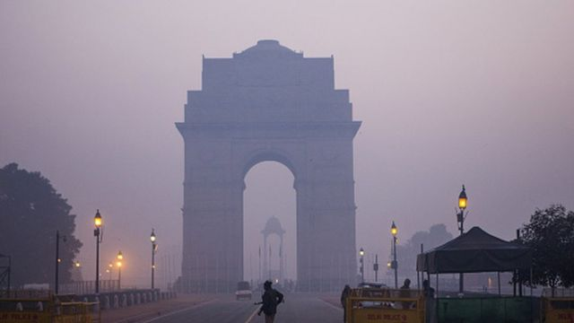
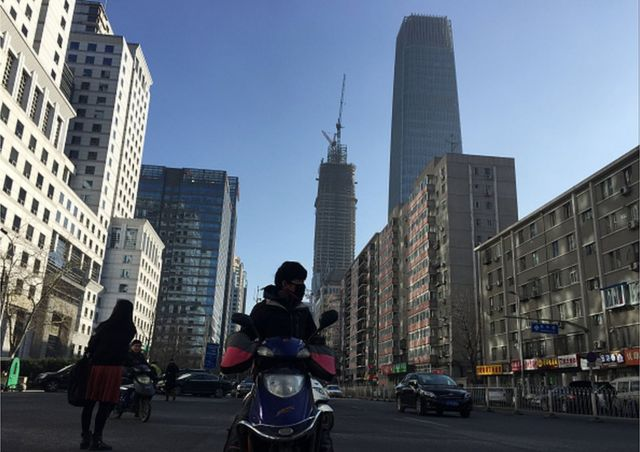
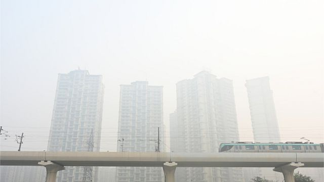
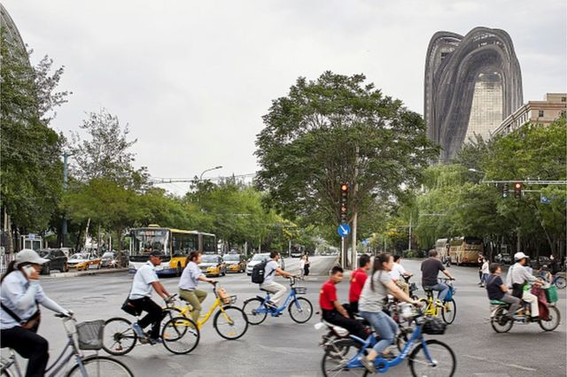
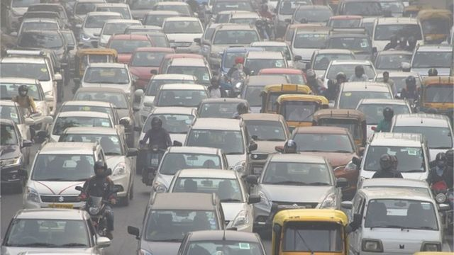
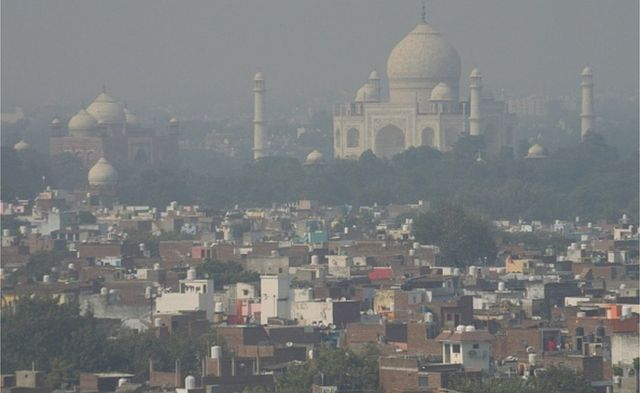

# [Science] 印度德里为何在消除雾霾之战中落后于北京

#  印度德里为何在消除雾霾之战中落后于北京

  * 苏提克·比斯瓦斯（Soutik Biswas） 
  * BBC驻印度记者 

> 图像来源，  Getty Images

**长期以来，生活在人口稠密的两个亚洲国家首都的人们，都饱受笼罩其城市的有毒雾霾之苦。**

德里和北京都是人口超过2000万人的繁华都市。在某些日子里，当它们被雾霾所笼罩，呈现出橙灰色的天际线并弥漫着烟味时，人们说感觉就像生活在一场反乌托邦的梦魇中。北京居民甚至将毒雾称为“空气末日”。

如今，德里又来到了一年中的雾霾季，而北京的空气质量已经好得多。

PM2.5是一种小到可以深入肺部的颗粒物，它们和多种气体的混合物在内陆城市德里遮天蔽日，使其成为世界上污染最严重的城市之一。低风速将污染物截留在低层大气中，使空气质量恶化。

当局暂时关闭学校、命令柴油车禁止上路、停止建筑施工、要求人们在家工作，以及禁止燃放鞭炮。在印度混乱的民主制度下，这些措施很难执行。居民们咳嗽、喘息、愤怒，生活仍在继续。

> 图像来源，  Getty Images
>
> 图像加注文字，一系列指挥和控制措施帮助北京净化了空气。

周一，印度教节日排灯节过后的清晨，狂欢者不顾禁令燃放鞭炮，德里成为世界上污染最严重的城市之一。一款政府应用程序显示，周一上午，一些地方的空气质量指数（AQI）攀升至520以上（数字低于50为良好）。

同日上午，北京的天空更加湛蓝，空气质量指数不到德里的五分之一。自2013年以来，北京乃至整个中国都通过一系列指挥和控制措施，对空气污染发起了一场坚决的战争。

一项雄心勃勃的行动计划限制了新增煤炭产能、关闭居民楼内以煤炭为燃料的供暖系统、提高柴油卡车的燃料和发动机标准、淘汰污染严重的老旧汽车……当局还鼓励人们在短途通勤时改用电动汽车或骑自行车。

总部位于赫尔辛基的能源与清洁空气研究中心（CREA）首席分析师柳力（Lauri Myllyvirta）表示，北京曾努力提高市内的空气质量，但过去十年的显著改善来自于其将工作范围扩大到了城市之外。

他表示，通过建立一个覆盖城市以外的产业集群和主要排放源的“重点控制区”，当局取得了更具影响力的成果。北京治理空气污染的预算从2013年的4.3亿美元（3.5亿英镑）跃升至2017年的26亿多美元。

> 图像来源，  Getty Images
>
> 图像加注文字，德里地铁是印度最长的地铁网络，但通往目的地的“最后一公里”仍然没有被打通。

结果令人印象深刻。根据芝加哥大学能源政策研究所编制的空气质量生活指数（Air Quality Life Index），自2013年以来，北京的空气污染下降了约50%，全国范围下降了约40%。

“北京曾在（空气污染指数）中位居前列，但现在已经有了显著改善。人们大力推动从煤炭向天然气和可再生能源转变。购买电动汽车比购买汽油车更容易。”《经济学人》智库（EIU）中国分析师李子谦（Chim Lee）告诉我。

专家们承认，德里20年来改善空气质量的努力也取得了一些成果。该市淘汰了污染严重的行业、关闭了燃煤电厂、推出了全球规模最大的天然气公共交通项目、强制淘汰老旧商用车、制定了更严格的排放标准，并建设了高效的地铁。

> 图像来源，  Getty Images
>
> 图像加注文字，自2016年以来，共享单车在北京遍地开花。人们又开始骑自行车进行短途通勤。

这些措施是否影响了德里的空气质量？空气污染专家、德里科学与环境中心执行总监阿努米塔·罗伊乔杜里（Anumita Roychowdhury）给出了肯定的答复。

“德里长期的空气质量趋势显示其水平并没有逐年上升。实际上它正在下降。这意味着德里已经稳定了问题，并扭转了污染曲线。但这也意味着德里需要将PM2.5水平再降低60%，才能达到洁净空气标准。”她告诉我。

然而，由于规划不足、政策设计缺陷和党派政治，德里与空气污染的斗争步履蹒跚。

研究表明，德里一半以上的污染来自车辆排放，其次是燃煤工业产生的烟尘、垃圾焚烧和建筑工地的灰尘。

冬季来临，邻近的旁遮普邦和哈里亚纳邦在收获季节焚烧秸秆是一种常见的做法。在某些日子里，根据风速和风向的不同，焚烧秸秆造成的空气污染可构成德里空气污染的四分之一。

印度总理纳伦德拉·莫迪（Narendra Modi）领导的印度人民党（BJP）政府现在指责由反对党执政的旁遮普邦未能解决该问题。

通过禁止老旧车辆上路，德里已将道路上的汽车数量减少了近800万辆，比2015年减少了三分之一以上。

然而，汽车尾气排放仍然是造成德里污染的主要原因，因为这座城市的设计更偏向于汽车，而不利于行人和骑自行车的人。

> 图像来源，  AFP
>
> 图像加注文字，机动车尾气排放仍然是德里污染的主要来源。

全长近400公里（248英里）的德里地铁是印度最长、最繁忙的地铁网络，但通往家庭和工作场所的最后一公里路仍然不畅。虽然全市7000辆公交车中约有14%是电动车，但讽刺的是由于使用不便，公交车的乘坐率却在下降。

尽管德里总体规划的目标是80%的机动出行由公共交通承担，但地铁和公交系统之间缺乏整合阻碍了这一目标的实现。

“即使有了解决方案，你也无法使它发挥作用，因为设计不合理。”罗伊乔杜里说。

缺乏区域性的规划也阻碍了空气改善。当人们围绕德里的污染问题展开讨论时，广袤的印度河- 恒河平原（横跨印度北部、巴基斯坦东部、尼泊尔和孟加拉国部分地区）上的邻近城市也被烟雾笼罩。

研究表明，比哈尔邦的空气污染水平经常高于德里，但有关这一问题的讨论却十分有限。“对话不能只是关于德里，必须扩大到整个地区。”罗伊乔杜里补充道。

专家们说，这正是北京的正确之处。北京制定了到2017年将空气污染减少四分之一的目标，并推出了一项包括邻近省份在内的区域计划。

2013年至2017年，北京及周边地区的细颗粒物水平分别下降了约35%和25%。联合国的一份评估报告称：“地球上没有其他城市或地区取得过这样的成就。”

> 图像来源，  AFP
>
> 图像加注文字，广袤的印度河-恒河平原上的其他城市，包括泰姬陵所在地阿格拉，也被大雾笼罩。

北京摒弃煤炭和柴油的速度比德里快得多。罗伊乔杜里说：“北京所做的大部分决策在（像印度这样的）民主国家是很难实现的。”她补充称，德里和印度应该借鉴欧美城市控制空气污染的做法。

此外，尽管取得了进步，但根据空气质量生活指数，北京的污染程度仍然比美国污染最严重的城市洛杉矶高出三倍，也没有跻身地球上污染最轻的城市之列。

“德里没有时间了。我们必须在未来几年内推出所有措施。德里和印度需要为颠覆性行动做好准备。”罗伊乔杜里说。

