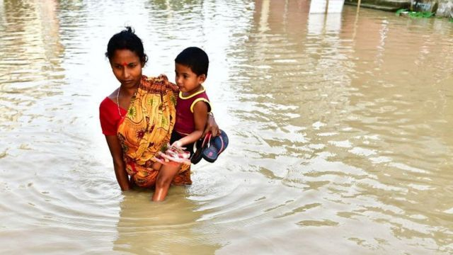
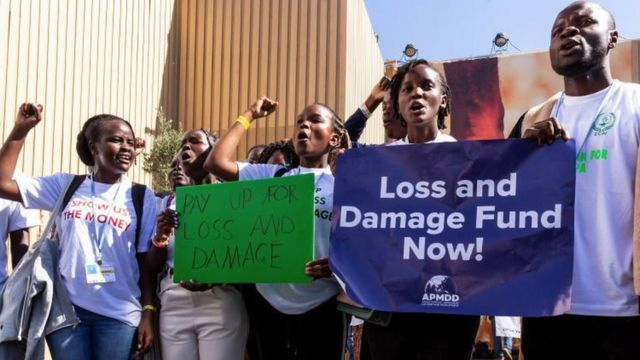
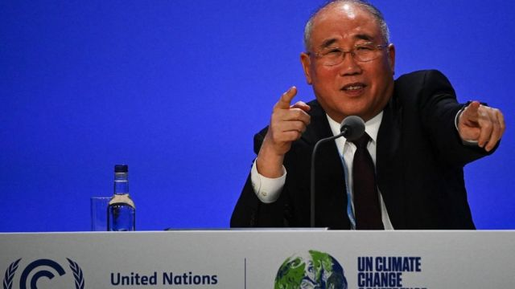
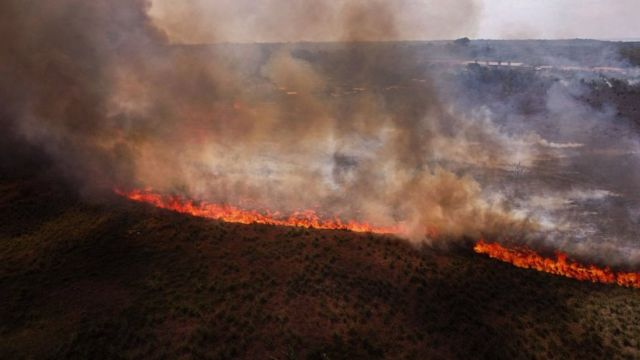

# [Science] 联合国气候变化大会：中国和印度是否应该为气候资助基金买单

#  联合国气候变化大会：中国和印度是否应该为气候资助基金买单

  * 纳文·辛格·卡达（Navin Singh Khadka） 
  * BBC国际部环境事务记者 

> 图像来源，  Getty Images
>
> 图像加注文字，损失和损害气候基金的目标是为贫穷国家提供财政援助，以应对气候变化带来的负面影响，例如洪水

**中国和印度是世界上其中两个最大的温室气体排放国——中国排名第一，印度则排在第三。**

这两个国家也是主要的经济体，那么为什么对于两国是否应该为应对气候变化造成的“全球损失和损害基金”捐钱还是存在分歧？

让我们来看一看这个问题，它即将在第28次联合国气候大会（COP28，全称为“《联合国气候变化纲要公约》缔约方第二十八届会议”）上进行辩论——本届气候大会将在迪拜举行。

##  什么是“损失和损害基金”？

根据联合国在2022年的一份报告，至2030年，发展中国家将需要每年3000多亿美元来应对气候变化。

经过发达国家和发展中国家多年的分歧协商之后，“损失和损害基金”在去年的第27次气候大会上得以原则上建立。

该基金的目标是为贫穷国家提供财政援助，以应对气候变化带来的负面影响——例如帮助因海平面上升而被迫迁离的社群，或帮助森林大火后的重建。

但是目前基金当中尚没有任何资金，而且对谁将资助该基金以及细节上将如何运作等也未有具体细节，很多问题仍然未有答案。

##  谁应为此付钱？

美国是发达国家，也是世界第二大温室气体排放国。它和其他发达国家均表示，中国和印度应该加入它们的行列，不仅要大幅减少排放量，进行有意义的国际气候行动，而且还应该为基金会提供资金。

但是中国和印度并不同意。两国认为，与英美等发达国家长久的排放历史相比，中印的高排放水平是近代发展才出现的现象。

两国还声称，根据1992年签署的《联合国气候变化框架公约》（UN Framework Convention on Climate Change），它们仍是发展中国家，因此实际上有资格获得损失和损害基金的资助，而不是被要求捐款。

> 图像来源，  Getty Images
>
> 图像加注文字，经过多年的谈判和辩论，损失和损害基金成立了，但目前还没有钱。

在第27届气候大会以来的一年时间里，各国已经就如何令基金奏效已有过激烈的辩论，并最终在2023年10月就一系列建议达成一致。

现在这些建议仍需在第28次大会上获得批准。建议“敦促”发达国家支持“损失和损害基金”，并“鼓励”其他国家自愿支持。

相关建议还明确指出，所有发展中国家都有资格申请资助。

但是，谈判代表指，建议并未结束发达国家与中印等主要发展中国家之间关于谁应为基金付钱、谁又应该获得资助等问题上的紧张分歧。

“财政的来源仍是主要争论点，现在争论是暂搁置了，”一名要求匿名的西方国家谈判代表这样说道。

##  谁应获得资助？

中国在2006年超过美国，成为最大的二氧化碳排放国。

但是中国和印度都辩称，气候危机是由发达国家排放的温室气体造成的，这可以上溯到工业时代发端的1850年代。

这两个亚洲大国还指出在《联合国气候变化框架公约》当中提到的“共同但有差别的责任”原则，大致是指所有国家均有责任减少温室气体排放，但其责任的份额取决于各国的发展需求。

> 图像来源，  Getty Images
>
> 图像加注文字，中印两大经济体均表示，自己是发展中国家，应获得基金资助。

很多公民社会组织和气候活动家也支持这一论调。

“我们现在看到的巨大损失和损害，是30年来发达国家在加快减排并向发展中国家提供气候融资方面拖拖拉拉的结果 ，” 海因里希·伯尔基金会（Heinrich Boll Stiftung）助理总监莉亚娜·沙勒卡特（Liane Schalatek）说。这家总部在美国的机构密切跟踪着有关损失和损害基金的谈判。

“要求发展中国家与发达国家同步向新的基金会付钱，在道义上是错误和虚伪的，”她说。

然而，发达国家却认为，对发达和发展中国家的划分已经过时，需要修订。

在1992年，各国被划分为发达国家和发展中国家。批评者认为，在那之后已经发生了很多变化，特别是像中国和印度这样的国家，现在都是主要经济体，也都属于温室气体排放量最大的国家。

“我们不仅希望中国和印度，还希望阿联酋和沙特——这些根据1992年名单仍属于发展中国家的国家——更多地将自己视为资金的贡献者而不是接受者，”上文中的匿名谈判代表补充道。

一些小岛国也附和了这一说法。

##  道义责任

米凯·罗伯逊（Michai Robertson） 是“小岛屿国家联盟”（Alliance of Small Island States）的损失和损害财政谈判代表。

他认为，像中国和印度这样的主要经济体需要承担一些“参与这个基金的道义责任”。

“在建议中有‘鼓励其他方提供资金’的字眼，就是整个委员会（包括发达国家和发展中国家）都认可，我们不仅需要发达国家，也需要其他方参与进来。”

> 图像来源，  Getty Images
>
> 图像加注文字，2022年的一份联合国报告指，至2030年，发展中国家将需要每年3000多亿美元来应对气候变化。

不过，这并不是气候基金第一次花费很长时间来解决有关问题。

在与一位基督教援助组织的政策和倡议事务官员谈话时，他把有关气候问题“损失和损害基金”的辩论与之前一项气候融资承诺作对比，后者至今仍未兑现。

“既然联合国十多年来在气候谈判中存在着信任赤字，那么很多发展中国家现在将此视为一种拖延政策便不足为奇，”罗斯·菲茨帕特里克（Ross Fitzpatrick）说。

“这种信任赤字的最佳体现，就是富裕国家过去曾承诺从2020年开始每年提供1000亿美元作气候融资之用，却没有履行。”

这1000亿美元的气候融资承诺与“损失和损害气候基金”是分开的，由发达国家在2009年哥本哈根的气候峰会上作出。

新德里研究损失与损害基金谈判问题的“气候趋势”组织（Climate Trends）主管阿拉蒂·科斯拉（Aarati Khoslaof）表示，只要上述这一承诺未兑现，主要发展中国家就永远有借口延迟敲定损失和损害气候基金的细节。

“这成为了责任演变的论据，”她表示，“……发达国家不先履行自己过去所作的承诺，要中国和印度为这个基金付钱就变得不那么理直气壮了。”

