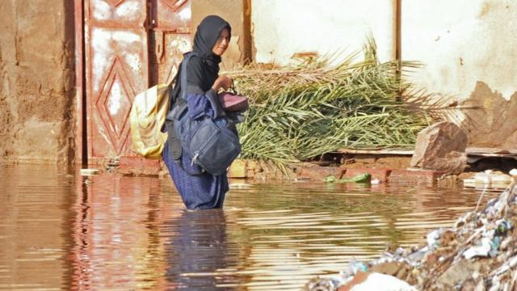

# [Science] COP28：在产油国举行气候大会的争议、惊喜和政治博弈

#  COP28：在产油国举行气候大会的争议、惊喜和政治博弈

> 图像来源，  Getty Images
>
> 图像加注文字，将近10万人在迪拜参加了联合国举行的COP28大会。

**11月30日到12月12日，《联合国气候变化框架公约》第二十八次缔约方大会（COP28）在阿联酋迪拜召开，相比于往年，此次会议有颇多看点：**

参会规模史上最大；在全球最大产油国之一阿联酋召开；超过140位政府首脑、元首和国际组织负责人到会；会议将做出多项重要决定，包括“损失与损害”基金安排的决议。

作为全球最大两个碳排放国，美国总统拜登和中国国家主席习近平没有出席会议，但两国分别派出气候特使约翰·克里和副总理丁薛祥出席。

本届大会为什么重要？有哪些看点？BBC中文为您一一梳理。

##  规模最大、史上最热

去年的COP27在埃及的沙姆沙伊赫举行，2021年在英国的格拉斯哥举行，但这两届大会正处于新冠疫情之中，会议规模受到影响。

本届大会的会议规模为去年的两倍左右，是1992年开展该会议至今规模最大的一次。其中重要的原因之一是中国代表团的加入，从中央政府到地方政府，再到各类企业，以及开设的“中国角”场馆，使参展人数和活动数量都创下纪录。

会议期间，世界气象组织适时发布今年全球气候状况报告，声称2023年为人类有记录以来最热的一年，平均气温较工业化之前（1850年至1900年，即化石燃料广泛使用之前）高出1.4摄氏度，而且在今年三分之一的日子里，该数字是高出1.5摄氏度。

科学家普遍认为，为了避免气候变化带来破坏性影响，人类需要使该数字长期保持在1.5摄氏度以下。基于此认识，2015年12月，各国政治领导人齐聚巴黎，签署《巴黎协定》，将本世纪全球气温的长期升幅控制在“远低于”2摄氏度，并尽一切努力将其控制在1.5摄氏度以下。

《巴黎协定》所设定的阈值并不意味着要在每一天或每一周都控制在阈值之下，而是在20年或30年的时间段的平均值。目前，这一平均值为1.1度到1.2度之间，但随着今年超过1.5度的次数越来越多，从长远来看，全球就越接近突破这一临界值。

你的裝置可能不支持這一可視化效果

目前来看，COP28上的参会者做出的最新承诺，将有助于达到上述目标。

约100个国家承诺到2030年将全球可再生能源使用量增加到目前的三倍；同时，包括沙特巨头阿美石油公司（Aramco）在内的50家石油和天然气公司承诺到2050年停止新增温室气体。

但值得注意的是，这些能源公司所承诺的，只包括生产过程中的排放，而不包括化石燃料燃烧过程中的排放，批评者认为这并不能有意义地应对气候变化。不少与会国家认为，这将有助于最迟在 2050 年将化石燃料从世界能源系统中清除。

包括欧盟和COP28东道国阿拉伯联合酋长国（UAE）在内的支持者希望将这一承诺纳入COP达成的最终协议中，这意味着与会的近200个国家都将签署这一协议。

气候组织对增加可再生能源的承诺表示谨慎欢迎，但认为石油和天然气公司的承诺是在“洗绿”（green washing）。气候分析公司（Climate Analytics）首席执行官、多份联合国气候变化报告的作者比尔·黑尔（Bill Hare）教授说，“我对此持怀疑态度。石油和天然气行业面临的真正挑战是摆脱石油和天然气生产。说到底，其他一切都不重要。”

##  在产油国开的气候大会

此次COP28最大争议点在于东道主阿联酋。最重要的气候大会，却选择在全球十大产油国之一举行，本身就招致批评声，而当本届COP28大会的主席人选贾比尔（Sultan Ahmed al-Jaber）公布时，争议声进一步放大。

贾比尔作为COP28的主席，同时还是阿布扎比国家石油公司（Adnoc）的主席，这家公司2021年每天抽取270万桶石油，并计划在2027年之前产能翻一番。

> 图像来源，  UN CLIMATE CHANGE/KIARA WORTH
>
> 图像加注文字，贾比尔既是气候大会的主席，又是大型石油公司的主席。

环保人士格丽塔·通贝里（Greta Thunberg）认为任命贾比尔“无比荒谬”，并表示这使整个联合国气候进程受到质疑。来自美国和欧盟的130多名立法者致函联合国，要求解除他的职务。

贾比尔辩解称，他在推动石油和天然气行业采取行动方面具有得天独厚的优势，而且作为阿联酋可再生能源公司马斯达尔（Masdar）的董事长，他还负责风能和太阳能等清洁技术的发展。

争议虽然未能改变东道国和主席人选，但一直持续到COP28开幕前。BBC在上周一报道称，阿联酋在利用COP28这个国际场合达成石油和天然气交易，一份泄漏文件显示，阿联酋计划与15个到访迪拜的国家讨论化石燃料的交易。

上述泄漏文件是阿联酋的COP28团队准备的与27场外国政府会面的谈话要点——比如一份涉及中国的文件称，阿布扎比国家石油公司（Adnoc）愿意共同评估在莫桑比克、加拿大和澳大利亚的液化天然气的机会；再比如，该文件建议与一位哥伦比亚部长会谈时表示，阿布扎比国家石油公司“随时准备”支持哥伦比亚开发其化石燃料资源。

文件中还有针对德国和埃及等其他13个国家的谈话要点，暗示阿布扎比国家石油公司希望与这些国家的政府合作开发化石燃料项目。

贾比尔指责这些报道是“虚假的、不真实的、不正确的、不准确的”，旨在破坏他担任COP28主席期间的工作，而他本人“从未见过他们提到的这些谈话要点，我甚至从未在讨论中使用过这些谈话要点”。

BBC的发言人则表示，该调查是按照最高编辑标准进行了深入研究的。

> 图像来源，  Getty Images
>
> 图像加注文字，生产石油时排放的甲烷对温室效应的影响大于二氧化碳。

##  化石能源的存废

在上述争议声中，本届COP28还将讨论一个重要的话题——煤炭、石油和天然气等化石能源的未来。

核心在于最后各方所签署的协议中对该问题的用词。贾比尔呼吁“逐步减少”（phase down）化石燃料的使用，即随着时间的推移逐步减少，但不是完全停止。而欧盟和其他团体预计将推动“逐步淘汰”（phase out）。

联合国环境规划署（UN Environment Programme）最近的报告显示，目前正在生产或建设中的化石燃料产能已经远远超过将全球升温控制在1.5摄氏度以内所能燃烧的化石燃料。

在COP28会场，联合国秘书长古特雷斯呼吁，“只有我们最终停止燃烧所有化石燃料，才有可能实现1.5℃的（升温）上限……各国政府应当采取多种措施，包括监管、立法、对碳制定公平的价格、停止补贴化石燃料、对化石燃料公司的利润征收暴利税（windfall tax）等等，逐步实现向可再生能源的转变。”

古特雷斯同时喊话化石能源企业，“不要重复过时的商业模式。利用你们现有的资源，引领向可再生能源的过渡。”

而欧佩克（OPEC）成员国等主要油气出口国反对淘汰化石燃料，他们中不少认为，未来几十年，人类依然持续有化石能源的需求。在去年的埃及COP27上，80多个国家共同要求“逐步淘汰”所有化石燃料，但这一呼吁最终未被写入大会决议。沙特等主要能源出口国反对淘汰化石燃料，强调应推广碳捕获、碳封存等技术。

今年的大会最终如何决定化石能源的未来，将可以在12月12日最终协议的用词中，窥得一二。

##  钱、钱、钱！

COP28大会上也有意外惊喜，在11月30日大会首日，与会各国代表就通过了关于“损失与损害”基金安排的决议，让这项延宕已久的安排突然成为现实。该基金将使发达国家进一步向发展中国家提供应对气候变化的资金。

谢菲尔德大学教授迈克尔·雅各布斯（Michael Jacobs）表示，“他们在第一场会议上就达成协议，这是整个会议最重要的部分之一，也是非常有争议的部分，就在几周前，美国还对有关损失和损害基金的文本不满意，而今天却同意了。”

按照决议，该基金将所有发展中国家开放，先由世界银行托管4年，并要求各国自愿捐赠。在成立基金的决议顺利通过后，大会主席贾比尔说，“我们今天创造了历史！”

随即，贾比尔宣布阿联酋将为该基金提供1亿美元的资金。各国开始了现场认捐的环节，德国表示捐款1亿美元，英国表示至少5050万美元（苏纳克之后发言称6000万英镑），日本表示1000万美元。欧盟在一个多小时后表示，包括德国在内整个欧盟将捐款2.45亿美元。

美国给出的数额为1700万美元，有国家认为这与美国的实力和责任不匹配，并且质疑交由世界银行托管能否保证公平性。

全球各国在温室气体排放所承担的责任、所遭受的影响并不平均。很多发展中国家认为，欧美国家是过去两百年来主要排放国，但太平洋岛国和非洲穷国却在当前遭受更多气候危害。

> 图像来源，  Getty Images
>
> 图像加注文字，苏丹在气候危机中大受影响，或可得益于损失与损害基金。

基于这一理念，上世纪90年代，瓦努阿图率先提出发达国家应对深受影响的国家进行气候补偿。然而，过去30年来，富裕国家竭力反对这一想法，因为它们担心这样一来必须为其历史上的所有碳排放支付“补偿”。

直到去年埃及COP27上，这一想法的道德力量赢得胜利，各国同意设立这样一个基金。过去一年，各国就基金的规则、运作以及谁应该出资的问题争论不休。

甚至直至大会开幕前一天，美国总统气候问题特使克里还在一场线上新闻吹风会上对此表示，“今年一整年，我们一直在与过渡委员会的其他成员密切合作，以设计一个基于合作、不涉及责任或赔偿的有效基金。”他还表示，希望所有国家都知道，捐款并不意味着他们接受该基金是对历史性排放的赔偿。

在本届大会前，各国仅达成一项临时性协议。然后等待大会上全体会员才有机会对文本进行细致梳理，并提出异议，一般这一步会伴随着巨大争议，各方再进一步谈判直至全体国家接受，通常会在会议最后一天达成一份妥协后的版本。

因此，当会议第一天就通过如此重要的协议，会令外界惊讶，路透社称其为“早来的胜利”。

##  中国与美国：不止是气候，还关乎政治

从2018年贸易战以来，中美进入剑拔弩张的五年，期间起伏不定，而气候问题比较特殊——

  * 一方面，当中美关系遭受重大挫折，比如去年八月佩洛西访问台湾，中国就暂停中美气候变化商谈； 
  * 另一方面，中美关系好转时，往往率先选择在气候问题上合作，释放信号。比如，今年11月15日，习近平和拜登会谈，修复两国关系，同一天中美发布关于加强合作应对气候危机的阳光之乡声明，将甲烷纳入各自的2035年减排计划，并共同努力控制其他非二氧化碳温室气体排放，遏制森林减少和塑料污染。 

中美作为世界上最大的两个碳排放国和经济体，他们在应对气候危机上的合作受到外界关注，但深入细节之中，两国的站位和利益并不一致。

站在美国的角度，如上述所言，主要担心对历史性碳排放的补偿。同时美国还要求，中国也加入它的行列，不仅大幅度减排，而且应该为“损失与损害”基金捐款。

站在中国的角度，并不同意这一点，中国认为自己与英美等发达国家长久的排放历史相比，当前的高排放仅仅是近几十年的事情。而且，根据1992年签署的《联合国气候变化框架公约》（UN Framework Convention on Climate Change），中国仍是发展中国家，因此实际上有资格获得损失和损害基金的资助，而不是被要求捐款。

克里在上述吹风会上曾表示，“如果中国和美国不积极推进减排，我们就无法赢得这场战斗。”

虽然COP28以“团结、行动、落实”为主题，但参会的孟加拉气候特使还是表示，全球不够团结是遏止气候变迁的主要障碍。

