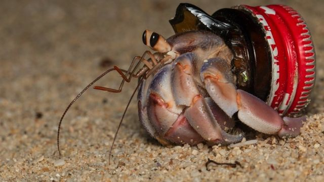
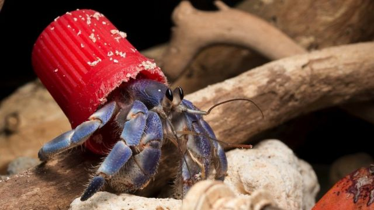
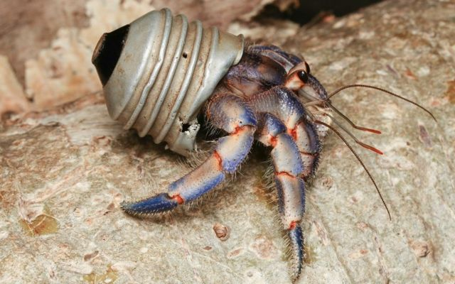

# [Science] 塑料与海洋环境：“身穿”塑料垃圾的寄居蟹

#  海洋环境：“身穿”塑料垃圾的寄居蟹

  * 维多利亚·吉尔（Victoria Gill） 
  * BBC科学事务记者 

> 图像来源，  Shawn Miller

**寄居蟹通常寄居于其他动物的壳中，将其当作自己的盔甲。但现在，世界各地的寄居蟹却越来越多地寄居在塑料垃圾中。**

这一结论是基于对野生动物爱好者拍摄并发布在网上的照片的分析得出的。

科学家们表示，看到这些动物寄生于垃圾中的情况，他们感到“心碎”。

他们说，三分之二的寄居蟹被拍到生活在“人造壳”中，即人类丢弃的物品。

这一发现发表在《整体环境科学》（Science of the Total Environment）杂志上。

研究人员之一、华沙大学城市生态学家玛尔塔·苏尔金（Marta Szulkin）解释说，这项研究利用了社交媒体和照片分享网站的内容，“我们开始注意到一些完全不同寻常的东西。”

“它们不会像我们以前看到的那样戴着美丽的螺壳，而是会在背上背一个红色的塑料瓶盖或一个灯泡。”

> 图像来源，  Shawn Miller
>
> 图像加注文字，研究人员在照片中看到寄居蟹所利用的绝大多数物品，都是塑料制品。

她和华沙大学的同事祖扎娜·贾吉洛（Zuzanna Jagiello）和武卡斯·迪莱夫斯基（Łukasz Dylewski）共发现了386只个体使用了人造壳——主要是塑料瓶盖。

“根据我们的计算，世界上16种陆生寄居蟹中，有10种使用该类型的庇护所，而且在地球上所有的热带地区都观察到这种情况。”苏尔金教授解释说。

目前还不清楚对这些脆弱的小甲壳类动物来说，这些材料是有害还是有益的。

“当我第一次看到这些照片时，我感到心碎。”苏尔金教授对BBC广播第四台的《科学内幕》（Inside Science）节目说道。“与此同时，我认为我们真的需要了解这样一个事实：我们生活在一个不同的时代，动物们也在物尽所用。”

##  争夺塑料

这项基于互联网内容的生态研究显示，使用人造贝壳是一种“全球现象”。

“我们在三分之二的陆生寄居蟹物种中看到了这种现象。”苏尔金教授说。“这是我们仅通过游客拍摄的照片就能识别出来的。”

研究人员表示，这些发现揭示了这些沿海甲壳类动物如何与塑料互动和使用塑料的新问题。除了了解塑料是否会对它们造成伤害，科学家们还想研究塑料会如何影响它们的进化。

这群寄居蟹已经适应了靠捡拾和使用废弃的螺壳来保护它们脆弱的身体。当这些壳数量不足时，寄居蟹就会争抢它们。

> 图像来源，  Shawn Miller

苏尔金教授解释说：“我们不知道的是，这种新趋势对它们的影响有多大，也不知道这些蟹是否会争抢人造塑料壳。”

该研究者说，天然螺壳的数量正在减少，所以她怀疑动物们可能会更易找到人工替代品。更轻的塑料'壳'甚至可以帮助更小、更弱的寄居蟹生存，因为它们更易携带。

当然，海洋环境中有大量的塑料可供动物选择。最近一项试图量化塑料污染规模的研究估计，目前至少有171万亿个塑料碎片漂浮在我们的海洋中。

专家警告说，如果不采取行动，到2040年，这一数字可能会增加近两倍。

但人们希望，2024年各国能最终签署一份期待已久的全球条约，以结束塑料的危害。

伦敦大学学院材料与社会学教授马克·米奥多尼克（Mark Miodownik）对BBC说，这些画面给人类上了一课。“就像寄居蟹一样，"他说，“我们应该更多地循环使用塑料，而不是丢弃它们。”

