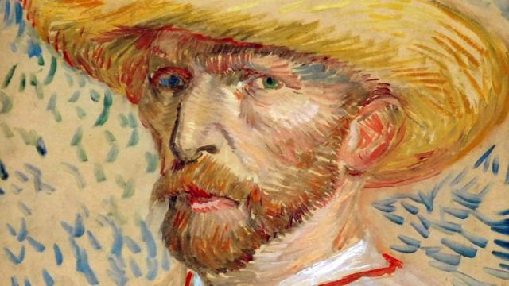
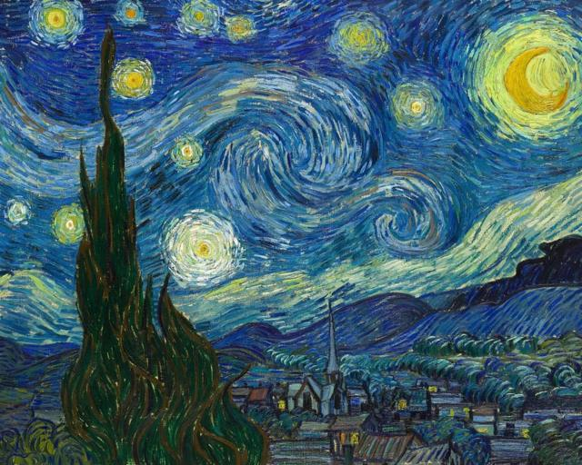
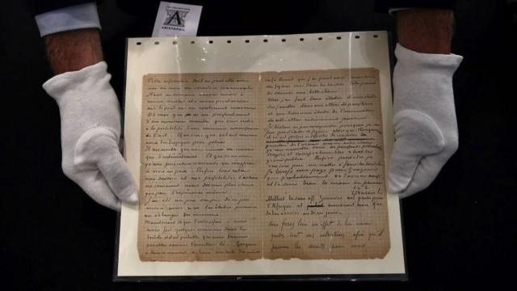
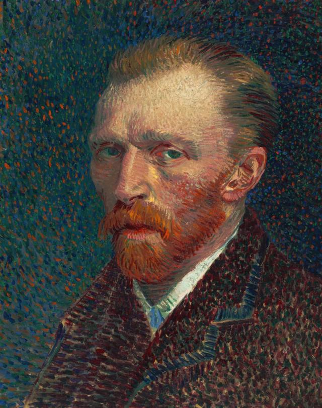
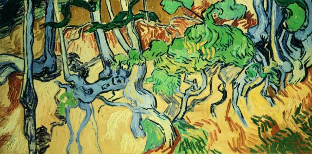

# [Science] 什么是双相情绪障碍症？为何它与艺术巨匠梵高有关？

#  什么是双相情绪障碍症？为何它与艺术巨匠梵高有关？

> 图像加注文字，梵高作品《戴草帽的自画像》。

**众所周知，荷兰艺术家文森特·梵高（Vincent van Gogh）有精神健康问题：他割掉了自己的左耳，又于两年后（1890年）自杀身亡。但关于他病情的确切性质一直存在诸多争论。**

然而，对一个已经去世的患者进行诊断是一项复杂的任务，关于梵高患有哪些疾病也众说纷纭。

荷兰学者在2020年进行了一项研究，以梵高的近1000封信为证据，试图诊断梵高的病症。

在每年源自梵高生日（3月30日）的“世界双相情感障碍日”（World Bipolar Day）到来之际，BBC采访了其中一位作者。

##  梵高与双相情绪障碍症

> 图像来源，  Corbis via Getty Images
>
> 图像加注文字，1889年，荷兰后印象派画家文森特·梵·高在法国普罗旺斯圣雷米郊外的一家精神病院住院期间创作了《星夜》。

梵高从青少年时期起就饱受各种精神健康问题的困扰，在经历了一次精神健康危机后， 他割掉了自己的部分左耳  ，并因此而闻名。

1890年7月，他在巴黎郊外的田野里开枪自杀。两天后，他因伤势过重不治身亡，年仅37岁。

在梵高自杀前的几年里，关于他的精神健康状况的确切性质有很多相互竞争的理论，但最有说服力的一种说法是梵高患有“双相情绪障碍症”（Bipolar disorder，又被称为“躁郁症”）。

##  什么是双相情绪障碍症？

**重要事实：**

  * 这是一种影响情绪的心理健康状况，其特征是从一个极端到另一个极端的剧烈波动。 
  * 这是一种相对常见的疾病，估计每100人中就有1人患病。 
  * “双相情绪障碍症”有不同的类型。“I型”患者会经历躁狂高潮和抑郁低谷。“II型”患者会经历严重抑郁和轻度躁狂发作（称为轻度狂躁），持续时间较短。循环性情感症患者的情绪波动较轻，但持续时间较长。 
  * 尽管双相情绪障碍症可以发生在任何年龄段，但青春期晚期的人尤其容易患上，因为它通常在15岁至19岁之间发病。 
  * 双相情绪障碍症的每次极端发作都可持续数周（甚至更长时间）。 

**治疗方法包括：**

  * 被称为情绪稳定剂的长期药物可以防止躁狂和抑郁症发作。 
  * 在症状发作时使用药物治疗。 
  * 心理治疗有助于应对抑郁症。 
  * 生活方式建议——定期锻炼、改善饮食和增加睡眠。 

自从这项研究引用的一本1938年德国出版的书籍首次阐述双相情绪障碍理论以来，梵高就一直与该病症联系在一起。

但是，我们如何确定他患有这种疾病，而不是精神分裂症、神经性梅毒或中毒等其他疾病呢？

答案就在于他留下的证据。

> 图像来源，  AFP
>
> 图像加注文字，梵高是一位多产的书信作家——这封信是与他的朋友兼艺术家同事保罗·高更合写的。

“我们有幸研究了梵高写给他哥哥和其他人的近1000封信，并以此为基础得出了结论。”2020年研究的作者之一、荷兰格罗宁根大学（University of Groningen）精神病学退休教授威廉·诺伦（Willem Nolen）说。

他告诉BBC，这些信件让他的团队有机会研究症状的证据，以便做出诊断。

作者们的目的是对作为患者的梵高进行“广泛的诊断性访谈”，以分析他的精神状况，尽管他们认识到这位画家并非为医生写下这些信，而且他的描述可能并不总是完全诚实。

“他在给弟弟的信中夸大了自己的症状，因为他需要更多的钱和支持。但你也可以想象，当他写信给其他家庭成员（包括他的母亲）时，他可能会把症状说得不那么严重。”诺伦教授说。

> 图像来源，  Willem Nolen
>
> 图像加注文字，诺伦教授是一位训练有素的精神病学家，也是该研究的作者之一。

诺伦教授亲自翻阅了全部的六卷信件，荷兰梵高博物馆（Van Gogh Museum）的三位艺术史学家也为这项研究接受访问，他们都是研究梵高生活和工作的专家。

研究人员在《国际双相情感障碍杂志》（International Journal of Bipolar Disorders）上发表的这项研究得出的结论是，梵高患有双相情绪障碍症，具有边缘型人格障碍的特征，“很可能因饮酒和营养不良而恶化”。

在生前，梵高也不完全清楚自己到底出了什么问题。他曾写道：“精神或神经发烧或疯狂，我不知道该怎么说，也不知道该如何命名”。可能是为了让家人放心，他最初也将其描述为“一场简单的艺术家的发狂”。

> 图像来源，  Heritage Images via Getty Images
>
> 图像加注文字，梵高一生至少画了35幅自画像，这幅是1887年画的。

但该研究的作者发现，有证据表明他在青春期曾患有抑郁症，符合边缘型人格障碍的标准；酗酒，并有自残行为。但有迹象表明，他经历了明显的抑郁和躁狂阶段，这表明他患有双相情绪障碍症。

“目前还不完全清楚他患的是哪种双相情绪障碍，因为尽管他的抑郁发作显然非常严重，”诺伦教授说。“但我们无法从信件中判断他是否在社交方面患有躁狂症”。

我们从梵高的艺术作品中了解到，在他的一生中，特别是在生命的尽头，他的创作力非常旺盛，至少画了35幅自画像和许多以向日葵为主题的作品。

诺伦教授说，梵高可能是在轻度躁狂状态下画了更多的画，双相情绪障碍症的这一阶段有时与极端创造力的爆发有关：许多名人都公开谈论过自己患上障碍症的经历，如玛丽亚·凯莉（Mariah Carey）、黛米·洛瓦托（Demi Lovato）、塞莱娜·戈麦斯（Selena Gomez）和碧碧·雷克萨（Bebe Rexha），以及许多其他音乐家、演员和艺术家——无论是在世还是去世的——都曾描述过与该病症非常相似的症状。

诺伦教授说，在梵高的书信和艺术作品中，也有同样有力的证据表明他经历了抑郁阶段。

> 图像来源，  Getty Images
>
> 图像加注文字，这是梵高在1890年创作的《树根和树干》，许多人认为这是艺术家去世前创作的最后一幅画。

梵高“至少有10次抑郁发作，甚至更多，而且尽管他在精神病院住了一年多，抑郁还是越来越严重”。

诺伦教授说，在严重的抑郁发作期间，梵高画得不多，有时甚至根本不画——“或者他画的是非常悲伤的画，是其他人无法比拟的”。

梵高一生都在挣扎，无论是作为一名艺术家的职业生涯（他只卖出过一幅画）还是与他的精神健康作斗争，但诺伦教授认为，如果这位艺术家今天还活着，结局可能会截然不同。

“他可能会被诊断出来，有人会建议他不要酗酒，也许他就不会陷入抑郁和躁狂发作。”

“很难说这是否会影响他成为一名画家，但他可能不会自杀。”

**珍惜生命，自杀不能解决问题，生命一定可以找到出路。**

**若须咨商或相关协助，请联系：**

中国大陆（ **+86** ）：希望24热线 4001619995

香港（ **+852** ）：撒玛利亚防止自杀会 23892222；明爱向晴轩 18288；生命热线 2382 0000

澳门（ **+853** ）：澳门明爱生命热线 2852 5222

台湾（ **+886** ）：生命线 1995；张老师服务专线 1980；台湾自杀防治中心 0800 788 995

新加坡（ **+65** ）：新加坡援人协会（Samaritans of Singapore, SOS） 1800 221 4444

马来西亚（ **+60** ）：生命线协会 (03) 4265 7995；Befrienders (03) 7956 8145

英国（ **+44** ）：BBC Action Line www.bbc.co.uk/actionline；撒玛利亚会 08457 90 90 90

世界各地： Befrienders International 

