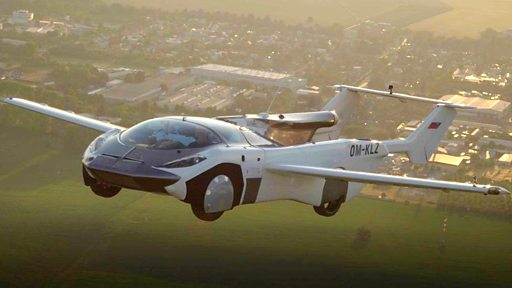

# [Science] “飞行汽车来了”？中国公司收购欧洲飞行汽车技术专利

#  “飞行汽车来了”？中国公司收购欧洲飞行汽车技术专利

**“飞行汽车来了”？中国公司收购欧洲飞行汽车技术专利**

在欧洲研发并试飞成功的飞行汽车“AirCar”已将相关技术专利出售给一家中国公司。

2021年，由欧洲企业“克雷恩愿景”（Klein Vision）开发的飞行汽车“AirCar”，由BMW宝马引擎提供动力，利用跑道起降，在捷克斯洛伐克两个机场间成功完成35分钟的试飞。

仅需两分多钟，“AirCar”就可完成从汽车到飞机的转换。

总部位于中国沧州的河北建新飞行汽车科技公司已与“克雷恩愿景”签订出售飞行汽车技术的协议，拥有在特定地区的制造和使用权。

飞行汽车（AirCar）的创建者“克雷恩愿景”公司联合创始人安东·扎亚克（Anton Zajac）表示，此前在收购了另一家斯洛伐克飞机制造商后，该公司已经建立了自己的机场和飞行学校。

中国正引领电动汽车的发展，目前也在积极开发飞行运输解决方案。

上个月，由上海峰飞航空科技有限公司研制的电动垂直起降航空器（eVTOL）“盛世龙”，在深圳和珠海两座城市之间成功完成了全球首条跨海跨城电动垂直起降航空器航线的公开首次演示飞行。

据报道，虽然飞机上没有乘客，但是这段驾驶汽车需要2.5到3小时的旅程，在20分钟内就完成了。

2023年，中国亿航公司的电动飞行出租车获得了中国官方颁发的安全证书。英国政府表示，到2028年，飞行出租车可能成为空中的常态。

