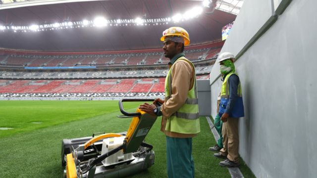
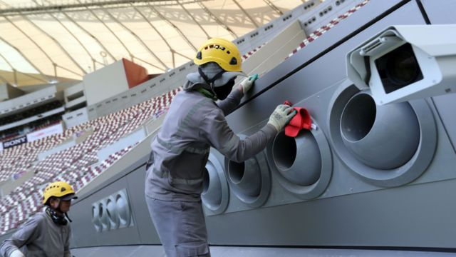

# [Sports] 卡塔尔世界杯：备受争议的外国劳工人权问题是怎么回事

#  卡塔尔世界杯：备受争议的外国劳工人权问题是怎么回事

> 图像来源，  Getty Images

**足球迷们很快就要亲临卡塔尔观看世界杯决赛圈比赛，而他们所住的酒店和观看比赛的球场，是由数以万计移民劳工所建造。**

而卡塔尔对待这些劳工的方式，受到了密切的关注。

Click to expand

##  2022 FIFA世界盃

  * 小組賽 
  * 淘汰賽 

###  淘汰賽

  * 十六強淘汰賽 

    * 12月3日， 15：00 GMT 

A組首名  非數值

\-

非數值  B組次名

(互射12碼)

非數值

\-

非數值

(互射12碼)

(哈利法國際體育場)

    * 12月3日， 19：00 GMT 

C組首名  非數值

\-

非數值  D組次名

(互射12碼)

非數值

\-

非數值

(互射12碼)

(艾哈邁德·本·阿里體育場)

    * 12月4日， 15：00 GMT 

D組首名  非數值

\-

非數值  C組次名

(互射12碼)

非數值

\-

非數值

(互射12碼)

(阿爾圖瑪瑪體育場)

    * 12月4日， 19：00 GMT 

B組首名  非數值

\-

非數值  A組次名

(互射12碼)

非數值

\-

非數值

(互射12碼)

(阿爾拜特體育場)

    * 12月5日， 15：00 GMT 

E組首名  非數值

\-

非數值  F組次名

(互射12碼)

非數值

\-

非數值

(互射12碼)

(阿爾賈努布體育場)

    * 12月5日， 19：00 GMT 

G組首名  非數值

\-

非數值  H組次名

(互射12碼)

非數值

\-

非數值

(互射12碼)

(974體育場)

    * 12月6日， 15：00 GMT 

F組首名  非數值

\-

非數值  E組次名

(互射12碼)

非數值

\-

非數值

(互射12碼)

(教育城體育場)

    * 12月6日， 19：00 GMT 

H組首名  非數值

\-

非數值  G組次名

(互射12碼)

非數值

\-

非數值

(互射12碼)

(盧塞爾體育場)

  * 半準決賽 

    * 12月9日， 15：00 GMT 

E1 v F2 勝方  非數值

\-

非數值  G1 v H2 勝方

(互射12碼)

非數值

\-

非數值

(互射12碼)

(教育城體育場)

    * 12月9日， 19：00 GMT 

A1 v B2 勝方  非數值

\-

非數值  C1 v D2 勝方

(互射12碼)

非數值

\-

非數值

(互射12碼)

(盧塞爾體育場)

    * 12月10日， 15：00 GMT 

F1 v E2 勝方  非數值

\-

非數值  H1 v G2 勝方

(互射12碼)

非數值

\-

非數值

(互射12碼)

(阿爾圖瑪瑪體育場)

    * 12月10日， 19：00 GMT 

B1 v A2 勝方  非數值

\-

非數值  D1 v C2 勝方

(互射12碼)

非數值

\-

非數值

(互射12碼)

(阿爾拜特體育場)

  * 準決賽 

    * 12月13日， 19：00 GMT 

半準決賽1 勝方  非數值

\-

非數值  半準決賽2 勝方

(互射12碼)

非數值

\-

非數值

(互射12碼)

(盧塞爾體育場)

    * 12月14日， 19：00 GMT 

半準決賽3 勝方  非數值

\-

非數值  半準決賽4 勝方

(互射12碼)

非數值

\-

非數值

(互射12碼)

(阿爾拜特體育場)

  * 季軍賽 

    * 12月17日， 15：00 GMT 

準決賽1 負方  非數值

\-

非數值  準決賽2 負方

(互射12碼)

非數值

\-

非數值

(互射12碼)

(哈利法國際體育場)

  * 決賽 

    * 12月18日， 15：00 GMT 

準決賽1 勝方  非數值

\-

非數值  準決賽2 勝方

(互射12碼)

非數值

\-

非數值

(互射12碼)

(盧塞爾體育場)

###  小組賽

小組

  * 小組  A 
  * 小組  B 
  * 小組  C 
  * 小組  D 
  * 小組  E 
  * 小組  F 
  * 小組  G 
  * 小組  H 

  * 賽  \-  已比賽場次 
  * 勝  \-  取勝場次 
  * 負  \-  告負場次 
  * 和  \-  平局場次 
  * 淨勝球  \-  得失球差 
  * 分  \-  積分 

  * ###  A組 

A組  球隊  |  賽  已比賽場次  |  勝  取勝場次  |  負  告負場次  |  和  平局場次  |  淨勝球  得失球差  |  分 積分  
---|---|---|---|---|---|---  
卡塔爾  |  0  |  0  |  0  |  0  |  0  |  0  
厄瓜多爾  |  0  |  0  |  0  |  0  |  0  |  0  
塞內加爾  |  0  |  0  |  0  |  0  |  0  |  0  
荷蘭  |  0  |  0  |  0  |  0  |  0  |  0  
  
      * 11月20日， 16：00 GMT 

卡塔爾  非數值

\-

非數值  厄瓜多爾

(互射12碼)

非數值

\-

非數值

(互射12碼)

(阿爾拜特體育場)

      * 11月21日， 16：00 GMT 

塞內加爾  非數值

\-

非數值  荷蘭

(互射12碼)

非數值

\-

非數值

(互射12碼)

(阿爾圖瑪瑪體育場)

      * 11月25日， 13：00 GMT 

卡塔爾  非數值

\-

非數值  塞內加爾

(互射12碼)

非數值

\-

非數值

(互射12碼)

(阿爾圖瑪瑪體育場)

      * 11月25日， 16：00 GMT 

荷蘭  非數值

\-

非數值  厄瓜多爾

(互射12碼)

非數值

\-

非數值

(互射12碼)

(哈利法國際體育場)

      * 11月29日， 15：00 GMT 

厄瓜多爾  非數值

\-

非數值  塞內加爾

(互射12碼)

非數值

\-

非數值

(互射12碼)

(哈利法國際體育場)

      * 11月29日， 15：00 GMT 

荷蘭  非數值

\-

非數值  卡塔爾

(互射12碼)

非數值

\-

非數值

(互射12碼)

(阿爾拜特體育場)

    * ###  B組 

B組  球隊  |  賽  已比賽場次  |  勝  取勝場次  |  負  告負場次  |  和  平局場次  |  淨勝球  得失球差  |  分 積分  
---|---|---|---|---|---|---  
英格蘭  |  0  |  0  |  0  |  0  |  0  |  0  
伊朗  |  0  |  0  |  0  |  0  |  0  |  0  
美國  |  0  |  0  |  0  |  0  |  0  |  0  
威爾士  |  0  |  0  |  0  |  0  |  0  |  0  
  
      * 11月21日， 13：00 GMT 

英格蘭  非數值

\-

非數值  伊朗

(互射12碼)

非數值

\-

非數值

(互射12碼)

(哈利法國際體育場)

      * 11月21日， 19：00 GMT 

美國  非數值

\-

非數值  威爾士

(互射12碼)

非數值

\-

非數值

(互射12碼)

(艾哈邁德·本·阿里體育場)

      * 11月25日， 10：00 GMT 

威爾士  非數值

\-

非數值  伊朗

(互射12碼)

非數值

\-

非數值

(互射12碼)

(艾哈邁德·本·阿里體育場)

      * 11月25日， 19：00 GMT 

英格蘭  非數值

\-

非數值  美國

(互射12碼)

非數值

\-

非數值

(互射12碼)

(阿爾拜特體育場)

      * 11月29日， 19：00 GMT 

伊朗  非數值

\-

非數值  美國

(互射12碼)

非數值

\-

非數值

(互射12碼)

(阿爾圖瑪瑪體育場)

      * 11月29日， 19：00 GMT 

威爾士  非數值

\-

非數值  英格蘭

(互射12碼)

非數值

\-

非數值

(互射12碼)

(艾哈邁德·本·阿里體育場)

回到頂部

  * ###  C組 

C組  球隊  |  賽  已比賽場次  |  勝  取勝場次  |  負  告負場次  |  和  平局場次  |  淨勝球  得失球差  |  分 積分  
---|---|---|---|---|---|---  
阿根廷  |  0  |  0  |  0  |  0  |  0  |  0  
沙特阿拉伯  |  0  |  0  |  0  |  0  |  0  |  0  
墨西哥  |  0  |  0  |  0  |  0  |  0  |  0  
波蘭  |  0  |  0  |  0  |  0  |  0  |  0  
  
      * 11月22日， 10：00 GMT 

阿根廷  非數值

\-

非數值  沙特阿拉伯

(互射12碼)

非數值

\-

非數值

(互射12碼)

(盧塞爾體育場)

      * 11月22日， 16：00 GMT 

墨西哥  非數值

\-

非數值  波蘭

(互射12碼)

非數值

\-

非數值

(互射12碼)

(974體育場)

      * 11月26日， 13：00 GMT 

波蘭  非數值

\-

非數值  沙特阿拉伯

(互射12碼)

非數值

\-

非數值

(互射12碼)

(教育城體育場)

      * 11月26日， 19：00 GMT 

阿根廷  非數值

\-

非數值  墨西哥

(互射12碼)

非數值

\-

非數值

(互射12碼)

(盧塞爾體育場)

      * 11月30日， 19：00 GMT 

波蘭  非數值

\-

非數值  阿根廷

(互射12碼)

非數值

\-

非數值

(互射12碼)

(974體育場)

      * 11月30日， 19：00 GMT 

沙特阿拉伯  非數值

\-

非數值  墨西哥

(互射12碼)

非數值

\-

非數值

(互射12碼)

(盧塞爾體育場)

    * ###  D組 

D組  球隊  |  賽  已比賽場次  |  勝  取勝場次  |  負  告負場次  |  和  平局場次  |  淨勝球  得失球差  |  分 積分  
---|---|---|---|---|---|---  
法國  |  0  |  0  |  0  |  0  |  0  |  0  
澳洲  |  0  |  0  |  0  |  0  |  0  |  0  
丹麥  |  0  |  0  |  0  |  0  |  0  |  0  
突尼西亞  |  0  |  0  |  0  |  0  |  0  |  0  
  
      * 11月22日， 13：00 GMT 

丹麥  非數值

\-

非數值  突尼西亞

(互射12碼)

非數值

\-

非數值

(互射12碼)

(教育城體育場)

      * 11月22日， 19：00 GMT 

法國  非數值

\-

非數值  澳洲

(互射12碼)

非數值

\-

非數值

(互射12碼)

(阿爾賈努布體育場)

      * 11月26日， 10：00 GMT 

突尼西亞  非數值

\-

非數值  澳洲

(互射12碼)

非數值

\-

非數值

(互射12碼)

(阿爾賈努布體育場)

      * 11月26日， 16：00 GMT 

法國  非數值

\-

非數值  丹麥

(互射12碼)

非數值

\-

非數值

(互射12碼)

(974體育場)

      * 11月30日， 15：00 GMT 

澳洲  非數值

\-

非數值  丹麥

(互射12碼)

非數值

\-

非數值

(互射12碼)

(阿爾賈努布體育場)

      * 11月30日， 15：00 GMT 

突尼西亞  非數值

\-

非數值  法國

(互射12碼)

非數值

\-

非數值

(互射12碼)

(教育城體育場)

回到頂部

  * ###  E組 

E組  球隊  |  賽  已比賽場次  |  勝  取勝場次  |  負  告負場次  |  和  平局場次  |  淨勝球  得失球差  |  分 積分  
---|---|---|---|---|---|---  
西班牙  |  0  |  0  |  0  |  0  |  0  |  0  
哥斯達黎加  |  0  |  0  |  0  |  0  |  0  |  0  
德國  |  0  |  0  |  0  |  0  |  0  |  0  
日本  |  0  |  0  |  0  |  0  |  0  |  0  
  
      * 11月23日， 13：00 GMT 

德國  非數值

\-

非數值  日本

(互射12碼)

非數值

\-

非數值

(互射12碼)

(哈利法國際體育場)

      * 11月23日， 16：00 GMT 

西班牙  非數值

\-

非數值  哥斯達黎加

(互射12碼)

非數值

\-

非數值

(互射12碼)

(阿爾圖瑪瑪體育場)

      * 11月27日， 10：00 GMT 

日本  非數值

\-

非數值  哥斯達黎加

(互射12碼)

非數值

\-

非數值

(互射12碼)

(艾哈邁德·本·阿里體育場)

      * 11月27日， 19：00 GMT 

西班牙  非數值

\-

非數值  德國

(互射12碼)

非數值

\-

非數值

(互射12碼)

(阿爾拜特體育場)

      * 12月1日， 19：00 GMT 

哥斯達黎加  非數值

\-

非數值  德國

(互射12碼)

非數值

\-

非數值

(互射12碼)

(阿爾拜特體育場)

      * 12月1日， 19：00 GMT 

日本  非數值

\-

非數值  西班牙

(互射12碼)

非數值

\-

非數值

(互射12碼)

(哈利法國際體育場)

    * ###  F組 

F組  球隊  |  賽  已比賽場次  |  勝  取勝場次  |  負  告負場次  |  和  平局場次  |  淨勝球  得失球差  |  分 積分  
---|---|---|---|---|---|---  
比利時  |  0  |  0  |  0  |  0  |  0  |  0  
加拿大  |  0  |  0  |  0  |  0  |  0  |  0  
摩洛哥  |  0  |  0  |  0  |  0  |  0  |  0  
克羅地亞  |  0  |  0  |  0  |  0  |  0  |  0  
  
      * 11月23日， 10：00 GMT 

摩洛哥  非數值

\-

非數值  克羅地亞

(互射12碼)

非數值

\-

非數值

(互射12碼)

(阿爾拜特體育場)

      * 11月23日， 19：00 GMT 

比利時  非數值

\-

非數值  加拿大

(互射12碼)

非數值

\-

非數值

(互射12碼)

(艾哈邁德·本·阿里體育場)

      * 11月27日， 13：00 GMT 

比利時  非數值

\-

非數值  摩洛哥

(互射12碼)

非數值

\-

非數值

(互射12碼)

(阿爾圖瑪瑪體育場)

      * 11月27日， 16：00 GMT 

克羅地亞  非數值

\-

非數值  加拿大

(互射12碼)

非數值

\-

非數值

(互射12碼)

(哈利法國際體育場)

      * 12月1日， 15：00 GMT 

加拿大  非數值

\-

非數值  摩洛哥

(互射12碼)

非數值

\-

非數值

(互射12碼)

(阿爾圖瑪瑪體育場)

      * 12月1日， 15：00 GMT 

克羅地亞  非數值

\-

非數值  比利時

(互射12碼)

非數值

\-

非數值

(互射12碼)

(艾哈邁德·本·阿里體育場)

回到頂部

  * ###  G組 

G組  球隊  |  賽  已比賽場次  |  勝  取勝場次  |  負  告負場次  |  和  平局場次  |  淨勝球  得失球差  |  分 積分  
---|---|---|---|---|---|---  
巴西  |  0  |  0  |  0  |  0  |  0  |  0  
塞爾維亞  |  0  |  0  |  0  |  0  |  0  |  0  
瑞士  |  0  |  0  |  0  |  0  |  0  |  0  
喀麥隆  |  0  |  0  |  0  |  0  |  0  |  0  
  
      * 11月24日， 10：00 GMT 

瑞士  非數值

\-

非數值  喀麥隆

(互射12碼)

非數值

\-

非數值

(互射12碼)

(阿爾賈努布體育場)

      * 11月24日， 19：00 GMT 

巴西  非數值

\-

非數值  塞爾維亞

(互射12碼)

非數值

\-

非數值

(互射12碼)

(盧塞爾體育場)

      * 11月28日， 10：00 GMT 

喀麥隆  非數值

\-

非數值  塞爾維亞

(互射12碼)

非數值

\-

非數值

(互射12碼)

(阿爾賈努布體育場)

      * 11月28日， 16：00 GMT 

巴西  非數值

\-

非數值  瑞士

(互射12碼)

非數值

\-

非數值

(互射12碼)

(974體育場)

      * 12月2日， 19：00 GMT 

喀麥隆  非數值

\-

非數值  巴西

(互射12碼)

非數值

\-

非數值

(互射12碼)

(盧塞爾體育場)

      * 12月2日， 19：00 GMT 

塞爾維亞  非數值

\-

非數值  瑞士

(互射12碼)

非數值

\-

非數值

(互射12碼)

(974體育場)

    * ###  H組 

H組  球隊  |  賽  已比賽場次  |  勝  取勝場次  |  負  告負場次  |  和  平局場次  |  淨勝球  得失球差  |  分 積分  
---|---|---|---|---|---|---  
葡萄牙  |  0  |  0  |  0  |  0  |  0  |  0  
加納  |  0  |  0  |  0  |  0  |  0  |  0  
烏拉圭  |  0  |  0  |  0  |  0  |  0  |  0  
韓國  |  0  |  0  |  0  |  0  |  0  |  0  
  
      * 11月24日， 13：00 GMT 

烏拉圭  非數值

\-

非數值  韓國

(互射12碼)

非數值

\-

非數值

(互射12碼)

(教育城體育場)

      * 11月24日， 16：00 GMT 

葡萄牙  非數值

\-

非數值  加納

(互射12碼)

非數值

\-

非數值

(互射12碼)

(974體育場)

      * 11月28日， 13：00 GMT 

韓國  非數值

\-

非數值  加納

(互射12碼)

非數值

\-

非數值

(互射12碼)

(教育城體育場)

      * 11月28日， 19：00 GMT 

葡萄牙  非數值

\-

非數值  烏拉圭

(互射12碼)

非數值

\-

非數值

(互射12碼)

(盧塞爾體育場)

      * 12月2日， 15：00 GMT 

加納  非數值

\-

非數值  烏拉圭

(互射12碼)

非數值

\-

非數值

(互射12碼)

(阿爾賈努布體育場)

      * 12月2日， 15：00 GMT 

韓國  非數值

\-

非數值  葡萄牙

(互射12碼)

非數值

\-

非數值

(互射12碼)

(教育城體育場)

回到頂部

所有顯示比賽時間為格林威治標準時間（GMT），且賽程有可能出現變更。 BBC不對賽程變更負責。

有多少外国劳工参与了世界杯的建设项目？

卡塔尔为主办世界杯而建造了七座球场，此外还有新的机场、地铁线、一系列公路，以及大约100家新酒店。

在举行决赛的球场周围，一整座全新的城市被建造出来。卡塔尔政府表示，单是建造这些新球场就雇用了30000名外国劳工。他们大多数来自孟加拉国、印度、尼泊尔和菲律宾。

##  在卡塔尔死了多少外劳？

2021年2月，《卫报》（The Guardian）报道，从卡塔尔赢得世界杯主办权开始至今，有6500名来自印度、巴基斯坦、尼泊尔、孟加拉国和斯里兰卡的移民劳工在卡塔尔死亡。

这个数字是基于各国驻卡塔尔使馆提供的资料。

然而，卡塔尔政府已经表示，这个统计总数带有误导性，因为并非全部的死者都是在参与和世界杯有关的项目。

他们说，当中很多人已经在卡塔尔工作数年，有可能是老死或者其他原因的自然死亡。

> 图像来源，  Getty Images
>
> 图像加注文字，世界各地的工会均评论卡塔尔对待外国劳工的方式。

该国政府表示，它的事故纪录显示，在2014至2020年间，在世界杯场馆建筑工地共有37宗劳工死亡事件，当中只有三宗是“与工作相关”。

不过，联合国机构国际劳工组织（International Labour Organisation，简称ILO）表示，这是对实际情况的低估。卡塔尔没有将心脏病发和呼吸衰竭致死的个案定为工作相关——但其实这些是中暑时的多发症状，可以是由在极高气温下从事过于繁重的劳动所致。

国际劳工组织对世界杯相关的事故做了自己的统计，收集的数据来自卡塔尔政府运营的医院和急救机构。该组织指，仅在2021年，就有50名外国劳工死亡，有超过500人严重受伤，另外还有37600人受轻伤。

BBC阿拉伯语组也收集了证据，显示卡塔尔政府在外国劳工死亡数字方面存在漏报。

##  外劳受到怎样的对待？

自从卡塔尔在2010年赢得世界杯主办权之后，人权组织就一直批评该国对待外国劳工的方式。2016年，国际特赦组织（Amnesty International）指控卡塔尔企业实施强迫劳动。

该组织指，很多工人居住在肮脏的宿舍，被迫支付高额招聘费，而且他们的薪金被扣押，护照被没收。

从2017年起，卡塔尔政府引入措施保护外国劳工，令他们免于在非常炎热的气温下工作，限制他们的工时，并且改善工人住宿的状况。然而，倡议组织人权观察（Human Rights Watch）在2021年的一份报道称，外国劳工仍然遭受“惩罚性且非法的薪金扣减”，而且“长时间从事繁重劳动却被拖欠薪金”。

卡塔尔的各家公司曾经运用一套叫做“卡法拉”（kafala）的制度，资助外国劳工来到该卡塔尔，但之后阻止他们离职。

在ILO等组织的施压下，卡塔尔政府废除了这个制度，但是国际特赦组织表示，各企业仍然向劳工施加压力，阻止他们更换雇主。该组织警告说，劳工改革“必须不能在（世界杯）这场巡演离开多哈之后停下脚步”。

##  卡塔尔政府有何评论？

卡塔尔政府与国际劳工组织合作，已经进行了一系列改革。

当中包括一个薪酬保障制度，确保雇主按时向员工支付薪金。

一名政府发言人向BBC表示，这些改革正在令卡塔尔大多数外国劳工的工作状况得到改善。

“在确保有效实际改革方面已经取得了重大进步，”这名发言人说。

“随着措施执行到位，违规企业的数量会继续减少。”

##  世界杯参赛队说了什么？

在世界杯举行期间，这个议题很可能会继续成为焦点之一。国际足联（FIFA）已经致信32支参赛球队，要求他们“专注在足球上”。这个运动项目管理机构表示，体育不应该被“接入”意识形态或是政治“斗争”，也不应该向其他地方“灌输道德说教”。

但是，十个欧洲足协——包括英格兰和威尔士在内——却回应称：“人权是普世价值，在任何地方都成立”。澳大利亚国家队则发布了一段视频，批评卡塔尔虐待移民劳工。丹麦队球员将会身穿“淡化”设计的全黑球衣，抗议卡塔尔的人权纪录。

