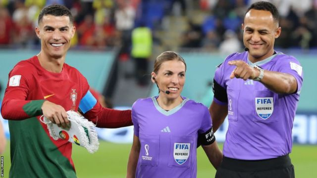
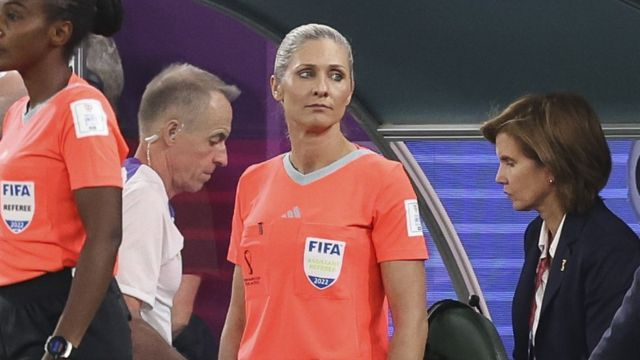
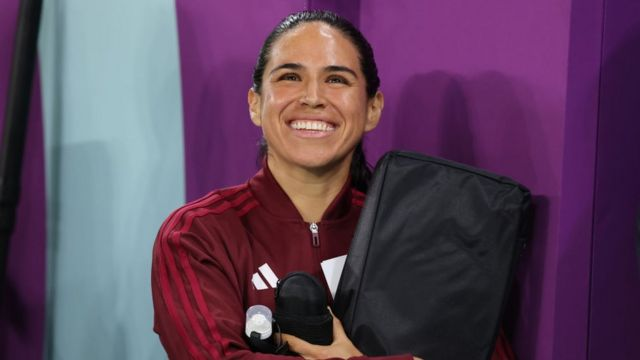
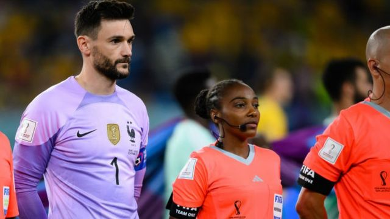
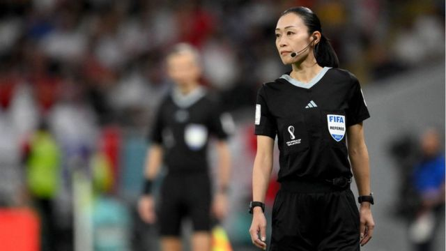

# [Sports] 卡塔尔世界杯：全女性裁判团今晚首次亮相

#  卡塔尔世界杯：全女性裁判团今晚首次亮相

> 图像来源，  Getty Images
>
> 图像加注文字，斯蒂芬妮·弗拉帕（中）较早前已成为男足世界杯历史上第一个女性裁判。

**周四（12月1日），2022卡塔尔世界杯分组赛末轮哥斯达黎加对德国，将是历史上第一次由全女性裁判团在场上执法的男足世界杯比赛。**

斯蒂芬妮·弗拉帕（Stephanie Frappart）亦将为男足世界杯史上第一名女性主裁判。

这名法国女性此前已经率先成为男足世界杯的第一名女性裁判。她在上周二（11月22日）墨西哥对波兰的比赛上被任命为第四裁判员（即主裁判及两名边裁之后的第四人）。

> 图像来源，  Getty Images
>
> 图像加注文字，作为女性裁判，弗拉帕在本届世界杯上创造了历史。

“我们知道这份压力，”弗拉帕在世界杯前接受BBC体育部访问时说。

“但是我认为，我们不会改变自己。冷静、专注、集中，不去想太多关于媒体或其他各种事，只要专注在场上就好。”

将与弗拉帕在周四的阿尔拜特球场（Al Bayt Stadium）一同执法的是本场比赛的助理裁判员，巴西人诺伊扎·贝克（Neuza Back）和墨西哥人凯伦·迪娅兹·梅迪纳（Karen Diaz Medina）。

> 图像来源，  Ian MacNicol
>
> 图像加注文字，巴西人诺伊扎·贝克将在周四的比赛中担任助理裁判。

> 图像来源，  Getty Images
>
> 图像加注文字，另一名助理裁判是墨西哥人凯伦·迪娅兹·梅迪纳。

被问到她是否曾经因为自己是女性而被球员、教练或者球迷品头论足时，弗拉帕说：“从我开始做这项工作起就一直得到球队、俱乐部和球员的支持。我在球场一直都受到欢迎，所以我觉得自己就是场上的又一名裁判。以前是这样，所以我觉得我会像过去一样受欢迎。”

早在2020年，弗拉帕已经成为男子欧洲联赛冠军杯（UEFA Champions League）比赛的首位女性裁判。

38岁的她也曾执法2019年利物浦（Liverpool）对切尔西（Chelsea，车路士）的欧洲超级杯比赛，当时是第一个在欧洲男足重大比赛中担任主裁判的女性。

本届卡塔尔世界杯共有36名主裁判员，当中有三名女性——除弗拉帕外，还有来自卢旺达的萨利玛·穆坎桑加（Salima Mukansanga）和来自日本的山下良美（Yoshimi Yamashita）。

> 图像来源，  Getty Images
>
> 图像加注文字，卢旺达裁判萨利玛·穆坎桑加（右）

> 图像来源，  Getty Images
>
> 图像加注文字，日本裁判山下良美

