# [Sports] 球王贝利逝世：永载足球史册的传奇，享年82岁

#  球王贝利逝世：永载足球史册的传奇，享年82岁

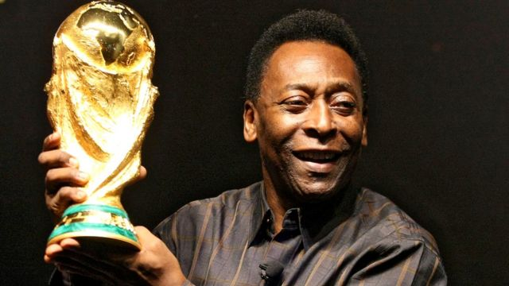

> 图像来源，  Getty Images

**曾率领巴西队三夺世界杯冠军的球王贝利（Pele，又译比利）患癌病逝世，享年82岁。**

在21年的职业生涯中，他在1363场比赛中攻入1281球，创造了世界纪录。 其中包括为巴西国家队出场92场比赛，攻入77球。

贝利是唯一一位在1958年、1962年和1970年三度夺得世界杯冠军的球员。 他在2000年被评为国际足联世纪最佳球员。

近年患上结肠癌的贝利在2022年健康状况恶化，他的癌细胞扩散至肺及肝脏。

而在2022年世界杯举行期间，最后一次进入医院的他仍然牵动着足球界内外千万人的心，这是因为他在这项全球性体育运动中的崇高地位。

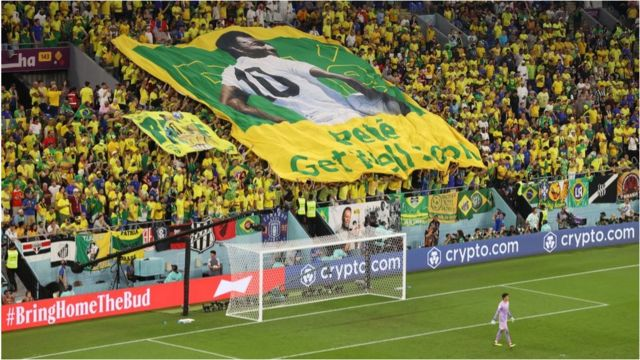

> 图像来源，  Getty Images
>
> 图像加注文字，在2022年，贝利仍然牵动着千万球迷的心

英格兰足球名宿博比·查尔顿 （Bobby Charlton，卜比·查尔顿）曾说，足球仿佛就是“为贝利发明的”。大多数球评家都认为，他就是这项“美丽的游戏”一个最完美的化身。

贝利有登峰造极的技巧和风驰电掣的速度，在此之上还配以球门前那种致命的精准。

在他的祖国巴西，他是一个民族英雄；在全世界，他是一个体坛偶像。

除此之外，在球场下，他孜孜不倦地致力于倡议活动，为社会中处在最弱势的人们改善生活状况。

##  少年横空出世

贝利原名叫埃德森·阿兰特斯·多·纳西门托（Edson Arantes do Nascimento），在1940年10月23日出生于巴西东南部城市特雷斯科拉松伊斯（Tres Coracoes）。

在他出生证明上显示的出生日期是10月21日，但是贝利一直坚称那是错的：“在巴西，我们对于准确性并没有那么高的要求。”

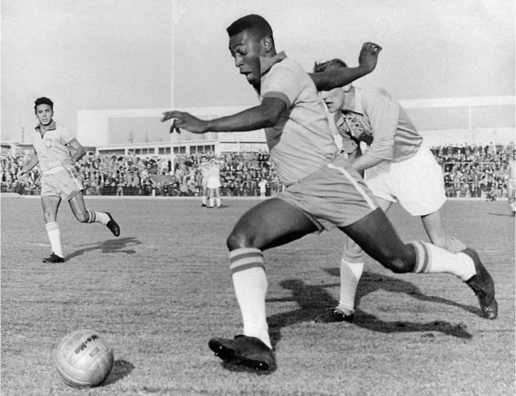

> 图像来源，  AFP/Getty Images
>
> 图像加注文字，1960年，贝利在代表巴西队的比赛中

他的名字“埃德森”来源于发明家爱迪生（Thomas Alva Edison）。据贝利所说，这是因为在他出生前不久，他的家乡才刚刚通了电力。

之后，他的父母把他名字中的字母“i”去掉了。

他在东南部城市巴乌鲁（Bauru）长大，童年家境较为贫困，他要在当地的咖啡店打散工帮补家计。

他父亲教会他踢球，但是他家里却买不起一个足球——于是年幼的贝利常常在街巷里用袜子卷成一个布团当球踢。

##  “贝利”

在学校，他第一次被朋友们起了一个叫“Pele”的外号，虽然他和他的朋友们都不知道这个称呼是什么意思。

他一直都不怎么喜欢这个外号，觉得这个称呼在葡萄牙语里听起来特别像“婴儿腔”。

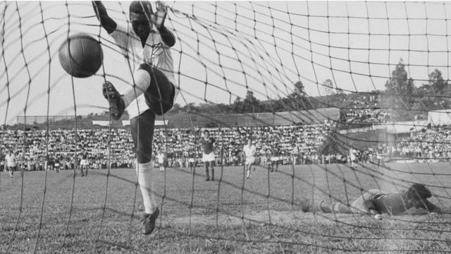

> 图像来源，  Getty Images
>
> 图像加注文字，贝利在球门前有着致命的精准度

在少年时期，他开始在当地一些业余球队里踢比赛。

在他所在的地区，室内足球当时刚刚兴起，年轻的贝利对于在这种不同的场地踢球乐此不疲。

“我玩起它来简直如鱼得水，”他日后这样说，“它可比草地上的足球快多了——你必须头脑转得非常快。”

他带领巴乌鲁竞技俱乐部（Bauru Athletic Club）少年队赢得三届州少年锦标赛冠军，由此成名，被视为天才少年。

1956年，他的教练瓦尔德马·德·布里托（Waldemar de Brito）将他带到港口城市桑托斯，去职业队桑托斯俱乐部（Santos FC，山度士）试训。

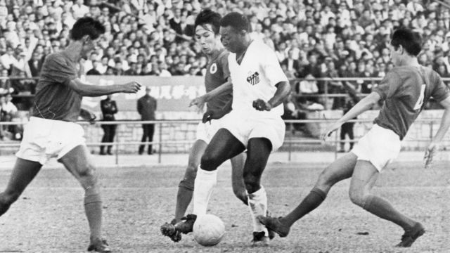

> 图像来源，  Getty Images
>
> 图像加注文字，代表桑托斯（山度士）比赛的贝利

其时德·布里托对于他这个得意门生的能力已经非常有信心。他向桑托斯队的总监们吹嘘，贝利将会成为世界上最好的球员。

贝利后来的表现丝毫无愧于这种吹捧，桑托斯队的人被他征服了，给了他一份职业合同。这是1956年6月，贝利年仅15岁。

##  神射手

一年后，他被召入桑托斯的成年队，在第一场比赛就攻入一球，由此开启了一个进球如麻的职业生涯。

他很快就赢得了球队里的一个主力位置，并且第一年就成为联赛的头号射手。

在签约成为职业球员之后仅仅10个月，贝利就得到了巴西国家队的召唤。

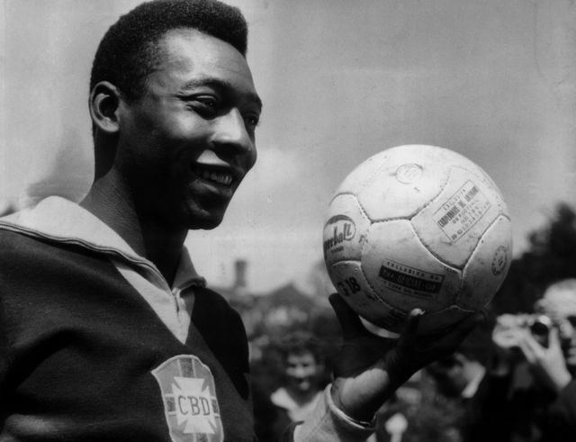

> 图像来源，  Keystone
>
> 图像加注文字，贝利在首次代表巴西国家队出场比赛时尚未成年

他第一次代表国家队比赛是在马拉卡纳球场（Maracana，马拉简拿球场）对阵阿根廷队，巴西以1-2落败。

他们在那场比赛的入球是由16岁的贝利射入的，他成为代表国家队入球的最年轻球员。

他代表巴西出战1958年世界杯的愿望一度几乎破灭，因为他遭受膝伤。

但是他的队友们向球队管理层施压，要求国家队选他入大名单。后来，他在对阵苏联队的比赛中出场，这是他的第一场世界杯比赛。

##  帽子戏法

顺理成章地，他也成为在世界杯上入球的最年轻球员，那是在半准决赛对阵威尔士时射入的。

在半决赛，巴西在下半场以2-1领先法国之后，贝利连入三球完成帽子戏法，消灭了比赛的悬念。

在对阵瑞典队的决赛中，贝利似乎已所向披靡。他再攻入两球，帮助巴西队以5-2获胜。

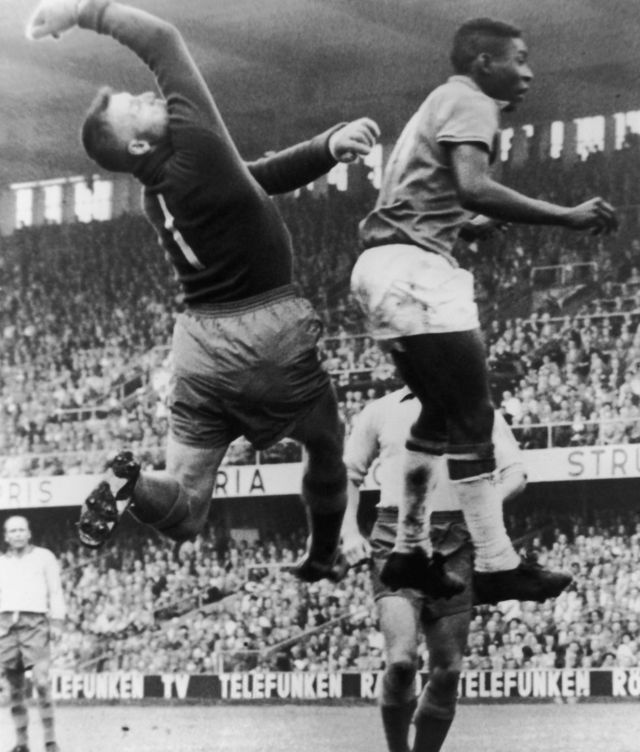

> 图像来源，  Getty Images
>
> 图像加注文字，1958年世界杯决赛上，贝利在起跳争顶头球时争赢了瑞典队门将

回到巴西，贝利又帮助桑托斯在1958年的国内顶级联赛中压过圣保罗，他也成为赛季的最佳射手。

1962年，有一场著名的比赛，是桑托斯击败欧洲冠军本菲卡（Benfica，宾菲加）。贝利在里斯本上演帽子戏法，击溃葡萄牙冠军队，令对手门将科斯塔·佩雷拉（Costa Pereira，哥斯达·彭利拿）心服口服。

“我本来希望来这里阻挡一个伟大的人，”佩雷拉说，“但是到最后我服了，我被一个出生在另一个星球的人打败了。”

##  国宝级人物

然而，1962年的世界杯虽然以巴西成功卫冕告终，但对贝利来说却伴随着失望。开赛之初一场比赛中的严重受伤，令他无法参加余下的比赛。

但是，这并没有阻止曼联和皇家马德里等富豪球队纷纷想要签下这个当时已被视为世界最佳球员的人。

一想到他们的巨星可能要被挖角至海外，巴西政府赶忙宣布贝利为“国宝”，以此阻止他转会到国外。

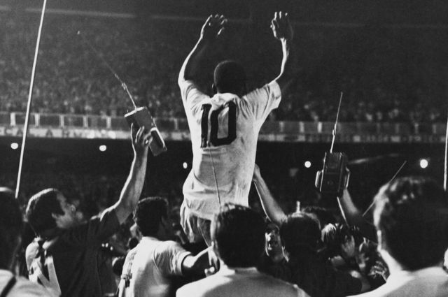

> 图像来源，  Getty Images
>
> 图像加注文字，1969年，贝利射入个人职业生涯第1000个入球，赛后他被队友举起

1966年世界杯对贝利和巴西而言是更大的失望。贝利在球场上成为众矢之的，不断被对手施以犯规战术，特别是在对阵葡萄牙和保加利亚队的比赛中。

巴西队在第一阶段就被淘汰出局，而贝利在接连被暴力拦截之后带伤比赛，使得他未能发挥出最佳水平。

回到巴西，桑托斯队也开始了一段衰落的过程，贝利对于球队的贡献也开始减少。

##  最伟大的球队

1969年，贝利年近30岁，起初并不愿意继续代表巴西队参加1970年的墨西哥世界杯。

当时的他还受到国内军事独裁政府的调查，怀疑他有亲左翼的政治立场。

但最终，他还是最后一次代表巴西出征世界杯，并攻入四球。这一支巴西队也被认为是历史上最出色的球队。

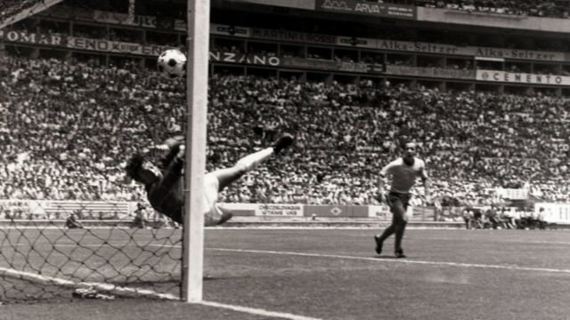

> 图像来源，  Popperfoto/Gerry
>
> 图像加注文字，英格兰门将班克斯挡住贝利攻门的一幕被称为“世纪扑救”

这届比赛当中著名的一幕出现在分组赛巴西对英格兰一战。贝利在禁区内的头球攻门势在必入，却在门线前被英格兰门将戈登·班克斯（Gordon Banks，哥顿·宾士）以惊人的反应奋力扑出，被誉为“世纪扑救”。

即使如此，巴西队还是一路晋级，并在决赛以4-1击败意大利队。

贝利在那一场决赛中攻入一球并助攻两球，巴西队亦由此成为首支三夺世界杯冠军的队伍。

在那场比赛中负责盯防贝利的意大利后卫塔尔奇西奥·布尔尼奇（Tarcisio Burgnich，贝历治）在赛后这样评价贝利：“比赛前我对自己说：‘他是个血肉之躯，和其他所有人是一样的。’但是我错了。”

按当时立下的规矩，三夺冠军的巴西队永久保留了以世界杯赛事创办人命名的雷米金杯（Jules Rimet trophy）。

他代表巴西队的最后一场比赛是1971年7月18日的里约热内卢对阵南斯拉夫。他在1974年从国内退役，不再参加巴西俱乐部比赛。

两年后，他签约美国纽约宇宙队（New York Cosmos）。尽管已过了巅峰时期，但贝利的名字仍然极大地帮助了足球这项运动在美国的普及。

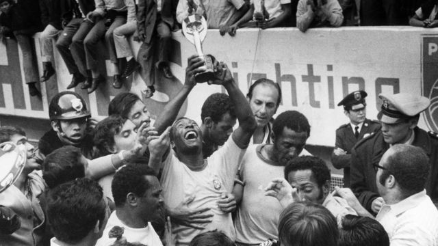

> 图像来源，  Getty Images
>
> 图像加注文字，贝利在1970年高举雷米金杯，巴西在那一年得以永久保留这一奖杯

##  公关大使和全球名片

1977年，即将结束球员生涯的贝利随纽约宇宙队展开全球访问，他的“足球公关”也延伸到了遥远的中国。

那一年9月，宇宙队与中国国家队在北京和上海各上演了一场友谊赛，让即将迎来改革开放时代的中国民众得以亲眼目睹球王的风采。

当时在比赛中代表中国队出场并攻入过一球的前国脚刘利福在2018年接受BBC中文访问时回忆说：“我当时就是一个井底的蛙……外边的（世界）一点都不知道”，但是与贝利同场竞技令他打开了眼界。

回到美国之后，宇宙队与贝利的老东家巴西桑托斯在新泽西巨人体育场进行友谊赛，作为贝利的告别赛。在这场全场座位爆满的比赛中，贝利代表两队各踢了半场。

在整个职业生涯中，贝利攻入了超过1200球。

在退役前，他是世界上收入最高的运动员；退役后，他仍然是吸金能力强大的机器。

他客串当过演员，在1981年的电影《胜利大逃亡》（Escape to Victory）与史泰龙（Sylvester Stallone）和迈克尔·凯恩（Michael Caine，米高·肯恩）同登大银幕。

他有过相当数量的赞助和代言合约，他的名字在世界各地仍然具有强大的号召力。

1992年，他被任命为联合国生态与环境宣传大使，之后又成为联合国教科文组织亲善大使。

五年后，他在白金汉宫获颁大英帝国爵级司令（Knight Commander of the British Empire）荣誉勋章。

1995年被时任巴西总统费尔南多·恩里克·卡多索（Fernando Henrique Cardoso）任命为巴西体育部长之后，贝利在巴西足球反腐败行动中担当领导角色。1998年，巴西通过《贝利法案》（Pele's Law），这被认为是该国足球运动管理现代化进程中的重要一步。

但是，之后他自己被指控有腐败行为，随后辞去联合国教科文组织的职务。不过，相关指控从未得到证实。

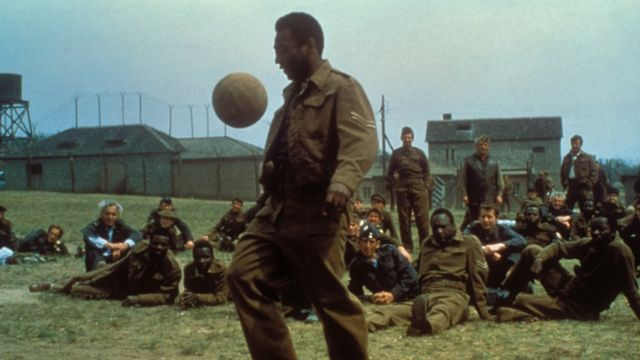

> 图像来源，  ullstein bild
>
> 图像加注文字，贝利参演的1981年电影《胜利大逃亡》

他在2016年里约奥运会的申办过程中也担当过重要角色，并在2012年伦敦奥运会闭幕式的交接仪式中出场。

2005年，他在BBC年度体育人物中获颁终身成就奖。

在他的一生中，即使是对足球毫无兴趣和一无所知的人，也都知道他的名字。

他曾开玩笑说，真正意义上的国际品牌只有三个：耶稣、可口可乐和贝利。

媒体总是追着他索求片言只语，而他又总是不吝啬他那些不加思索的评论和预言，哪怕他是个著名的“乌鸦嘴”。

最为人熟知的两次是曾预言非洲国家将在21世纪到来前夺得世界杯，和哥伦比亚将夺得1994年世界杯——哥伦比亚在那一年小组赛即告出局，非洲国家亦至今从未进入过世界杯决赛。

“我想我在这项运动中的往绩令我有了直说心里话的权利。”贝利在2006年曾对多次专访过他的BBC巴西语组记者费尔南多·杜阿特（Fernando Duarte）这样说道。

他是极少数将他所从事的体育运动升华为全世界熟知事物的人之一。

美国已故著名现代艺术家安迪·沃霍尔（Andy Warhol）曾说，贝利是极少数违背他“成名论”的人物之一：“他的名声不是持续15分钟，而是会持续15个世纪。”

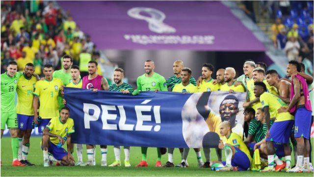

> 图像来源，  Getty Images
>
> 图像加注文字，卡塔尔世界杯期间，巴西队球员在16强比赛击败韩国之后拉起横幅向医院中的贝利致意

##  “三颗心脏”

贝利在1966年与露丝梅丽·多斯·莱斯·乔拉比（Rosemeri dos Reis Cholbi）结婚，二人育有两女一子。在贝利被指与模特兼影星舒沙（Xuxa）有染后，二人于1982年离婚。

贝利的第二段婚姻是与歌手阿西丽娅·莱莫斯·塞萨斯（Assiria Lemos Seixas）。他们育有一对双胞胎，但之后再以分手收场。

2016年，他与日裔巴西商人青木玛希亚（Marcia Cibele Aoki）结婚。他们早在1980年代已经相识。

贝利的个人生活和家庭并不缺少争议——他儿子埃德森（Edson）曾因参与贩毒被捕，而贝利亦拒绝承认一名叫桑德拉（Sandra）的女子是他在1960年代一段私情中生下的女儿。

在2022年的一部Netfilx纪录片中，贝利承认，自己有过太多风流韵事，“我都不知道自己有过多少个孩子”。

近年，贝利经常受到健康问题困扰。2021年9月，他接受结肠肿瘤移除手术。

不过，他依然以一贯的幽默来应对各种挑战。在2022年11月被送进医院前，他在一条Instagram帖文中开玩笑说，他正准备到医院进行“月度拜访”。

在2022世界杯举行期间，一度传出贝利病危的消息。主办国卡塔尔一座建筑亮起了灯光排列成字句：“Get Well Soon, Pele（贝利，早日康复）。”

贝利为此对卡塔尔世界杯主办方表达了感谢，并且在病房中仍然在社交媒体上发布帖文，赞扬在世界杯中表现出色的内马尔（Neymar，尼马）、姆巴佩（Kylian Mbappe，麦巴比）和梅西（Lionel Messi，美斯）。

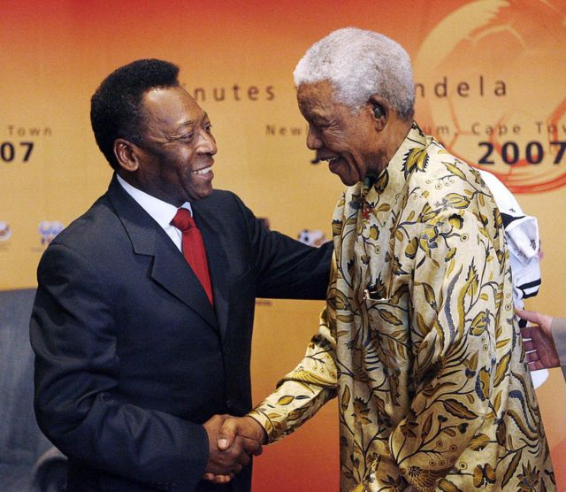

> 图像来源，  Getty Images
>
> 图像加注文字，尼尔逊·曼德拉对于看贝利踢球的感受作出过绝佳的总结

晚年的贝利一直未能摆脱髋关节手术的影响：他常常无法走路，而是坐着轮椅出现在世人面前。

但是，老球王又总是保持着积极乐观。费尔南多·杜阿特（Fernando Duarte）忆述，有一次谈到身体状况时，老贝利曾这样对他说：“你忘了我出生的地方叫‘Tres Coracoes’吗？”在葡萄牙语里，那是“三颗心脏”的意思。

“要让一个有‘三颗三脏’的人倒下是很难的，”贝利当时笑着说。

如今，贝利的人生走到了终点，但是在他的巅峰年华，他的球技给千千万万人带来了快乐：他的天赋才华同时赢得了队友和对手的尊敬。

匈牙利的伟大球星费伦茨·普斯卡什（Ferenc Puskas，普斯卡斯）甚至不愿意仅将贝利定义为一个球员。“贝利超越了这个，”他说。

而对于贝利的巨星光环，最佳的描述或许来自于尼尔逊·曼德拉（Nelson Mandela）。

“看他踢球，就像是同时看到一个孩子的快乐和一个男人的超凡风度。”

