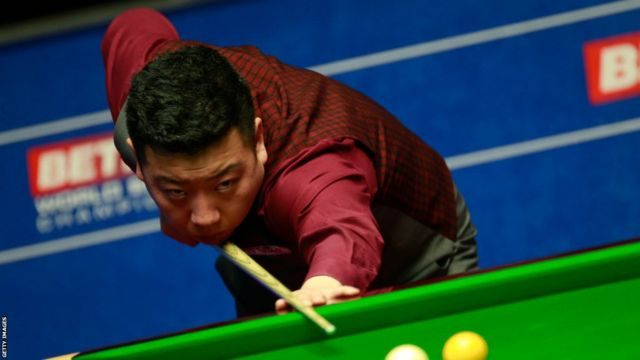
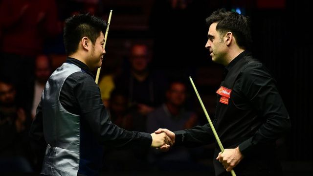
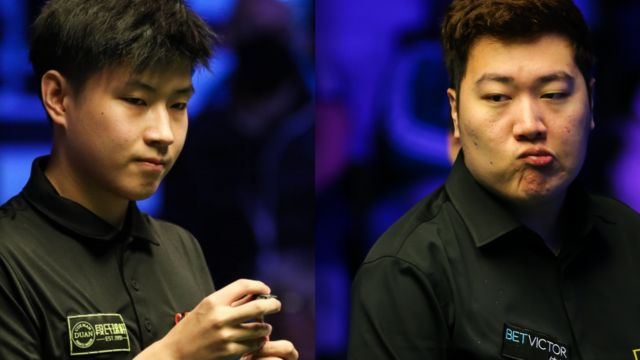

# [Sports] 斯诺克假球案：10名中国球员集体沦陷，调查称梁文博“游说”其他球员作弊

#  斯诺克假球案：10名中国球员集体沦陷，调查称梁文博“游说”其他球员作弊

> 图像来源，  Getty Images
>
> 图像加注文字，李行是两名被处以终身禁赛的中国球员之一。

**在斯诺克台球（snooker）界最大规模的一宗腐败案中，中国球员梁文博、李行涉嫌参与假球，被世界职业台球与斯诺克协会（WPBSA）处以终身禁赛。**

另外八名涉案的中国球员在相关调查中承认有不当行为，被处以20个月至5年不等的禁赛处罚。

涉案的10人中，世界排名最高的是第11位的前英国锦标赛冠军赵心童，他被处以1年零8个月禁赛，2021年大师赛冠军颜丙涛则被禁赛5年。

案件中的指控包括操纵比赛、打假球、唆使其他球员作弊以及赌球。

世界职业台球与斯诺克协会主席杰森·弗格森（Jason Ferguson）表示：“这是一件非常复杂的案件。看到一些年轻而有天赋的球员因为受到两名资深球员的施压而违反世界职业台球与斯诺克协会的行为守则，令人痛心。”

“这些行为被认定是全然不可接受，因此对两名球员强制禁止以任何形式参加受认可的斯诺克活动。”

“我感到欣慰的是，委员会没有从此宗案件里看到任何证据显示斯诺克运动中存在更广泛的不当行为风气。”

“世界职业台球与斯诺克协会将会对任何试图操纵这项运动的人继续秉持强硬立场，而今天的结果发出一个清晰的讯息，假球在斯诺克当中不会被容忍。”

中国台球协会则在周三（6月7日）就事件发表声明表示，将会对涉事球员“从严、从重处罚”。

##  “给中国斯诺克蒙羞”

案件调查始于去年8月，当时国际博彩诚信协会（International Betting Integrity Association）发出警报后，世界职业台球与斯诺克协会的体育廉洁部门与体育博彩数据分析提供商“Sportradar”合作，就事件展开详细调查。

涉案的10名球员在当时已被世界职业台球与斯诺克协会暂时停赛，中国台球协会也即时暂停了涉案球员的国内参赛资格。

调查发现，梁文博在2022年7月24日至9月28日期间在五场斯诺克比赛中打假球或参与打假球，并在2022年7月24日至12月13日间的九场比赛中“拉拢、诱使、怂恿、游说、鼓励或促成”其他球员打假球。

案件中涉及斯诺克运动中其中两名最被看好的年轻球员——25岁的赵心童和22岁的颜丙涛，分别赢得过大师赛（The Masters）和英国锦标赛冠军的二人此前曾被广泛认为，有潜力成为斯诺克世界冠军。

其中颜丙涛在2020年时赢得大师赛，是该项赛事26年来最年轻的冠军球手。被公认为世界头号斯诺克球员的罗尼·奥沙利文 （Ronnie O'Sullivan，奥苏利云）曾多次称赞颜丙涛，还形容他是“拿台球杆的费德勒（Roger Federer，费达拿）”，指他有潜力取代自己的地位。

> 图像来源，  Getty Images
>
> 图像加注文字，梁文博（左）与奥沙利文在2018年大师赛上交手。

如今颜丙涛将被禁赛5年。

25岁的赵心童则被处以20个月禁赛，在禁赛前，他是世界排名最高的中国球员。

判决结果公布后， 他于周三凌晨在社交媒体上发布一份“道歉声明”，指自己“给中国斯诺克蒙羞”。

他称自己因长期独自的海外生活“枯燥而闭塞”，“盲从”地仿效他人选择了用赌球“打发时间”，同时表示自己在赌球和打假球过程中“并没有从中获得任何形式的利益回报”。

“我为当时的愚蠢行为付出了沉重的代价，并且每天都在懊悔中度过。”赵心童在声明中说。

他还称自己在禁赛后接受了世界职业台球与斯诺克协会提供的心理咨询协助，表示会“以更好的形象重返赛场”。

这并不是近年迅速集体冒起的中国斯诺克球员第一次卷入假球丑闻——2018年，中国球员于德陆和曹宇鹏就因涉赌操纵比赛，分别被处以10年零9个月和6年的禁赛，事后中国台协还向于德陆追加国内范围终身禁赛，当时被指是历史上中国台协第一次实施顶格处罚。

中国媒体此前曾有报道，中国台球协会已经察觉到赌球行为可能渗透至中国球员群体，并在2019年成立了由著名斯诺克球手丁俊晖领衔的旅英职业球员委员会，监督海外的中国职业球员。

此次涉案的梁文博还是该协会的副主任，去年案件调查开始后，他已被中国台协撤去该职务。

有媒体评论指，与中国很多运动项目不一样，斯诺克职业球员并非由官方体制培养和管理，而是多由各自家庭投资培养，在英国生活和训练——《中国新闻周刊》引述知情人士称，这使得中国台协难以对球员进行统一管理。

斯诺克历史曾有过不少名将因涉嫌腐败而被禁赛，包括昆汀·哈恩（Quinten Hann）、斯蒂芬·李（Stephen Lee）等。

有公开信息和专业网站统计显示，斯诺克台球选手的培养费用和成本高昂，但收入与网球等其他个人项目相比低很多。

在世界职业台球与斯诺克协会的做出判决后，10名球员可在6月20日之前对处罚决定提出上诉。

目前未知中国台协是否会在之后对涉案球员实施追加处罚，但是该协会在周三的一份声明中表示，会依据世界台球协会的调查结果，“对涉事球员做出从严、从重处罚”。

“协会将在全行业开展警示教育，并推出系列举措，将反赌打假进行到底，”中国台协的声明说，同时表示此后会“进一步加大对旅英职业球员的管理力度”。

另一方面，还有专家曾指出，由于中国刑法在近年增设了“组织参与国（境）外赌博罪”，因此不排除此次涉案的球员当中有可能涉及刑事犯罪。

##  分析：处罚措施将起“强力阻吓”作用

_——BBC第五电台（BBC 5）斯诺克记者杰米·布劳顿（_ _Jamie Broughton_ _）_

世界职业台球与斯诺克协会很努力地调查这一宗复杂的案件，也会对最后处罚的决定感到高兴。

过去10年，这个组织表现出了调查腐败的决心，并对任何它相信有不当行为的人作出指控。

斯诺克在最近几个月经历了不少负面新闻，但是对梁文博和李行发出的终身禁赛处罚应当能对任何想要参与假球的球员起到强力阻吓作用。

对很多斯诺克球迷来说，这宗案件中真正令人伤心是为什么中国其中两名最大牌的球员颜丙涛和赵心童会涉及其中。两名球员都被认为有潜力成为未来的世界冠军。

现在人们会问，斯诺克的管理机构是否能在全世界范围多做一些工作，去教育年轻球员有关腐败的危险性。

##  十名球员的判决及处罚是什么？

> 图像来源，  Getty Images
>
> 图像加注文字，赵心童（左）与颜丙涛是此宗腐败案中世界排名最高的两名球员。

##  梁文博

**年龄：** 36； **世界排名：** 72；2015年英国锦标赛决赛选手

被处以 **终身禁赛** 并支付4.3万英镑。他被裁定在五场假球比赛中打假球或作为打假球团体的一员，在九场比赛中试图唆使其他球员打假球，参与斯诺克比赛赌球，威胁其他球员，删除文字讯息以及要求其他球员删除文字讯息，而且未有配合调查。

##  李行

**年龄：** 32； **世界排名：** 71

被处以 **终身禁赛** 并支付4.3万英镑。他被裁定在五场假球比赛中打假球或作为打假球团体的一员，在七场比赛中试图唆使其他球员打假球，参与斯诺克比赛赌球，删除文字讯息以及要求其他球员删除文字讯息。

##  鲁宁

**年龄：** 29 **；世界排名：** 65；2020年英国锦标赛半决赛选手

被判禁赛8年，在较早认罪并配合调查后，减为 **5年零4个月禁赛** 。他须支付7500英镑。在唆使他人在五场比赛中打假球的指控中，他则被裁定无罪。他承认自己在四场斯诺克比赛中打假球、参与赌球以及删除讯息。

##  颜丙涛

**年龄：** 22； **世界排名：** 23；第一名2000年出生的职业球员，2021年大师赛冠军

被判7年半禁赛，在较早认罪并配合调查后，减为 **5年禁赛** 。他须支付7500英镑。他承认自己在四场斯诺克比赛中打假球，以及参与赌球。

##  赵心童

**年龄：** 25 **世界排名：** 11；2021年英国锦标赛及2022年德国大师赛冠军

被判两年半禁赛，在较早认罪并配合调查后，减为 **1年零8个月** 。他须支付7500英镑。他承认自己与另一名球员一同在两场比赛中打假球，并亲身参与赌球。

##  张健康

**年龄：** 24； **世界排名：** 93

被判4年零5个月禁赛，在较早认罪并配合调查后，减为 **两年零11个月** 。他须支付7500英镑。他承认自己在一场斯诺克比赛中打假球，以及不向WPBSA提供信息。

##  陈子凡

**年龄：** 27； **世界排名：** 104

被判7年半禁赛，在较早认罪并配合调查后，减为 **5年禁赛** 。他须支付7500英镑。他承认打假球，或作为团体一员参与策划打假球，或在三场自己参加的斯诺克比赛中试图制造赛果或比分。

##  常冰玉

**年龄：** 20 **世界排名：** 88

被判禁赛3年半，在较早认罪并配合调查后，减为 **两年禁赛** ，须支付7500英镑。他承认在一场自己参加的斯诺克比赛中打假球。

##  赵剑波

**年龄：** 19 **世界排名：** 业余

被判停赛3年半，在较早认罪并配合调查后，减为 **两年零8个月禁赛** ，须支付7500英镑。他承认在一场自己参加的斯诺克比赛中打假球——并在该场比赛中赌赛。

##  白朗宁

**年龄：** 20\. **世界排名：** 130

被判禁赛4年，在较早认罪并配合调查后，减为 **两年零4个月禁赛** ，须支付7500英镑。他承认在一场自己参加的斯诺克比赛中打假球。

