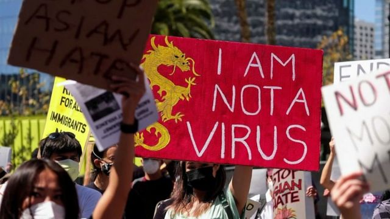

# 伦敦华裔女生：“疫情期间感受歧视，想为亚裔争取更多权益”

#  新冠疫情期间感受歧视 英国华裔女生创办网路平台为亚裔争取权益

9 小时前

> 图像来源，  YIWEN ZHANG
>
> 图像加注文字，张怡雯希望让更多人了解亚裔文化。

**新冠疫情期间，伦敦读大学华裔女生张怡雯创建了“亲爱的亚洲青年人伦敦分会”，希望为亚裔年轻人提供一个为自己权益发声的平台，也让更多人了解亚裔文化。**

“疫情期间，我们到图书馆，有人会开玩笑似的捂住嘴，或者问我们，‘你是武汉来的吗？’虽然他们没有恶意，但是让人（感觉）很不舒服。”

2020年2月，疫情刚刚开始的时候，当时不到20岁的张怡雯和朋友去巴黎，听到当地人对她们喊“新冠”。那段时间，她也听说、读到其它一些东亚人和东南亚人受到歧视的故事。

比如新加坡学生 莫显强在伦敦市中心的牛津街遇袭  。据莫显强回忆，袭击者在施暴前曾大叫：“我不想你把新冠病毒带来我的国家”。

就在这样的背景下，当时在伦敦政治经济学校读大学的张怡雯开办了一个名为“亲爱的亚洲青年伦敦分会” （DAYLDN，Dear Asian Youth London) 的组织。

张怡雯对BBC中文网说，他们的使命就是要“为英国的亚裔青年和社区争取更多的权益”，同时也希望能让英国人更多了解亚裔文化。

身为华裔的张怡雯自己的成长经历中对英国的多元文化有过怎样的体验？两年过去了，她的DAYLDN做了什么？还有哪些挑战？

##  “被当成外人”

张怡雯出生在中国河南，三岁时来到英国，在相对文化多元化的伯明翰长大。

她说，上小学的时候自己住在基本是白人的地区，文化多元化并不明显。虽然当时自己并没有感觉受到歧视，但是如今回想一下，也确实曾被当成了“外人”。

张怡雯记得，学校里当时还有一个东方女孩子，“我们走到哪里，大家都会以为我们是姐妹或者双胞胎。其他学生有时候会眯起眼睛，有时候会用中文或者日语说‘你好’。”

“他们这样做，都只是因为我们是华裔。当时自己完全不觉得有所谓，但是，这也是一种放松式的‘种族歧视’，就是把我们和当地人隔离开。”

读中学的时候，张怡雯去了一个有很多不同种族背景学生的文法学校，学校中的有色人种甚至可能多于白人。

她说，即使是那个时候，自己交的朋友很多也都是东亚人，或者东南亚人。 “当时大家给我们一帮人就取名为‘东方人（The Orientals)’，现在想想，这其实也是一种歧视和排外。 ”

等到她升入大学二年级，就爆发了新冠疫情。“伦敦政经大学是一个文化上非常多元化的大学，但是在疫情期间，我们华裔仍然能感受到一些歧视。”

张怡雯说，英国新冠疫情封城期间，社交媒体突飞猛进地发展。尤其是美国乔治·佛洛依德事件之后，越来越多的人把社交媒体当成更大的平台。刚好，总部在美国的“亲爱的亚裔青年” （DAY）组织也在推动扩展到世界其他地区，于是她自己就组建了DAYLDN。

##  成绩与挑战

“我们希望鼓励所有在英国的亚裔群体获得应得的权益，并与对这个族裔的一些不实报道作斗争。 ”她说。

“我们希望根据英国亚裔的经验提供多样化、有教育性的内容，目标是为英裔亚裔青年和社区提供力量，并通过提供英国亚裔能够发声和共享经验的平台来让英国大众更了解这个群体。“”

> 图像加注文字，新冠病毒以来在英国的不少亚裔人受到了仇视

至于自己的网站是否能让亚裔社区更认真对待族裔歧视，张怡雯说，“希望我们起到了这样的作用。看到很多人转发我们的内容，或者留言说感谢我们做出了这个网页，我们感到高兴和自豪。”

她非常自豪地对BBC中文说，从创立网站、最早开始发表文章到现在快两年了，刚开始时网站无人知晓，现在有了17000名关注者，受众绝大多数是在英国长大的亚裔群体，也有一些出生在亚洲、在英国留学多年或者曾经在英国留过学参加工作的人。

发表以来最受人关注的内容是针对首相约翰逊2021年中国春节时问候华人社群的评论，当时点赞人数超过了10万人。

但是张怡雯承认，开始的时候从来没有想到会有这么多人来关注，“感觉心里准备不足。”

“我们都是一些大学的在校学生，课余时间来管理经营网站。我从来都没有过这么大的责任，这也是一个学习的过程。”

“目前有大约80人在为DAYLDN工作，大家都是志愿者。”她说。

> 图像来源，  YIWEN ZHANG

##  期望与目标

张怡雯说，希望能够为更多的亚洲人（比如中亚人）发声，代表更多的亚裔人。 比如，他们做过关于南亚文化传承月的活动，在网上受到了很大的欢迎。

"当然我们也有非常轻松的话题，比如漫威的《尚气》。我们还有一个话题是专门讲越南船民的，也有专门谈论香港移民的。我们试图做一些专门为亚裔准备的别具特色的内容。"

刚刚研究生毕业、即将踏入职场的张怡雯说，参加工作后，仍然会用空闲时间来为DAYLDN写稿，普及亚洲文化，为帮助更多亚裔争取权益提供更大的平台。

“终止针对东亚和东南亚社区的暴力和种族歧视” （EVR）委托 英国独立电视台  （ITV）独家发布的数据显示，疫情期间，伦敦针对东亚和东南亚社区的仇恨犯罪增加了80%。

数据显示，过去两年间，英国针对东亚和东南亚人的攻击报案总数增加将近50%。

说起美国总统拜登2021年在白宫签署一项打击新冠疫情下反亚裔仇恨犯罪的法案， 张怡雯说，希望英国政府也能够针对反亚裔的情绪推出更多的条例。

她还希望英国政府能够让在校生学习有关华人、印度人、尼泊尔人等在第一次世界大战期间为英国做出贡献的历史知识。

14万中国劳工在一战期间远渡重洋来到欧洲，协助英法军队作战。

“我们认为在教育方面，有关这段历史的教育熏陶应该在学校中普及。这样人们可以从年纪小的时候就能够感受到这些亚裔群体（对英国）的重要性。”

> 图像来源，  YIWEN ZHANG
>
> 图像加注文字，DAYLDN的南亚文化传承月的活动非常受欢迎。

