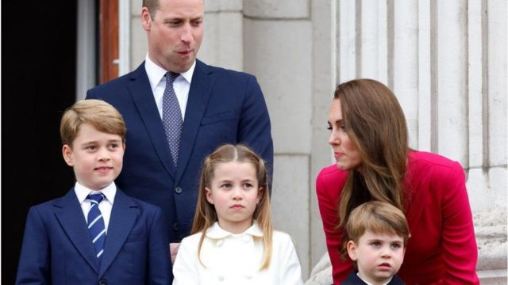
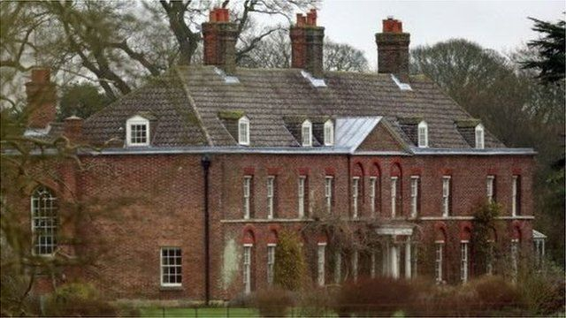

# 英国剑桥公爵举家放弃伦敦王宫迁居乡村的深层考量

#  英国剑桥公爵举家放弃伦敦王宫迁居乡村的深层考量

3 小时前

> 图像来源，  Getty Images
>
> 图像加注文字，英国剑桥公爵一家——威廉和凯特夫妇及孩子：从左至右：乔治王子、夏洛特公主和路易王子。

**近日， 英国女王长孙剑桥公爵一家宣布，搬出伦敦西城的肯辛顿宫，迁居温莎城堡附近的一桩“乡间”小屋居住。**

据称，这里将成为这位英国王位第二继承人和他一家未来几年的新家，这座名为阿德莱德小屋（Adelaide Cottage）的寓所距离女王长期居住的温莎城堡步行只需10分钟。

放弃伦敦华阔王宫而选择乡间民居自然会引发各界好奇，不少人估计不禁会问一句为什么。

##  选择乡间屋的多重考量

据熟悉威廉夫妇的人介绍，这次搬家标志着他们生活中的一个“新篇章”。威廉夫妇试图确保他们3个孩子能尽可能的“正常”成长。

同时， 此举也显示威廉和祖母伊丽莎白女王二世之间关系的重要性——搬到距离女王平时居住的温莎堡更近的地方，也方便一家人随时见面。

随着女王年事已高，她越来越依赖查尔斯王子和威廉为她提供王室以及家庭事务的建议，这种关系因此也变得越来越重要。

此外， 据介绍选择阿德莱德寓所还可以向公众传达了另外一个信号————即剑桥公爵夫妇不介意住在按王室标准来看相当简朴的住所中。

剑桥夫妇选择的阿德莱德小屋只有4间卧室，坊间估计很多人会把这座相对平常的住所与威廉弟弟——萨塞克斯公爵（哈里和梅根夫妇）一家在美国加州的豪宅相比较。

威廉和凯特希望能为他们自己和3个孩子提供一个更具隐私的住所和乡间环境。他们3个孩子分别是9岁的乔治王子、7岁的夏洛特公主和4岁的路易王子。

##  阿德莱德小屋来历与王室渊源

阿德莱德小屋与英国王室颇有渊源：建于1831年，最初曾是威廉四世（William IV）为妻子阿德莱德王后（Queen Adelaide）所建的寓所，并因此而得名。

更近期一点，此处曾是不列颠战役（the Battle of Britain）飞行员彼得·汤森上校（Captain Peter Townsend）的家。

汤森后来成为国王乔治六世（King George VI）的侍从武官，并成为国王小女儿玛格丽特公主（女王的妹妹，Princess Margaret）的密友。

从1944到1952年，汤森和他的第一任妻子曾住在阿德莱德小屋。

##  学区房

> 图像来源，  PA Media
>
> 图像加注文字，剑桥夫妇将继续保留他们在诺福克的家安默庄园（Anmer Hall）。

威廉夫妇的3个小孩都将会就读附近的伯克郡阿斯科特的兰布鲁克预备小学（Lambrook School），这是一所男女混合的私校。

学校的招生简章说，他们拥有“一流的教学和顶尖的设施” - 其中包括25米长的游泳池、9洞高尔夫球场、一个有蜜蜂、鸡和猪的果园，以及大片可以让孩子们尽情玩耍的林地。

假设不享受兄弟姊妹学费优惠待遇，那么把他们3个孩子送到那里走读（不住校），一年一共需要5万英镑（约43万人民币）以上。

阿德莱德小屋将无需进行重大装修，并显然能满足所有必要的安全考虑和措施。

剑桥夫妇将继续保留他们在诺福克的家安默庄园（Anmer Hall），以及他们在肯辛顿宫的公寓 - 这两处住所都很大。

但现在，阿德莱德小屋将是他们主要的家。他们希望在这里，家人可以尽可能享受不受外界干扰的正常生活。

