# 戴安娜王妃逝世25周年：最具标志性的那些老照片

#  戴安娜王妃逝世25周年：最具标志性的那些老照片

9 小时前

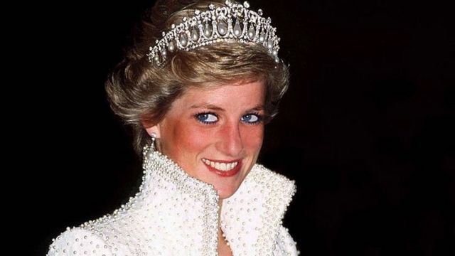

> 图像来源，  Getty Images
>
> 图像加注文字，戴安娜王妃

**戴安娜生前曾以“世界上镜率最高的女性”而闻名。**

在她逝世25周年之际，我们通过镜头来回顾她的一生，其中多为最具标志性的照片。

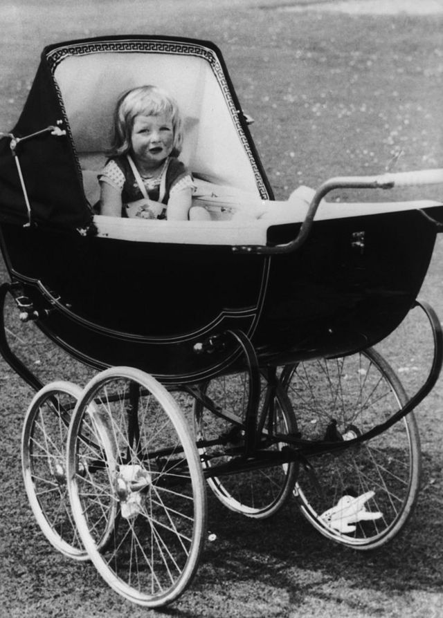

> 图像来源，  Getty Images

戴安娜·法兰西斯·史宾沙（也称 戴安娜·弗兰西斯·斯宾塞，Diana Frances Spencer）1961年7月1日在英格兰诺福克郡桑德林厄姆（Sandringham）附近的帕克庄园（Park House）出生。

她是奥尔索普子爵和子爵夫人最年幼的女儿。

在父母1969年离异后，戴安娜经常往返于分别在北安普敦郡和苏格兰的父母家。

> 图像来源，  Getty Images

戴安娜先就读于诺福克郡迪斯的Riddlesworth Hall预备小学，从1974年起则成为肯特七颗橡树附近西希斯（ West Heath）的寄宿生。

她1977年离开西希斯，去瑞士鲁日蒙继续完成学业，并于次年复活节学期后离开那里。

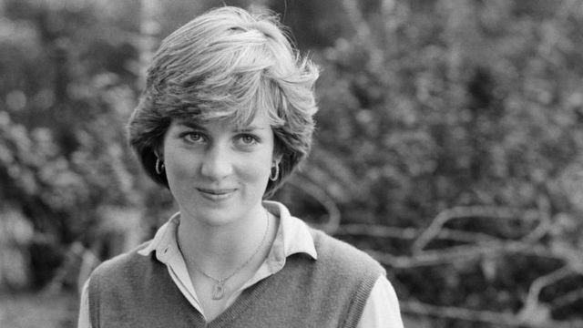

> 图像来源，  Getty Images
>
> 图像加注文字，戴安娜在伦敦

毕业后她在伦敦工作，先做过保姆，偶尔会当厨师，其后在伦敦骑士桥一所幼稚园做助理。

当时开始有言传称，她和威尔士亲王查尔斯的友情正发展为更正式的关系。

就是从那时起，她开始整天受媒体包围，工作的日子也屈指可数了。

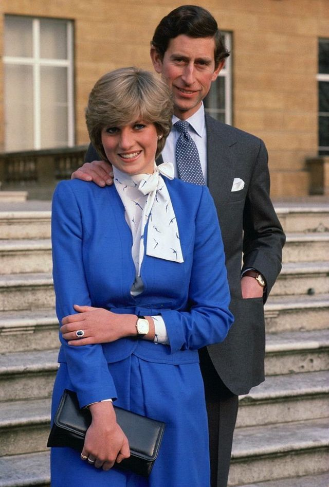

> 图像来源，  Getty Images

1981年2月24日，查尔斯王子和戴安娜女勋爵在白金汉宫正式宣布订婚，订婚戒指是一颗镶嵌了14颗钻石的蓝宝石戒指，当时约值近三万英镑。

这枚戒指后来非常有名，现在则戴在剑桥公爵夫人凯特手上。

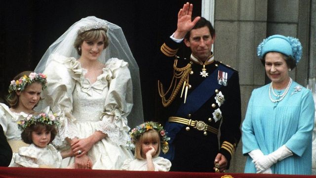

> 图像来源，  Getty Images

1981年7月29日，两人在伦敦圣保罗大教堂结婚，这场婚礼也被喻为“世纪婚礼”。全世界数百万人观看了婚礼仪式的电视转播。

当时，戴安娜年仅20岁。在整个过程中，她只有一次有点紧张，就是要把丈夫的全名以正确顺序说出来。戴安娜由父亲斯宾塞陪伴步入婚礼教堂。

她的婚纱由大卫和伊丽莎白·伊曼纽尔夫妇设计，有长达10米的裙摆。婚纱使用了象牙色塔夫绸，并绣有古典蕾丝图案。

大约有60万人排列在白金汉宫通往大教堂的道路两旁，想亲眼目睹一下这对新人的风采。新婚夫妇与小伴娘以及女王伊丽莎白二世一起站在白金汉宫的阳台上（如上图）向人群挥手致意。

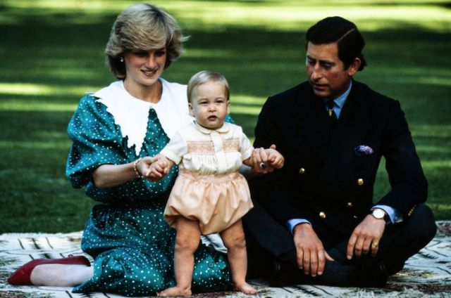

> 图像来源，  Getty Images

戴安娜一直渴望拥有一个大家庭。1982年6月21日，也就是婚后一年内，她生下了儿子威廉王子。威廉王子也成为继父亲查尔斯之后王位的第二顺位继承人。

她认为在王室允许的情况下，尽量应该给她孩子一个正常成长的环境。威廉也成为第一位上幼儿园的男性继承人。

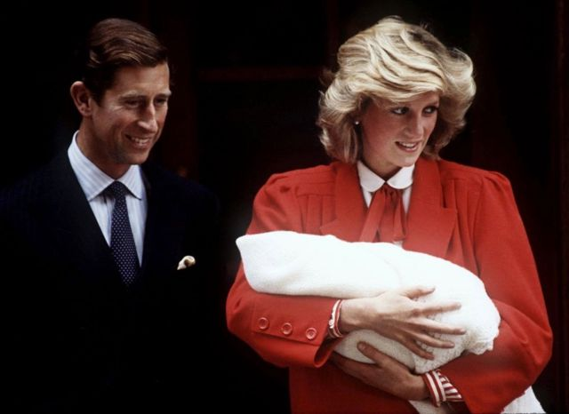

> 图像来源，  Getty Images

1984年9月15日，威廉的弟弟哈里王子出生。

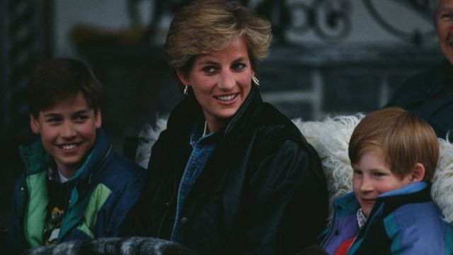

> 图像来源，  Getty Images

两位小王子并没有接受私教，而是和其他孩子一起上学校。

戴安娜对两个儿子宠爱有加。哈里王子曾说戴安娜是“最顽皮的父母之一”，但补充说：“她爱死我们了，毫无疑问。”

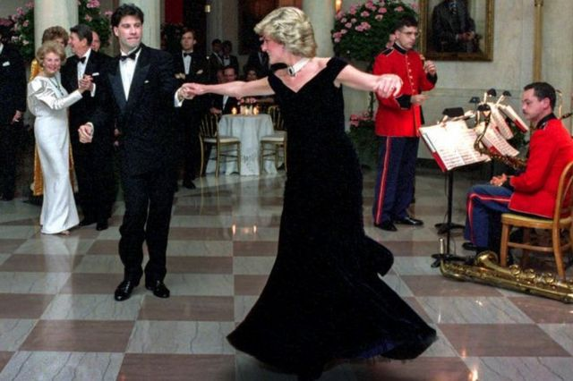

> 图像来源，  Getty Images

在她对美国的第一次正式访问时，戴安娜在白宫与美国演员约翰·屈伏塔（也叫约翰特拉沃尔塔，John Travolta）共舞。

戴安娜的人气开始增长。她正在成为时装偶像，她的衣柜成为人们关注的焦点。

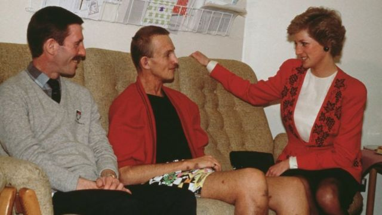

> 图像来源，  Getty Images

随着她在官方场合露面越来越多，她的慈善工作让她受到公众爱戴，她也上了世界各地的新闻头条。

她为艾滋病患者疾呼，并在宣传艾滋病患者所面对的困境方面发挥重要作用。她对有关艾滋病的坦率演讲挑战了人们的偏见。

她与艾滋病患者握手这样的简单举止，向公众证明社交接触没有传染风险。

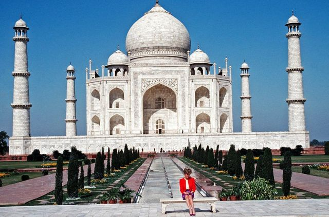

> 图像来源，  Getty Images

威尔士亲王夫妇之前曾一起出席过许多公务活动，包括海外义务。但到80年代末，二人分居的生活已经尽人皆知。

1992年，戴安娜对印度进行正式访问，她独自坐在“爱情象征”的泰姬陵前，形单影只。

它也被视为一种公开的宣言，虽然他们表面上还是一对夫妇，但实际上早已分道扬镳。

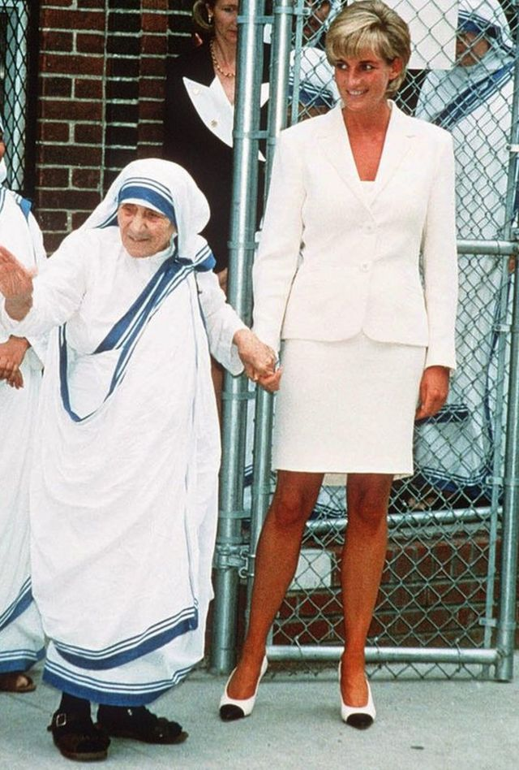

> 图像来源，  Getty Images

戴安娜一生与著名的罗马天主教修女特蕾莎修女（Mother Teresa）保持深厚友谊。特蕾莎修女后来被封为圣人。

特蕾莎修女以其慈善工作闻名，她一生致力于帮助穷人，并为此获得诺贝尔和平奖。

戴安娜与特蕾莎修女在相距6天之内相继离世。

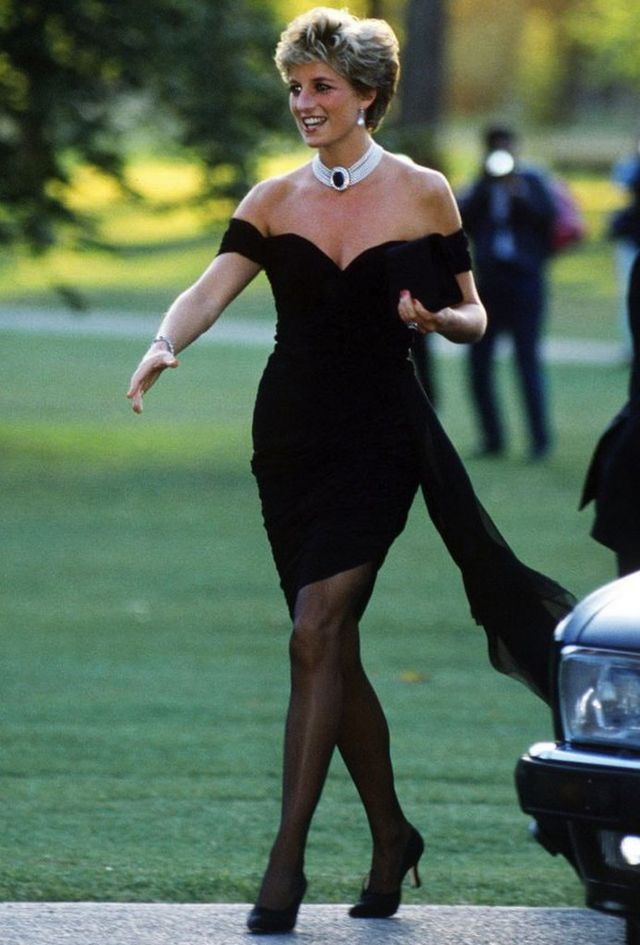

> 图像来源，  Getty Images

在分居多年后，戴安娜和查尔斯在1996年8月28日正式办完离婚手续。

次年6月，戴安娜拍卖了79件曾出现过各种杂志封面上的时装。

此次拍卖为慈善事业筹集了 450 万美元，似乎也象征着与过去的决裂。

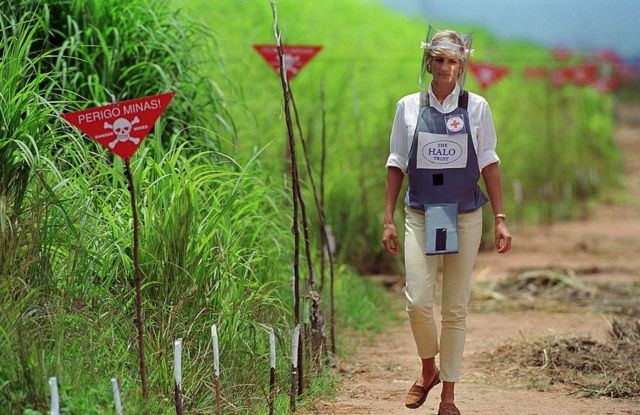

> 图像来源，  Getty Images

1997年1月，戴安娜王妃呼吁禁止杀伤性地雷装置引起全球关注。

反地雷活动团体“地雷咨询团体”（MAG）的联合创始人麦格拉斯曾与戴安娜密切合作。

他后来表示，戴安娜的支持为全球禁雷努力提供了一个“转折点”。

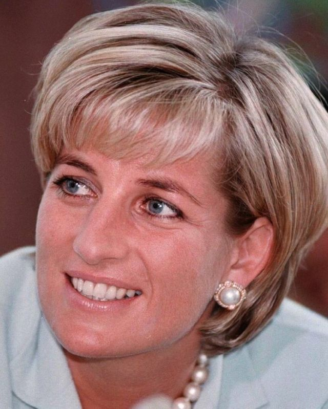

> 图像来源，  Getty Images

1997年8月31日，戴安娜与百万富翁商人穆罕默德·法耶兹（Mohamed Al Fayed）之子多迪‧法耶兹（Dodi Al Fayed)在巴黎丽兹酒店用完餐后乘车离开。

他们受到骑着摩托车的狗仔队的追赶，他们希望能拍到戴安娜新男友的更多快照。

但这一追逐导致巴黎隧道悲剧 -- 一场致命的车祸。

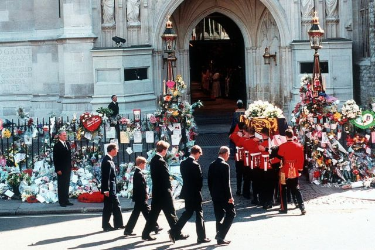

> 图像来源，  Getty Images

超过100万人列队路旁，目送送葬队伍沿着威斯敏斯特教堂缓缓行进到她在北安普敦郡斯宾塞家的最后一段旅程。

步行跟在灵柩后的分别是（从左至右）查尔斯王子、小儿子哈里王子（当时年仅12岁）、戴安娜弟弟斯宾塞、长子威廉王子和爱丁堡公爵。

戴安娜去世25年后，她仍被铭记为“人民的王妃”。

