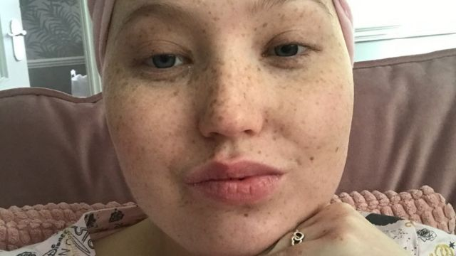
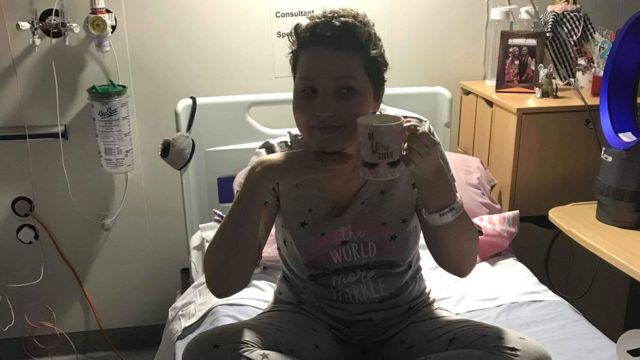

# “我根本不知道胸部感染会是白血病”

#  世界白血病日：英国前患者警告血癌的一些“模糊”症状

3 小时前

> 图像来源，  Sophie Wheldon
>
> 图像加注文字，索菲说被诊断出白血病让她“非常震惊”。

**索菲·韦尔登(SophieWheldon)在学生时期被诊断患有白血病（leukaemia），当时她非常震惊。在经过特殊的靶向治疗后病情缓解。索菲敦促人们学会识别白血病的症状。**

24岁的索菲是英国西米德兰人。她说，上学期间她经常出现持续的胸部感染、头疼和颈部疼痛，但她把这归咎于压力，没有当回事。

但在看了医生，然后去医院检查后，2018年，她被诊断患有这种血液疾病。

英国白血病慈善组织（Leukaemia UK）说，英国每天都有28人被确诊白血病，但只有不到1%的人能够识别其中的一些症状。

9月4日是“世界白血病日”。根据世界癌症研究基金会（World Cancer Research Fund International）的数据，2020 年全球约有 50 万人确诊患有白血病。

该慈善机构表示，报告最常见的四种症状包括：疲劳、瘀伤、异常出血和反复感染。

英国白血病慈善组织与“白血病护理”（Leukaemia Care）联手合作，敦促人们警惕白血病的可能症状，并说，尽早诊断可能挽救生命。

> 图像来源，  Sophie Wheldon
>
> 图像加注文字，21岁的索菲接受CAR-T 特殊治疗。

2018年，索菲在读生物学专业期间生病，当时家庭医生建议她去医院，并警告她她的颈部疼痛可能是脑膜炎。

索菲回忆，刚开始，她在急诊室就诊，但立即被转移到“重症”病房，每小时接受一次血液检查，还做了全身 CT 扫描和“我现在所知道的骨髓活检”。

活检后，她的症状一直不消失，她再次去看医生，并得知她被“列为身患绝症”，直到医生告诉她，她可能有资格接受一种特殊治疗——嵌合抗原受体T细胞免疫疗法（CAR-T therapy）。

索菲说，治疗过程就是取出患者免疫系统中的一些T细胞和白细胞，（经过生物技术处理后）让它们可以识别癌细胞，并针对癌细胞进行靶向治疗。

> 图像来源，  Sophie Wheldon
>
> 图像加注文字，索菲的癌症现在已经缓解，她说早期发现白血病“至关重要”。

索菲说，她是他们地区第一个接受这种（靶向）治疗的人，当时正是她21岁生日的第二天（2019年6月）。

“‘细胞’回来时，装在一个小袋子里——这就是可能将拯救我生命的（东西），”她说。 “仅仅 20 秒的输液 - 想想它能救命，简直令人难以置信。”

在经过血液定期检查后，她说在2019 年 7 月被告知“你的病情彻底缓解了”，那“真是生命中最美好的一天”。

虽然治疗影响了她的免疫系统，但苏菲说，对今天自己还能活着“非常感恩”，并敦促人们警觉一些明显迹象。

“白血病的症状可能很模糊，因此很容易被忽视，但永远相信你的直觉，”她补充道。

