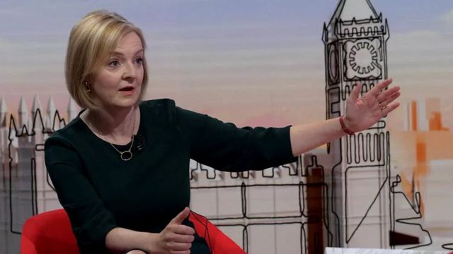
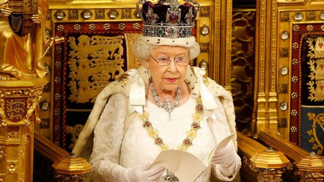
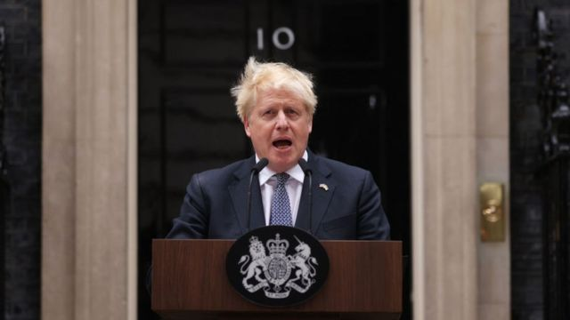
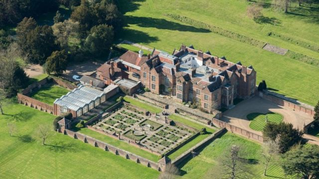

# 在英国当首相究竟是份怎样的工作？工资福利待遇如何？

#  英国敲定特拉斯出任首相：这究竟是份怎样的工作？有什么工资福利和待遇？

> 图像来源，  Reuters
>
> 图像加注文字，即将出任英国首相的特拉斯

**特拉斯（Liz Truss，又译卓慧思）经过英国执政保守党党员全体投票表决，成为新一任党魁，将接替鲍里斯·约翰逊（Boris Johnson）出任英国首相。**

现任首相约翰逊由于在新冠疫情期间的种种违规行为和保守党议员性骚扰丑闻，政治诚信受到极大的损害，今年7月被迫辞去党魁职务，但留任至党内选出接班人。

在保守党选出特拉斯作为新党魁后，约翰逊将于周二辞去首相职务。而作为首相正式官邸的伦敦唐宁街10号，将辞旧迎新，入住新一任首相。

约翰逊在宣布辞任保守党领袖的演讲中曾经表示，担任英国首相是“世界上最好的工作”。

这份工作究竟要做什么呢？位高权重的首相究竟要承担怎样的责任？又享受哪些待遇和福利？

##  英国首相这份工作究竟做什么？

> 图像来源，  Getty Images
>
> 图像加注文字，英国首相由女王任命。女王每年在议会开幕式上提出工作重点。

英国首相是政府的掌门人，由女王任命。通常情况下，他或她是在大选中获胜政党的党魁。

不过，由于约翰逊在保守党仍然执政期间辞职，英国并没有举行大选，所以新党魁由保守党党员而不是英国选民投票选出。

所谓首相，位居群臣之首，总揽负责政府所有政策和决定。

另外负责政府班子中的人事任命，选择政府各部门的大臣和部长。

各重要部门的首脑，称为内阁大臣，分管各部门的工作，例如财政部、内政部、外交部、国防部、卫生部、教育部、交通部, 等等。

首相可以在任何时候任命或者撤换内阁大臣；首相还可以解散某个政府部门，或者建立全新的部门。

首相与财政大臣一起负责国家的税收和财政支出政策。

首相和其他大臣还可以制定新的法律，不过需要得到议会的支持。

##  首相还有什么权力？

首相还总管公务员队伍，即执行政府决策的人员和部门。

首相还负责英国的国防和安全。例如，他们有权派遣英国的武装力量参加军事行动。然而，最近的惯常做法是，在可能的情况下，军事行动应该获得议会的批准。

> 图像来源，  Getty Images
>
> 图像加注文字，约翰逊首相今年7月因新冠疫情期间“派对门”丑闻和议员性骚扰丑闻引发党内信任危机，被迫辞任党领袖。但他表示将留任至保守党选出新首相。

首相还肩负着一些其他的特殊责任，如是否击落被劫持的飞机或身份不明的飞机，都由首相决定。

英国如果需要动用核武器，也由首相授权。

荣誉勋章的获得者名单，无论是骑士勋章还是爵士勋章，都由首相提出。首相有权推荐某人成为上议院的议员。

首相通常每周觐见一次女王，向女王通报政府事务。不过这些会议是完全不公开的，谈话内容没有官方记录。

##  英国首相享受哪些福利和待遇？

英国首相官邸位于伦敦唐宁街10号。自1735年以来，这里一直是首相的办公和生活地点。

然而，最近的几位首相包括约翰逊都选择居住在唐宁街11号，因为它的居住面积更大。

此外，首相还有一个位于乡村的别墅，即位于白金汉郡的契克斯（Chequers）。2015年，中国国家主席习近平访问英国时，时任英国首相卡梅伦曾邀请习近平到契克斯举行会谈，营造轻松、友好气氛。

首相的年薪共164,080英镑，由两部分组成：首相津贴79,936英镑和议员工资84,144英镑。不过，约翰逊首相领取了75,440英镑的首相职务津贴。

##  如何问责首相？

首相虽然位高权重，但做决定时并不能随心所欲。

首相需要保持大多数议员对自己的信任。这是因为法律只有在大多数议员投票赞成的情况下才能获得通过。

如果政府拿出的法律草案在议会投票中一再失利，议员们可以选择对首相提出“不信任动议”。如果首相在不信任动议投票中失败，将面临大选的前景。

如果首相领导的政党在大选中失利，无法再把握下议院的信任，他们必须辞职，以便让在大选中获胜政党的领袖接任。

##  约翰逊首相的继任人是如何选出的？

> 图像来源，  Getty Images
>
> 图像加注文字，自1921年开始，英国首相官邸除了伦敦唐宁街10号首相府，还有乡间别墅契克斯（Chequers) 。

约翰逊首相今年7月宣布他将辞职时，引发了保守党357名议员竞争领导权。

在几轮竞选之后才最后剩下了前财政大臣苏纳克（（Rishi Sunak，又译辛伟诚））和外交大臣特拉斯（Liz Truss，又译卓慧思）。成为保守党领袖的候选人将自动成为下一任首相。

在保守党党魁的竞选中，开始共有八个人被提名，但经过保守党议员的一系列不公开投票，八个候选人被缩减到两个。

今年整个夏天，特拉斯和苏纳克参加了一系列辩论会，阐明政策争取支持，而保守党党员就他们提出的治国方略和政策提问。

然后，保守党党员们投票选出了党魁。也就是说，还不到英国总选民人数1%的大约16万名保守党党员为总人口6700万的英国选择了首相。

##  会不会举行大选？

英国首相辞职时，不会自动举行大选。

例如，2016年英国公投“脱欧”后，卡梅隆辞职，特蕾莎·梅继任首相，她决定不立即举行选举。约翰逊本人也是于2019年7月在梅首相辞职后才成为首相的，但直到12月才举行大选。

如果约翰逊的继任者也选择不提前举行大选，那么英国下一次选举就必须在2025年1月之前举行。

