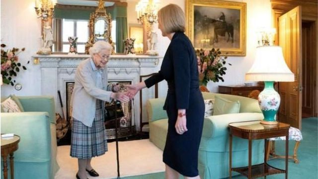

# 英国保守党新党魁特拉斯出任首相 “铁娘子”第二对中国态度强硬

#  英国保守党新党魁特拉斯出任首相 “铁娘子”第二对中国态度强硬

最近更新： 2022年9月6日

> 图像来源，  PA Media

**英国执政的保守党新党魁特拉斯接替约翰逊，正式成为英国首相。**

特拉斯周二（9月6日）前往苏格兰的巴尔莫拉尔城堡（Balmoral Castle）觐见英国女王，被正式任命为英国首相。白金汉宫发表声明说，女王授意特拉斯组阁。

此前，离任首相约翰逊也在巴尔莫拉尔觐见女王，向女王递交辞呈。白金汉宫说，女王接受了约翰逊的请辞。

按照传统，新首相任命通常在女王在伦敦的官邸白金汉宫举行。但女王因行动不便，依然留在苏格兰。

保守党星期一（2022年9月5日）宣布选出新党魁特拉斯（Liz Truss，又译卓慧思），接替因丑闻缠身被迫辞职的约翰逊首相。

在由英国保守党约14万名成员投票进行的选举中，特拉斯击败前财政大臣苏纳克（Rishi Sunak) 成为保守党领袖。

特拉斯接手的英国可谓“内忧外患”：英国仍然笼罩在新冠疫情造成的经济低迷之际，国际间因为俄罗斯入侵乌克兰导致能源价格飙升，使英国国内通胀问题“雪上加霜”、物价飞涨；原本计划脱欧后单飞世界的英国，仍然没有厘清脱欧后的种种限制和掣肘；美国与中国竞争，“新冷战”阴云密布之外，英国与中国因为香港问题关系紧张......

##  “铁娘子”对中国强硬

特拉斯现年47岁，2010年当选英国下院议员，曾在保守党三位首相卡梅伦、特蕾莎·梅和约翰逊内阁任职，担任国教育部长、司法部长和国际贸易大臣等，现任外交大臣。

特拉斯行事和装扮都颇有英国第一位女首相“铁娘子”撒切尔夫人之风，因此被认为有志成为“铁娘子”第二。

她在竞选期间一直表示，出任首相后将迅速采取行动对付英国高达10%的通货膨胀率，重振趋于衰退的经济，为英国家庭减轻高涨的能源开支。

在外交政策上，特拉斯承诺会更新英国外交国防综合评估，更注重中国和俄罗斯的威胁。

今年8月初美国国会众议院议长佩洛西访问台湾后，中国一连多日举行大规模环台军事演习。作为英国外相的特拉斯发表声明说：“我指示官员召见中国大使，要求他就中国的行动做出解释。我们看到北京近几个月来的行动和言辞越来越咄咄逼人，这威胁到地区和平与稳定。”

英国媒体上星期引述接近特拉斯的人士的话说，担任首相后，她会将中国正式视为对英国国家安全构成严重威胁，并且不再是与英国有经济伙伴关系的国家。

中国外交部发言人赵立坚曾回应称，“奉劝英国个别政客，动辄拿中国说事、鼓噪所谓‘中国威胁论’，这是不负责任的言论，也解决不了英国自身的问题。”

外界关注特拉斯出任首相之后，将在对华政策上如何调整。

##  新首相的七个大问题

实际上，无论谁出任首相，英国都面对同样的困难和挑战。英国广播公司BBC盘点出新首相在国内和国际间的七大挑战：

  * 冬天临近能源价格飙升、如何帮助民众负担日常开支？ 
  * 医疗系统NHS在新冠疫情冲击后越发不堪重负, 如何面对冬季发病高峰？ 
  * 乌克兰战争：还要继续不惜血本援乌抗俄吗？ 
  * 如何团结因党魁选举而四分五裂的执政保守党？ 
  * 如何应对苏格兰再次独立公投的诉求？ 
  * 如何化解脱欧造成的北爱尔兰问题可能对与欧盟关系的影响？ 
  * 能源危机下如何兑现2050年实现温室气体零排放目标？ 

