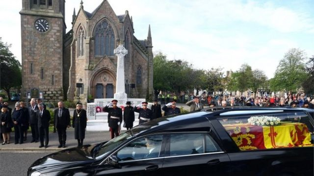
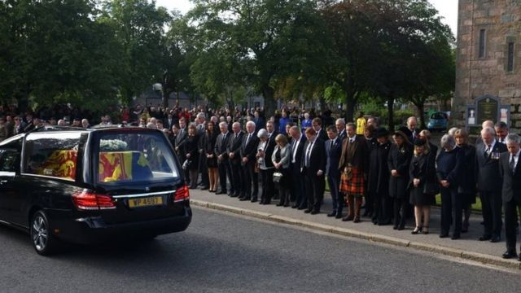
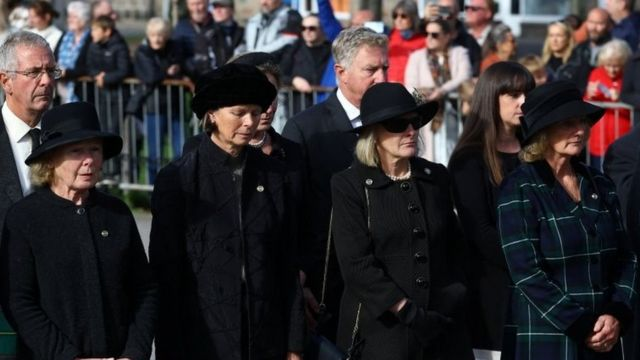
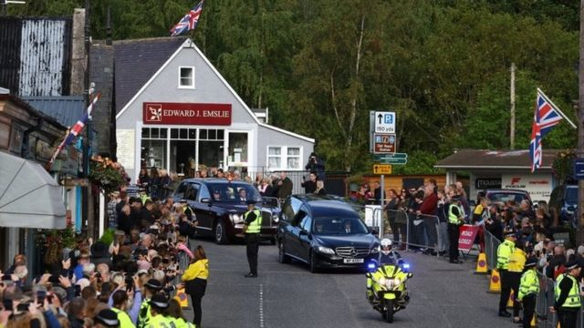
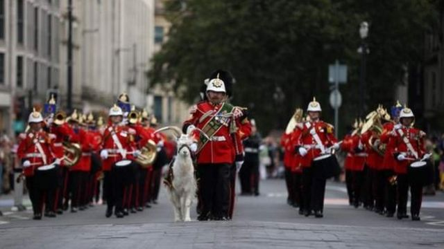
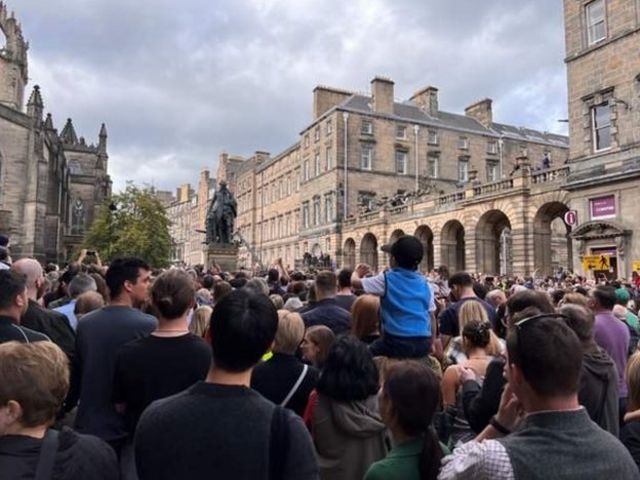
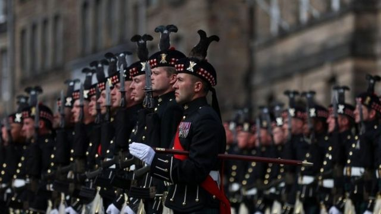
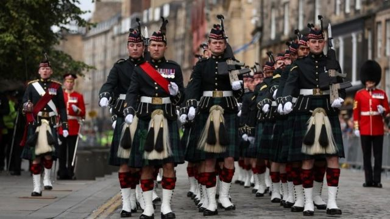
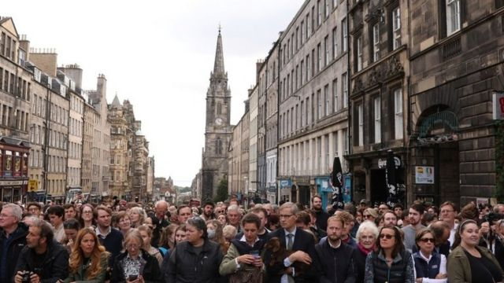

# 英国女王逝世：灵柩前往爱丁堡 各地昭告新君继位

#  英国女王逝世：灵柩前往爱丁堡 各地昭告新君继位

> 图像来源，  Reuters

**英国女王伊丽莎白二世周四（9月8日）在苏格兰的巴尔莫勒尔城堡去世后，送别女王，新君即位的活动已经开始。**

周日（9月11日）上午，女王灵柩离开了巴尔莫勒尔城堡，沿途经过她生前熟悉的多个小村庄后抵达苏格兰首府爱丁堡。灵柩在爱丁堡停留24小时供民众瞻仰后，将空运回伦敦。英国为女王举行的隆重国葬将在9月19日举行。

与此同时，在苏格兰、威尔士和北爱尔兰，举行了昭告新国王查尔斯三世继位的仪式。

##  灵柩离开巴尔莫勒尔城堡

> 图像来源，  Reuters

> 图像来源，  Reuters

> 图像来源，  Reuters

##  各地举行仪式昭告新君上位

与此同时，继昭告查尔斯国王三世上位的仪式伦敦举行之后，周日在威尔士、苏格兰和北爱尔兰也举行了昭告仪式。

在威尔士首府卡迪夫、苏格兰首府爱丁堡和北爱首府贝尔法斯特，昭告之后鸣放礼炮。

在这些地方，数以千计的人们参加仪式，高呼“天佑国王”。

> 图像来源，  PA

##  民众向女王致敬

女王周四去世后，民众纷纷前往她生前居住的伦敦白金汉宫和温莎城堡表示哀悼。

周日女王灵柩抵达爱丁堡之前，大批民众已经聚集在灵柩经过的大道旁等候。

而在英格兰，人们继续前往白金汉宫和温莎城堡。

> 图像来源，  Reuters
>
> 图像加注文字，爱丁堡，卫兵列队等待女王灵柩。

> 图像来源，  Reuters

> 图像来源，  Reuters

