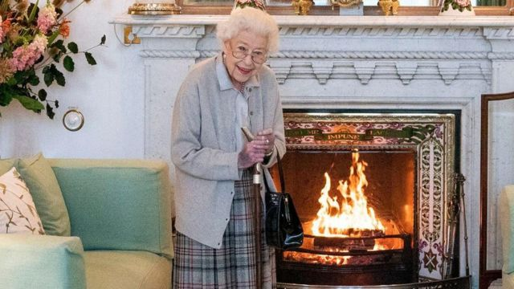
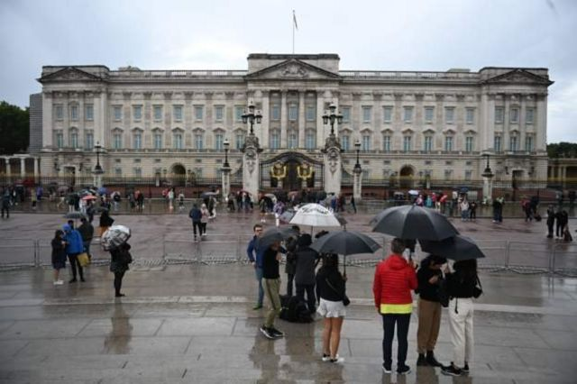
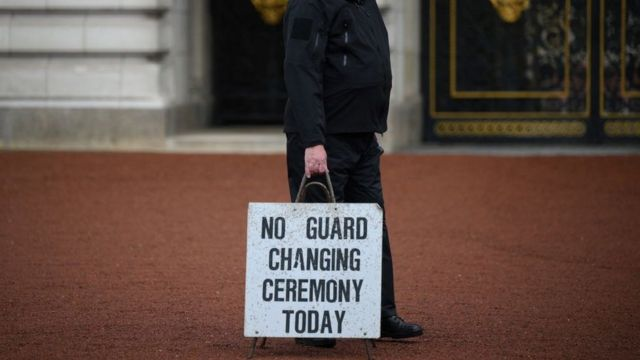

# 英国女王健康欠佳 家人赶往苏格兰陪伴身边

#  英国女王健康欠佳 家人赶往苏格兰陪伴身边

> 图像来源，  EPA
>
> 图像加注文字，英国女王本周二在苏格兰正式任命新任首相特拉斯

**白金汉宫说，王室医生对女王的健康状况表示担忧，女王现在苏格兰接受医疗监护。女王的所有子女都已经抵达或正在前往苏格兰，陪伴在女王身边。**

白金汉宫在今天中午发表的一份声明中说，“早上进一步检查评估后，女王医生对她的健康状况表示担忧，建议女王继续接受医疗监护。”

白金汉宫发表类似声明的做法非常罕见，因为女王的健康状况被视作隐私，白金汉宫一般不置评。

女王的长子查尔斯王子和妻子康沃尔公爵夫人已经在女王在苏格兰的行宫巴尔莫拉尔城堡。

女王的孙子剑桥公爵、和女王的其它两个儿子安德鲁王子、爱德华王子以及爱德华王子的妻子索菲在英国夏令时下午4时许抵达阿伯丁机场。

巴尔莫拉尔城堡位于阿伯丁以西大约64公里。

女王的女儿安妮公主已经在苏格兰，在巴尔莫拉尔参加其它公务。

剑桥公爵夫人留在温莎，剑桥公爵夫妇三个年幼的孩子今天是第一天正式开学。

发言人说，原计划在伦敦参加一场慈善活动的哈里王子也在前往苏格兰。

> 图像来源，  EPA
>
> 图像加注文字，白金汉宫外聚集起人群

##  女王健康担忧

BBC王室记者分析说，很明显，这一次对女王的健康状况有更加严重的担忧，白金汉宫的声明比以往更加明确，而且并没有只说女王年事已高、行动不便。

今年96岁的女王自从7月起一直在苏格兰度暑假。

在伦敦，女王身体欠安的消息传出后，人群聚集在白金汉宫外。

白金汉宫取消了传统的换岗仪式。

> 图像来源，  Getty Images
>
> 图像加注文字，白金汉宫取消换岗仪式

