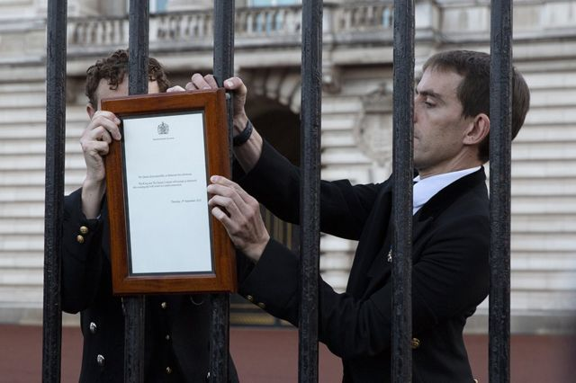
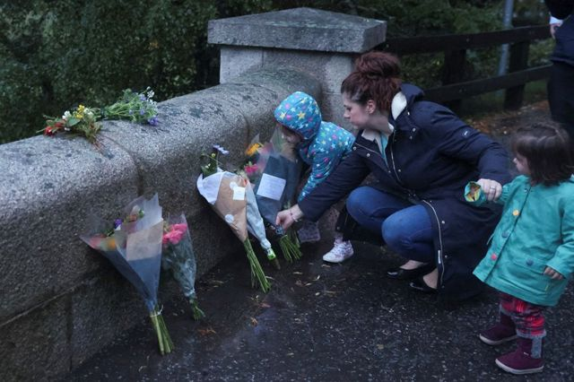
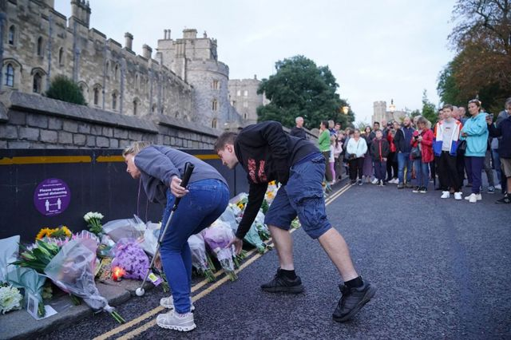
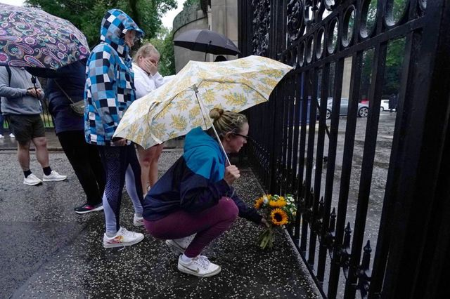
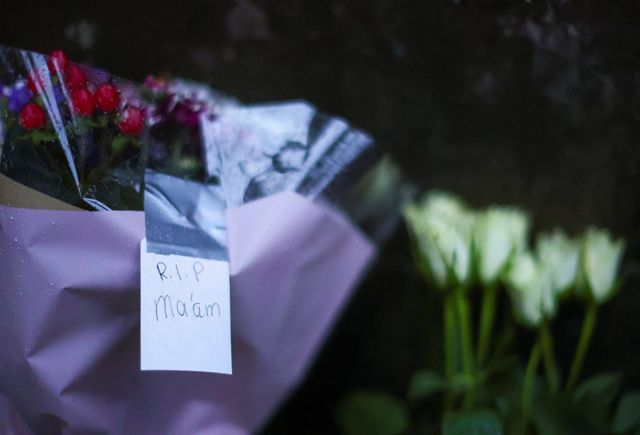
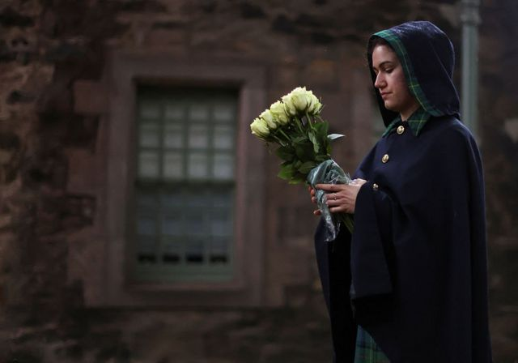

# 图辑：英国公众悼念女王伊丽莎白二世

#  女王伊丽莎白二世逝世：英国公众悼念

**英国在位时间最长的国君伊丽莎白二世女王逝世的消息传开后，英国民众在各地地标建筑外聚集、献花，表示哀思和悼念。**

> 图像来源，  Samir Hussein/Getty Images

伦敦，女王官邸白金汉宫外，数以千计的人来献花、拍照，王宫下半旗。

> 图像来源，  Reuters
>
> 图像加注文字，女王逝世的消息公布后，有人留下眼泪

> 图像来源，  Tom Pilston

> 图像来源，  Tom Pilston

> 图像来源，  Ben Stansall/Getty Images
>
> 图像加注文字，白金汉宫外，人们点起蜡烛

> 图像来源，  Getty Images
>
> 图像加注文字，伦敦经典的黑色出租车在白金汉宫外的林荫大道列队

白金汉宫工作人员在大门上贴出宣告女王去世的公告。

> 图像来源，  Tom Pilston

周四（9月8日）下午，女王在苏格兰的行宫巴尔莫勒尔安详辞世。尽管当时阴雨连绵，人们仍然来献花。

> 图像来源，  Russell Cheyne / Reuters

温莎堡也是深受女王喜爱的城堡。当地人视女王为自己的邻居。

> 图像来源，  Jonathan Brady/PA

> 图像来源，  Chris Jackson/Getty Images

西汉姆联队和FCSB在伦敦体育场举行的欧联杯足球赛前默哀一分钟。

> 图像来源，  Peter Cziborra/Reuters

女王另一处官邸、爱丁堡的荷里路德宫外，人们也来表达对女王的哀思。

> 图像来源，  Jane Barlow/PA

> 图像来源，  Carl Recine/Reuters

> 图像来源，  Carl Recine/Reuters

伦敦地标皮卡迪利广场，巨大的广告牌打出女王影像，游人驻足。

> 图像来源，  Reuters

