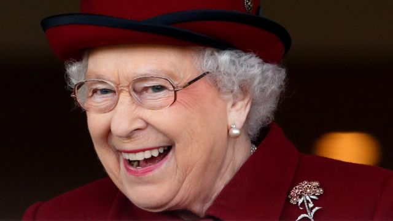
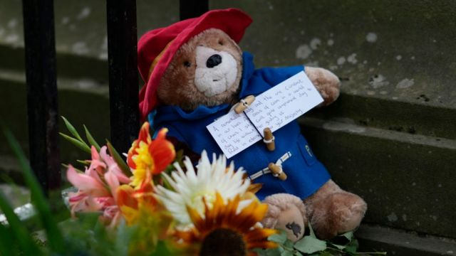
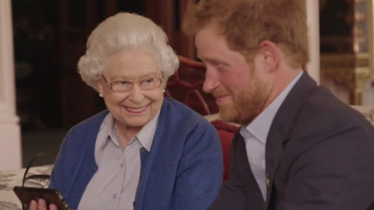
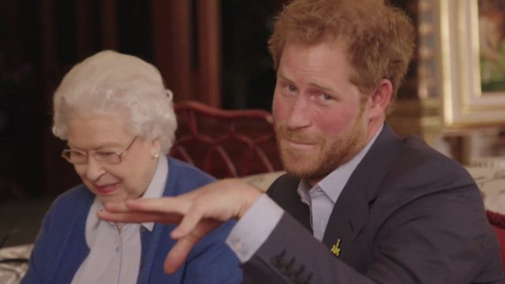
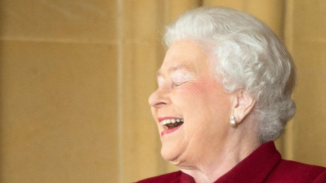
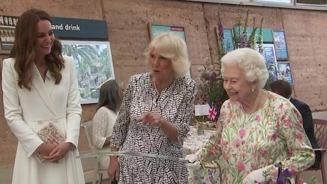
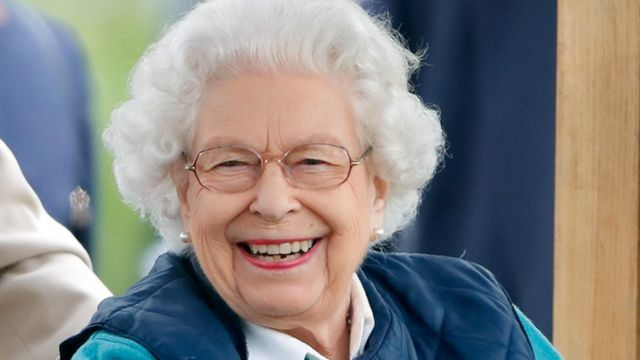
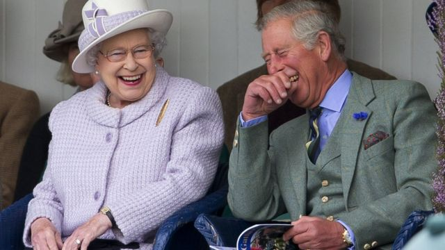
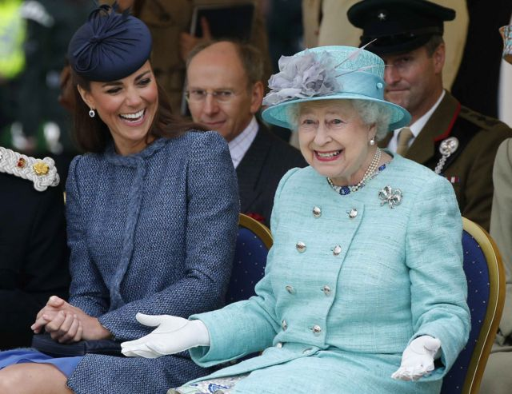
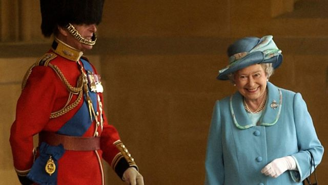

# 英国女王逝世：细看女王轻松幽默的一面

#  英国女王逝世：细看女王轻松幽默的一面

> 图像来源，  Getty Images
>
> 图像加注文字，幽默感是女王“最优质的人格特点”

**在位长达70年的女王伊丽莎白二世历经过许多国家动荡时代，但是她作为国君的公众形象始终维持不变，而随着女王年龄的增长，人们也有更多机会窥见女王的幽默感。**

2022年，萨塞克斯公爵（Duke of Sussex）哈里王子在接受BBC访问时表示，女王最优质的人格特点就是她“绝佳的幽默感”。

历史学家作者塞尔登（Anthony Seldon）表示，女王没有把自己看的多了不起，“这对于她作为女王的成功做出了巨大贡献。”

英国王室历史学家罗伯特·莱西（Robert Lacey）表示，“能够对许多事情一笑置之，这是一项很重要的生存技巧。”

以下是让我们得以窥见女王幽默感的那些令人难忘的时刻。

##  白金禧和帕丁顿熊一起喝茶

2022年是女王即位70年的白金禧纪念，作为庆祝活动之一，女王亲自上镜和帕丁顿熊（Paddington Bear）合演喜剧小品，作为BBC白金禧纪念特别节目的开场。

短剧中女王在庆祝活动即将开始之前和帕丁顿熊一起喝茶，帕丁顿熊从那顶破旧的红帽子中拿出一个柑橘果酱三明治，并对女王说，“我总是准备一个应急。”

“我也是，”女王微笑回答，并从她经典的黑色手提包中拿出她的三明治。

> 图像来源，  Getty Images
>
> 图像加注文字，民众留下帕丁顿熊和鲜花向女王致敬

##  运动会竞技“不屈不挠”

> 图像来源，  Kensington Palace
>
> 图像加注文字，哈里王子和女王一起拍摄趣味影片

2016年，女王和哈里王子一起出镜，为“不屈不挠”运动会（Invictus Games）进行宣传，这段视频也在网上热传。

影片中女王和哈里王子一起观看了前美国总统奥巴马及夫人米歇尔传来的影片讯息，奥巴马夫妻两人向哈里王子发出体育场上竞技的挑战。

女王看了之后做出不以为然的反应，“噢，不是吧，拜托。”

> 图像来源，  Kensington Palace
>
> 图像加注文字，哈里王子向镜头做手势接受体育竞技挑战

##  善于模仿

> 图像来源，  PA Media

Netflix电视剧《王冠》（The Crown）的历史顾问，英国王室历史学家罗伯特·莱西（Robert Lacey）透露，私底下，女王据说很会模仿，善于运用各种腔调和不同的说话方式。

阐述女王幽默感的《Wicked Wit of Queen Elizabeth II》一书作者凯伦·杜比（Karen Dolby）表示，据说女王特别会模仿前俄罗斯领导人叶利钦（Boris Yeltsin）。

她还会模仿其他政治人物，宗教领袖和电视人物。

莱西说女王的幽默感经常是“自嘲式的，有点像拿自己开玩笑”。

她举个例子说，有一次一位政治人物在与女王会面时突然手机响了，让他感到很不好意思赶快关机。

结果女王说，“我希望那不是什么重要人物。”

##  拿仪仗刀来切蛋糕

> 图像加注文字，女王拿礼仪用刀来切蛋糕

女王一生中切过无数个蛋糕，有一次在康沃尔郡（Cornwall）一场慈善活动上，拿了一把礼仪用刀具来切蛋糕。

当时有一名志愿工作者提醒女王已经有准备好一把普通刀子来切蛋糕，但女王仍然不为所动。

“我知道有切蛋糕的刀子，但用这个比较不寻常。”

##  机智风趣

杜比特别喜欢一段轶事，有一次女王在苏格兰巴尔莫勒尔（Balmoral）和一群美国观光客巧遇，当时天下着雨，女王全身包裹严实，身边还跟着一名保护随从。

那群美国观光客没认出全身包裹着的女王，还问她有没有看过女王。

“没有，”女王回答，但指着旁边的保护随从说，“但是他有。”

> 图像来源，  Max Mumby/Indigo
>
> 图像加注文字，据说女王很善于模仿不同腔调和说话方式

另外还有一次女王私下到诺福克（Norfolk）购物，店员跟她说，“你看起来就像女王。”

据说女王回了一句，“那我就放心了。”

像这样的轶闻趣事还有很多很多，这些故事共同体现出女王低调、不张扬、风趣又幽默的一面。

##  化解紧张

幽默也是打破沉默，化解紧张的一个好办法，尤其是当人们觐见女王而感到紧张的时候。

塞尔登说，女王“具有无论如何都能在生活中体会趣味的能力”。

杜比回忆说，有一次女王和喜剧演员汤米·库珀（Tommy Cooper）见面，后者问女王喜不喜欢足球。

女王坦白说对足球没有特别兴趣，于是库珀打趣地说，“如果是这样的话，你的足总杯（FA Cup）决赛门票能不能给我？”

> 图像来源，  Getty Images
>
> 图像加注文字，大笑有助于化解紧张局面

如果说到电视喜剧小品，据说女王很喜欢看BBC播出的喜剧《The Kumars at No. 42》（住在42号的库马一家人）。

##  用笑纾压

女王的生活受到公众关注，在许多公开场合一举一动都是所有人注意的焦点。

英国心理学会（British Psychological Society）的奥黛丽·唐（Audrey Tang）表示，作为备受关注的聚焦点，具备幽默感知道如何通过笑来纾解压力是很重要的应对之道。

“笑是一个共同纾压的姿态。”

> 图像来源，  PHIL NOBLE
>
> 图像加注文字，女王：“别把自己太当回事儿”

笑还能让人们感觉更好，减缓紧张压力。

笑也能与人“建立连结”，据说女王和菲利普亲王就非常享受一起说笑的时光。

但是笑有时候也不是那么简单容易。

在一场活动过后私底下说笑并不伤大雅，但是在众目睽睽之下忍不住笑出来则是很多人都有过的难忘经验。

奥黛丽·唐说，如此"失礼的情感表达"有时候是对突如其来的情绪，或者是想要排解压力而产生的一种自然而非刻意的回应。

杜比回忆起一段往事，有一次加拿大总理让·克雷蒂安（Jean Chretien）在一场正式签字仪式上把笔折断并出言咒骂的时候，女王似乎忍不住笑出來。

> 图像来源，  Chris Young / PA Media
>
> 图像加注文字，一群蜜蜂扰乱军仪队，女王忍不住笑出来

塞尔登表示，“她喜欢这种荒谬感，事情出错的时候，她更可能会感觉滑稽，而不是恼怒。”

2003年，女王在温莎堡（Windsor Castle）校阅军队，突然一群蜜蜂闯入扰乱队伍，女王忍不住笑出來，在现场的摄影师克里斯·扬（Chris Young）记录了这段画面。

“我觉得那是个非常人性化的时刻。她笑得就像一个小女孩一样。”

女王1991年圣诞致辞对自己的幽默感做了完美诠释。

“别把自己太当回事儿，”她说，“没有人是完全的智者。”

