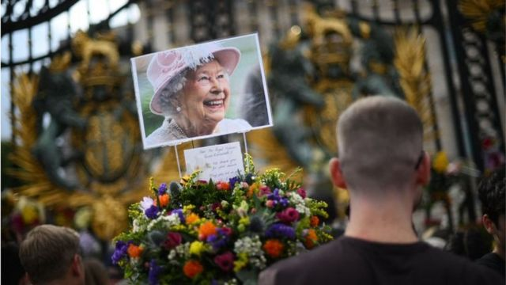
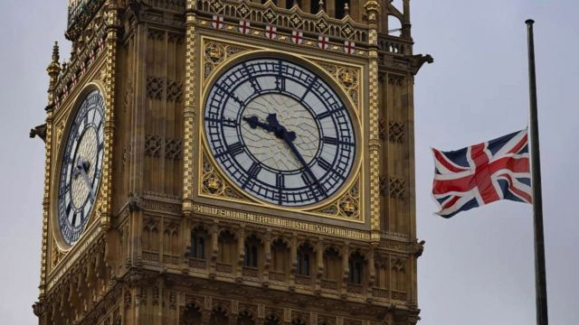
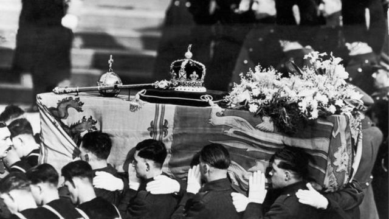
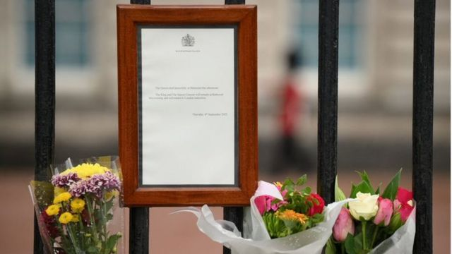

# 鸣礼炮和下半旗：英国悼念王室成员传统和习俗的由来

#  英国女王逝世：英国怎样悼念王室成员以及传统习俗的由来

> 图像来源，  Getty Images
>
> 图像加注文字，伊丽莎白女王二世于9月8日逝世

**正像涉及英国王室的许多事情一样，君主的丧事也会遵循一些传统和惯例。**

继女王伊丽莎白二世在9月8日去世后，王室已经宣布了皇家哀悼期，它将一直持续到葬礼后7天。

这里，我们介绍纪念英国在位时间最长的君主去世的一些传统及其背后的历史，其中一些目前已经流传到全世界。

##  下半旗

> 图像来源，  EPA
>
> 图像加注文字，下半旗默哀

标志悼念期的第一个方式就是下半旗，政府大楼以及与王室有关的建筑物都会降半旗。

虽然被称为下“半”旗，但旗帜实际上是从旗杆顶端降至全长三分之一的位置。

这一传统据信可以追溯到17世纪 - 通过降旗，给正常旗帜上方留出空间，象征“隐形的死亡之旗”（“invisible flag of death”）。

这种做法最初是用于向船长或是船上资深官员致敬，其他船员用降旗来表达哀悼与痛失之意。

> 图像来源，  Getty Images
>
> 图像加注文字，英国皇室成员的葬礼安排遵循传统和惯例

奇怪的是，皇家旗 (theRoyalStandard，又称王室旗) 并不受这一规则的限制。旗帜在象征君主在。它从来不下半旗，因为君主制是连续性的 - 伊丽莎白女王二世一去世，长子查尔斯王子会自动继位成为国王。

但英国其他地方的降半旗将一直持续到女王国葬后次日清晨8点才结束，唯一例外是9月10日王位继承理事会（Accession Council）正式宣告查尔斯成为国王的那一天。

当天，为纪念查尔斯正式继位，暂停半旗数小时之久，之后恢复。

##  鸣礼炮

> 图像来源，  Getty Images
>
> 图像加注文字，鸣礼炮

王室悼念的另一个传统是鸣礼炮。根据英国军方历史学者的说法，这一传统源于15世纪。当战舰寻访外国港口时将把炮口朝向大海鸣放礼炮，以示意和平意图，因为他们的武器是空的。

到1730年，皇家海军已经用礼炮来庆祝一些大事，但直到1808年才成为王室以及其他一些国家元首的规定性礼节。

至于鸣礼炮的次数则有一套复杂的规定，取决于鸣放地点，以及场合。

例如，1827年，英国军械委员会（Board of Ordnance）下令从伦敦的皇家公园（也称皇家御苑）之一或是从伦敦塔鸣41响礼炮符合正确皇家礼炮规定。

但在另外一些场所及场合，则会鸣放62响礼炮。

鸣礼炮既可以用于悼念伊丽莎白女王二世的去世，也可以用来庆祝国王查尔斯三世的继位。

9月9日，即女王去世的第二天，伦敦海德公园鸣放96响礼炮，每一响代表女王生命中的每一年。

##  教堂钟声

> 图像来源，  Getty Images
>
> 图像加注文字，教堂敲响低沉钟声

在女王去世的第二天，英格兰教堂、礼拜堂以及大教堂都鸣钟以示悼念。

君主去世是教堂敲响“沉闷丧钟”（fully muffled bells）的罕见时刻之一 - 它是一种通过在铃舌两侧加上厚垫而使钟声低沉的一种做法。但在随后庆祝新国王登基时则使用正常钟声。

在英格兰，这种做法据信至少可以追溯到七世纪，因为修道士圣比德（Venerable Bede）在其著作中提到过生活在那段时期的惠特比的希尔达（Hilda of Whitby）去世时曾使用过此方法。

此外，英国王室还有一个独一无二的传统就是敲响在温莎城堡的塞瓦斯托波尔钟 (SebastopolBell)。

在1856年的克里米亚战争期间，这座钟从俄国人手中被俘获，并从塞瓦斯托波尔的十二使徒教堂（the Church of the Twelve Apostles in Sebastopol）带到了王宫。

在女王去世的第二天，共鸣响了96响钟声，每一响代表女王生命中的每一年，这一传统只有王室高级成员才有资格享受。

上一次钟声响起是2002年，是为悼念女王母亲的去世。

##  白金汉宫公告

> 图像来源，  Getty Images
>
> 图像加注文字，宣布女王去世的公告

白金汉宫往往以简短公告的形式对公众宣布一些王室重大事件，例如王室有婴儿降生或是成员去世。

女王逝世的简告是一张纸镶嵌在一个深色的小木框中。

如果是王室婴儿降生，公告架会放在白金汉宫前院大门栏杆内华丽的金色画架上，但是死亡公告则一般固定在铁栅栏外面。

1952年乔治六世和1936年乔治五世的死讯也是以这种方式宣布的。

