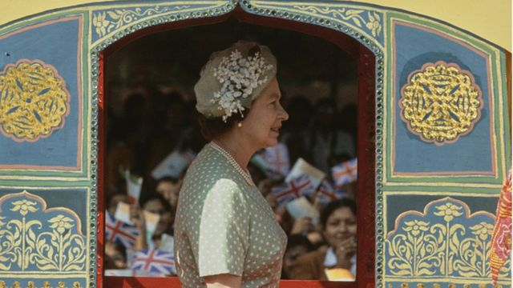
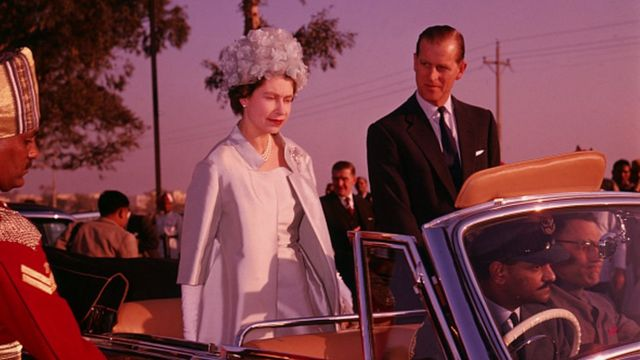
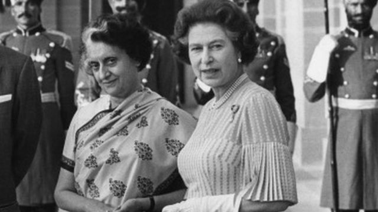
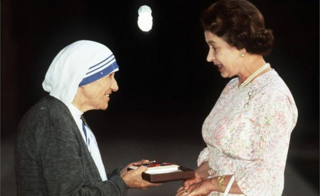

# 印度人心目中的英国女王伊丽莎白二世

#  英国女王伊丽莎白二世的三次印度之行

  * 苏蒂克·比斯瓦斯（Soutik Biswas） 
  * BBC印度记者 

> 图像来源，  Getty Images
>
> 图像加注文字，英国女王伊丽莎白二世1983年对印度进行了为期9天的国事访问

**英国女王伊丽莎白二世1961年1月首次访问印度，当时在女王从德里机场去印度总统官邸的路上，将近1百万印度公众夹道欢迎。**

《纽约时报》当时报道说，“印度人忘掉了那个星期的麻烦。当然不会全忘掉，但是经济困难，政治争斗，和对共产主义中国，刚果和老挝的担忧似乎都退居其次。现在伊丽莎白二世女王到了印度，至少首都德里显得要充分利用这段访问。”

《泰晤士报》报道说，人们乘火车，公共汽车和牛车涌入首都。在首都街头和草坪上游逛，希望能一睹英国女王夫妇的尊容。报道说，“他们似乎把女王和菲利普亲王当成能让他们忘却、并能让他们感到享受的人。”

与此同时，报道还说，“伊丽莎白女王不是作为一名统治者来巡查她的帝国，而是作为一个平等的人来访”，她是印度脱离英国统治获得独立后迎来的第一个在位英国君主。

> 图像来源，  Fox Photos/Hulton Archive/Getty Imag
>
> 图像加注文字，1961年英国女王伊丽莎白二世和菲利普亲王对印度国事访问期间在德里

女王来访给印度一个向一名英国统治者展示的机会，即“在英国人离开后印度人做的还不错”：例如印度有了喷气飞机时代的机场，新居和新办公楼，炼钢厂和原子能反应堆。

对女王夫妇来说，在次大陆长达6周的逗留也是一个很好地发现印度的机会。

英国百代新闻社（British Pathe）的影片资料显示女王夫妇受到热烈欢迎的场面和许多有趣的细节。

女王游览了印度城市孟买，钦奈和加尔各答，而且还去像泰姬陵，拉贾斯坦邦首都斋浦尔的粉红宫殿等历史古迹和瓦拉纳西古城观光。女王还参加了许多招待会，她在印度摩诃罗阇（maharajah）王公的狩猎别墅逗留了两天，骑了大象。女王夫妇还作为贵宾参加了1月26日的共和日盛大阅兵仪式。

在德里的罗摩力拉广场（Ramlila Maidan），女王对那里情绪热烈的成千上万人发表了讲话。她乘坐敞篷车去阿格拉参观泰姬陵，向聚集在那里的人群招手致意。她还访问了在西孟加拉的一个英国援建的炼钢厂，并且同工人会面。

在加尔各答，女王访问了一个纪念维多利亚女皇的纪念碑。为女王夫妇到来，当地一个赛马场还专门举办了一次赛马会，女王向获奖赛马的主人颁发了奖杯。

全印广播电台(AIR)的一名记者在报道女王坐敞篷车从机场前往加尔各答市区的时候引述《约克郡邮报》的社论说，女王也许不是印度女皇，但是印度公众的热情证明了她仍然是亿万印度人心中的女皇。

> 图像来源，  Getty Images
>
> 图像加注文字，英国女王伊丽莎白二世和英迪拉·甘地在德里，1983年11月

差不多过了20年后，在1983年11月，女王第二次访问了印度，访问被安排在和英联邦领导人峰会同时进行。

女王夫妇下榻在豪华的总统宫的贵宾套房。一则报纸报道说，那个套房的印度装饰被换掉，恢复了印度总督时期的面貌。官员说，“在办公室和博物馆落找到的满灰尘的古董家具被修理一新，摆放在套房里。

为了和君王传统相吻合，他们替换了套房里的床单，窗帘和装饰挂布。菜单包括老式的西式菜肴”，因为女王似乎喜欢“简单的食品”。

女王最后一次访问印度是在1997年10月，当时王室正受到一场悲剧的影响。访问安排在纪念印度和巴基斯坦独立50周年的时候，那是女王在戴安娜王妃葬礼后首次公开的官方活动。

那次访问也涉及了一些争议。她本来要访问旁遮普邦阿姆利则的札连瓦拉园（Jallianwala Bagh），当初在那个纪念公园发生过英国统治印度历史上最血腥的屠杀。1919年，在那里英军开枪打死了参加集会的数百名印度人。许多人要求英国道歉。

在访问札连瓦拉园的前夜，女王在德里的一个招待宴会上说：“众所周知，过去有过一些困难的时期，我明天要访问札连瓦拉园，那就是个令人不安的例子。历史不能重写，但是我们有时候还是希望能那样。过去有过悲惨的时刻，也有过快乐。我们要从悲伤中吸取教训，在快乐的基础上努力。”

> 图像来源，  Getty Images
>
> 图像加注文字，在1983年访问德里期间，英国女王向特蕾莎修女颁发了功绩勋章

女王的讲话虽然没有让那些要求英国明确道歉的所有人都满意，但似乎平息了一些受害者亲属的情绪，他们取消了在阿姆利则飞机场举行抗议示威的计划。

在从机场到市区长达10英里的公路两边还出现了“摇旗欢迎的入群”。在阿姆利则的锡克圣地的金庙，女王被允许脱鞋后穿着袜子走进庙内。

王室成员的装束成了印度媒体感兴趣和乐于猜测的话题。《今日印度》杂志报道说，在1983年女王访问印度期间，出现了对女王穿着方方面面的猜测。苏尼尔·谢蒂（Sunil Shetti）这样报道那次访问：

一个记者喊着，“帽子，那顶帽子，那是什么做的？”

一个英国人说，“那是用草做的”，然后正了正身子。

“那裙服呢? 是什么材质?”

“是真丝双绉。”

我问他，“那你是女王的设计师吗?”

“我也是个记者,” 他说。“他的确是（记者），我后来证实了，伦敦《泰晤士报》驻德里的记者。”

女王三次访问印度，她很珍惜和怀念在印度渡过的那段时光。

女王后来说，“印度人民的热情好客，印度本身的丰富多彩让我们所有人都学到很多东西。”

