# 图辑：英国女王灵柩运抵伦敦 民众排队等候瞻仰

#  图辑：英国女王灵柩运抵伦敦 民众排队等候瞻仰

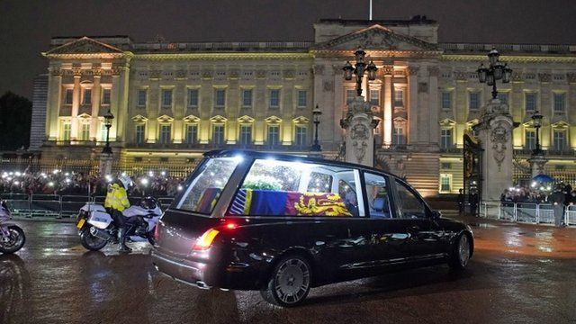

> 图像来源，  PA Media

**英国女王伊丽莎白二世的灵柩13日从苏格兰首府爱丁堡运抵伦敦。**

14日下午，女王灵柩移往西敏厅（Westminster Hall），在那里停放四天。预计将有数以十万计的公众前往瞻仰。

女王国葬将于9月19日举行。

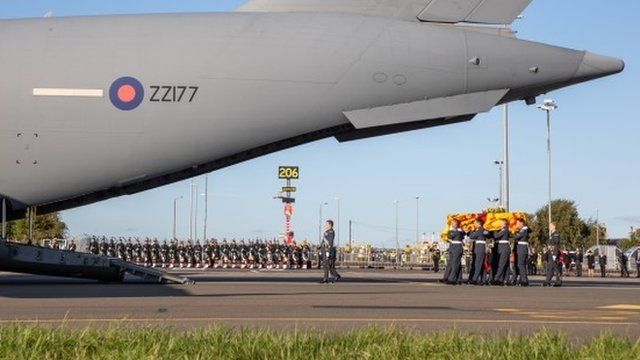

> 图像来源，  EPA
>
> 图像加注文字，女王灵柩13日晚由皇家空军飞机从苏格兰运往位于伦敦西部的军用机场。

> 图像来源，  Reuters

据航班跟踪网站Flightradar24，女王灵柩搭载的飞机成为有史以来跟踪人数最多的一架航班。

该网站说，飞机起飞后几分钟内，曾有将近600万人同时跟踪。

根据Flightradar24，此前的跟踪人数纪录是美国众议长佩洛西上个月前往台湾的航班，当时共有220万人跟踪。

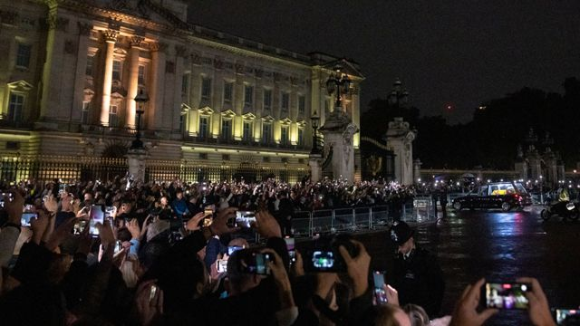

> 图像来源，  Reuters
>
> 图像加注文字，白金汉宫外聚集起大批人群。

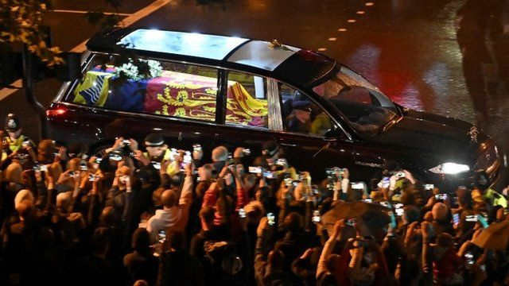

> 图像来源，  Reuters
>
> 图像加注文字，灵车车队从机场前往伦敦市中心的大约十几公里，沿途路边大批民众等候。

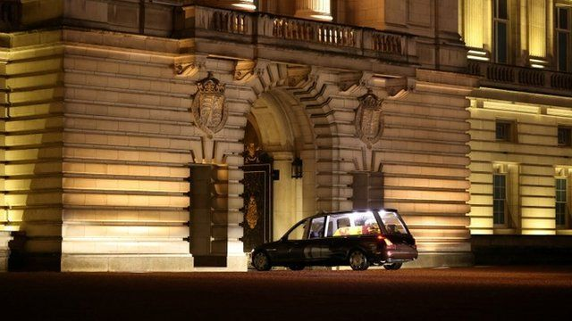

> 图像来源，  Reuters
>
> 图像加注文字，女王灵柩运抵白金汉宫

国王查尔斯三世、王后卡米拉、威廉王子和哈里王子和王室其他成员在白金汉宫迎候女王灵柩。

之后，查尔斯三世和卡米拉离开白金汉宫。

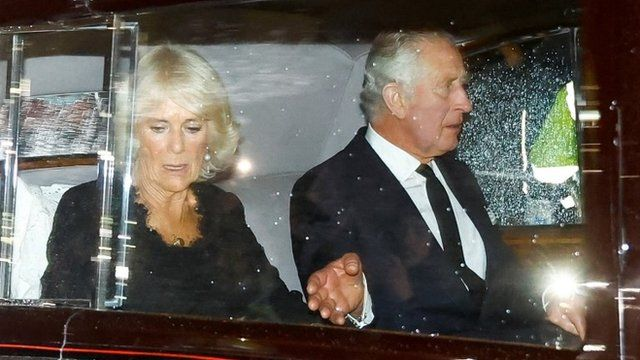

> 图像来源，  Reuters

女王灵柩在白金汉宫停放一夜后，14日下午在王室成员陪伴下移往西敏厅。

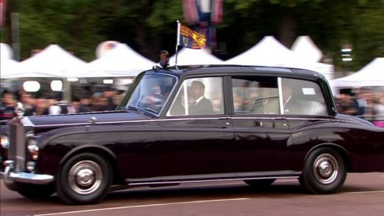

> 图像加注文字，9月14日上午，查尔斯三世抵达白金汉宫。当日下午，他将率领王室成员陪同女王灵柩前往西敏寺厅。

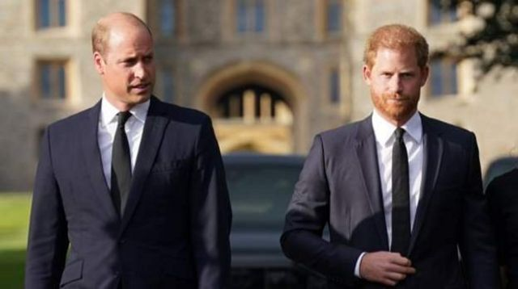

> 图像来源，  PA Media
>
> 图像加注文字，威廉王子、哈里王子也将跟随在女王灵柩之后

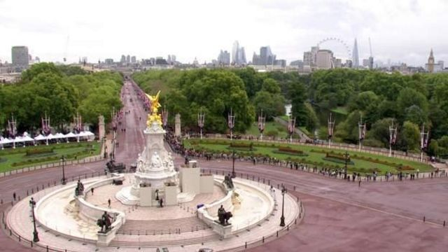

> 图像加注文字，女王灵柩经过的白金汉宫外的林荫大道排满了等候人群

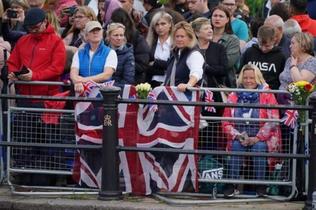

> 图像来源，  PA Media
>
> 图像加注文字，沿途经过的许多地方人群挤到水泄不通

女王灵柩停放四天。

预计将有超过40万人前往瞻仰女王灵柩。官方已经警告，可能需要排队长达数个小时、甚至通宵。

> 图像来源，  PA Media
>
> 图像加注文字，泰晤士河边，大批民众开始排队等候，以期有机会近距离悼念女王。

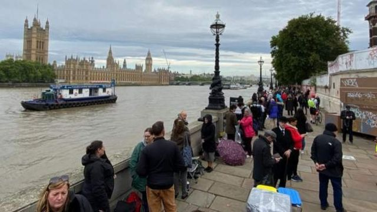

> 图像加注文字，所幸的是，伦敦今天天气尚可，淅淅沥沥的小雨总算停了。

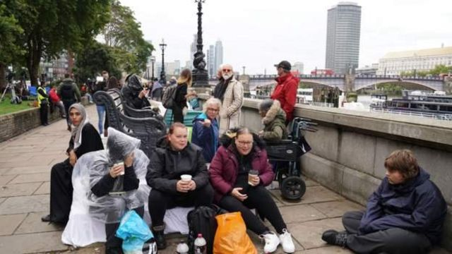

> 图像来源，  PA Media
>
> 图像加注文字，官方说，排队可能需要长达几个小时，甚至通宵

