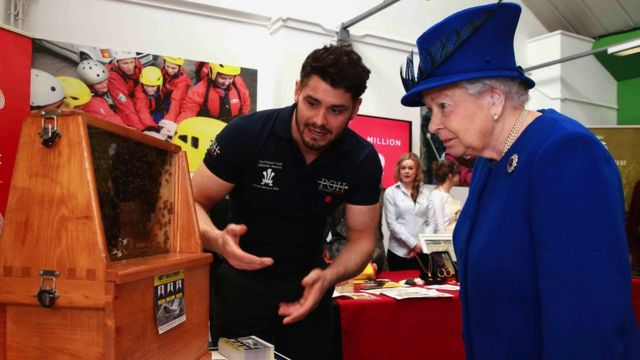
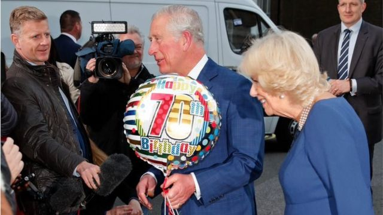
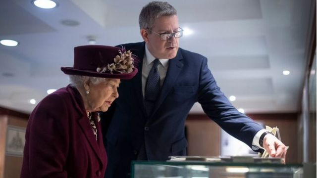

# 通知蜜蜂 - 英国君主去世后那些非同寻常的王室传统

#  英国女王逝世：从通知蜜蜂到墓前断杖 一些不同寻常的王室传统和习俗

  * 费尔南多·杜阿特（Fernando Duarte） 
  * BBC国际部 

> 图像来源，  Getty Images
>
> 图像加注文字，在王子信托基金会一次活动中，工作人员向女王展示密蜜蜂。

**英国女王伊丽莎白二世去世，查尔斯三世登基。这是数十载以来英国首次王位交替，也让人们第一次目睹了英国王室的一些重大礼仪，其中一些甚至令那些自认为是王室事务专家的人惊讶。**

我们盘点一下那些比较不寻常的例子。

##  要把死讯亲自通知蜜蜂

（来自王室官方推特账户推文显示白金汉宫内的四个蜜蜂箱。）

女王去世的消息，尽管有媒体以及社交媒体的大量报道，但对一个少数群体来说，必须要“亲自去告诉它们” ：女王的蜜蜂。

约翰·查普尔担任王室养蜂人已经有15年了。他负责把女王去世的悲痛消息告诉白金汉宫以及克拉伦斯宫（威尔士亲王的官方官邸）蜂巢中的蜜蜂们。这一传统已经保留了数百年。

在接受《每日邮报》采访时查普尔解释说，他还请求蜜蜂们要对新国王好。这一仪式也是一种迷信，即如果不告诉它们更换了主人，蜜蜂可能会停止产蜜。

“去世者为蜂巢主人/女主人 - 家里有重要成员去世了 - 不会再有比女王更重要的人了，对吧？，”查普尔解释说。

“你要轻敲每一个蜂箱，对它们说，‘女主人去世了，但你们不要走。新主人将会是一个好主人’”。

##  查尔斯三世也会有两个生日吗？

> 图像来源，  Getty Images
>
> 图像加注文字，新国王也会保留“两个生日”的传统吗？

在查尔斯国王三世需要做的众多庆典决定中，有一项是涉及到个人的：他的生日庆典。

众所周知，女王有两个生日：4月21日（出生生日），以及官方生日庆典，每年6月的第二个周六，通常会举行阅兵庆典（Trooping the Colour）。

为什么呢？因为在英国，通常4月份户外天气还是很凉的，真正的夏季6月份才开始。

这一传统非常古老，始于1748年的乔治二世。他当时决定把生日庆典和已有的庆祝游行结合起来。

查尔斯三世会保留这一传统吗？我们目前还无从得知，但值得注意的是，新国王的生日是在11月 - 11月的天气可不是以阳光、温暖而闻名。

“我敢打赌新国王将会维持现状，尤其是他是秋天出生的，而生日阅兵庆典又是非常受欢迎的活动，”王室历史学家菲茨威廉姆斯（Richard Fitzwilliams）告诉BBC。

不过，菲茨威廉姆斯指出，英国的又一传统特点是天气的不可预测性，例如，1953年6月伊丽莎白女王二世加冕仪式。

“当天的天气非常不好，”他说，“女王和国王都无法控制天气。”

##  人力胜过马力？

> 图像来源，  Getty Images
>
> 图像加注文字，维多利亚女王的葬礼上，皇家海军水手不得不帮助抬灵柩。

自1901年以来，英国皇家葬礼都是由皇家海军水手用绳索牵引君主的灵柩，灵柩放在炮车上。

为什么要用人而不是马似乎有点令人迷惑，但这一传统开始于1901年维多利亚女王的葬礼上。当时，用马匹拉载有君主灵柩的车仍非常普遍。

但马受到惊吓后失去控制，给行进的送葬队伍带来片刻的恐惧。

“马受不了当时的寒冷天气，差点把维多利亚女王的灵柩弄翻到地上，”皇家历史学家斯瓦布告诉BBC。

维多利亚女王的继承人、也就是新君主爱德华七世命令当时送葬队伍中的水手来帮忙。

“当时有来自世界的各国政要，整个事件差点变成一个巨大的尴尬场面。”

“一个王室传统就这样诞生于纯粹的混乱之中，”斯瓦布补充说。

在1952年国王乔治六世的葬礼中 - 这是最后一次举行此类的君主仪式 - 共有138人负责这项工作。

##  断杖象征着什么？

> 图像来源，  Getty Images
>
> 图像加注文字，前军情五处负责人，安德鲁·帕克将在女王伊丽莎白二世的坟墓上折断白杖

在各种各样的皇家仪式和礼仪中，可能有一项只有很少有人听说过的。

根据传统，王室最高级别总管宫务大臣（Lord Chamberlain）其中的一项任务是伴随君主出席年度议会活动。

他必须在已故君主坟墓上折断手持的礼仪白杖，以标志他为他们服务的终结。

现任宫务大臣安德鲁·帕克（Andrew Parker）曾是英国情报机构之一军情五处的前负责人，他从2021年4月就任此职。

这一仪式传统可以追溯到几个世纪以前。而上一次发生时则是70多年前，当时的克拉伦登伯爵（Earl of Clarendon）在乔治六世国王（女王的先父）的坟前断杖。

菲茨威廉姆斯说，这样的传统赋予了英国王室独特的魅力。

“正是这样的传统，令英国王室真正独一无二。”

