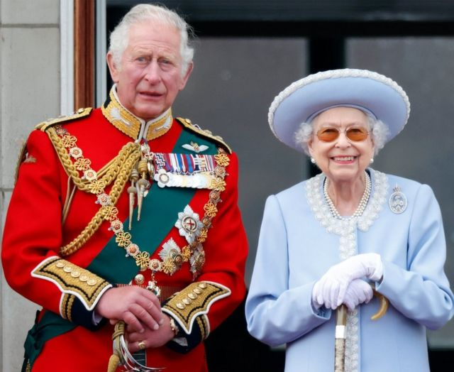
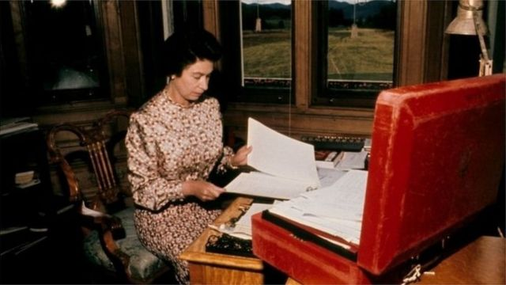
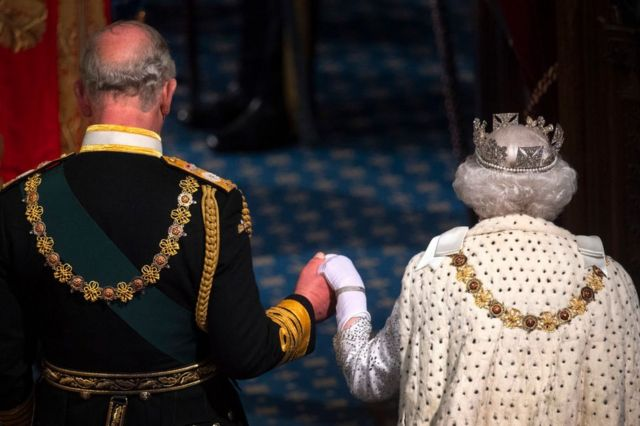
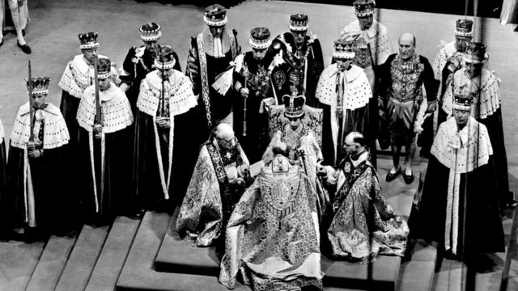
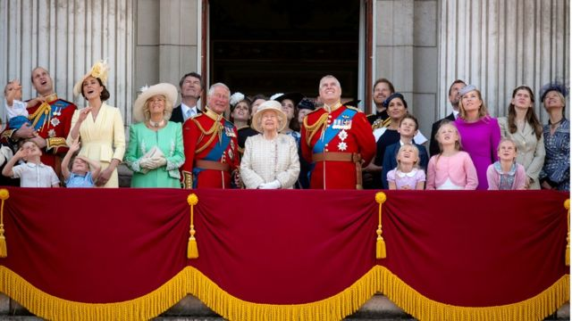
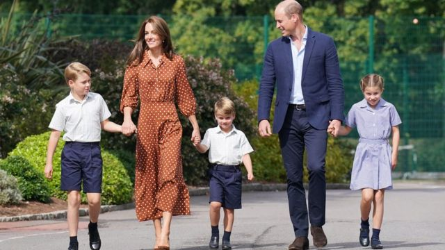

# 英国王室和君主立宪制：国王有什么职能？

#  英国国王查尔斯三世：英国君主有什么职能？

7 小时前

> 图像来源，  Getty Images

**英国女王伊丽莎白二世去世后，长子查尔斯王子继位，成为国王查尔斯三世。**

英国是一个君主立宪制国家，体制传承悠久， 议会和君主互辅并存。

##  英国国王有哪些职能？

国王是英国的国家元首，有许多议会职能，但君主的权力是象征性、仪式性的；君主政治上保持中立。

他每天都会收到政府用红色箱子送达的公文，比如重要会议前的简报，或者需要他签名的文件。

通常，每周周三首相会到白金汉宫觐见国王，陈述政府事务。

这些会面完全保密，没有关于交谈内容的官方记录。

> 图像来源，  PA Media
>
> 图像加注文字，这是1972年的时候英国女王在查看每天都收到的红箱子中的政府公文

国王还具有一些议会职能：

  * 任命政府 —— 赢得大选的政党领导人通常被召到白金汉宫，国王在那里正式邀请他/她组建政府。大选前由国王出面正式解散政府； 
  * 议会开幕大典和国王的演讲 —— 国王主持议会开幕大典，在上议院的王座上发表讲话，宣布政府施政计划； 
  * 王室御准 —— 一项立法议案在议会通过后，必须得到国王御准才能成为法律生效。历史上最后一次君主拒绝御准法案，是在1708年。 

> 图像来源，  Getty Images
>
> 图像加注文字，2019年10月14日，女王伊丽莎白公主和当时的威尔士亲王查尔斯王子出席议会开幕大典

此外，国王将接待来访的国家元首，并会见驻英国的外国大使和高级专员。他通常会在每年11月在伦敦的战争纪念碑前主持一年一度的“国殇日”纪念活动。

新国王是英联邦首脑。英联邦成员包括 56 个独立国家，总人口 24 亿。其中有 14 个国家被称为英联邦王国，这些国家的元首也是英国国王。

然而，自巴巴多斯于2021年成为共和国以来，加勒比地区的其他英联邦国家表示他们可能会效仿。

国王查尔斯三世的形象将取代他母亲的形象，出现在皇家邮政邮箱、邮票和英格兰银行的钞票、硬币上。

此外，新的英国护照上的文字将改为国王陛下（His Majesty），国歌歌词中的“天佑女王”改成“天佑国王”。

> 图像来源，  PA Media
>
> 图像加注文字，1953年6月，伊丽莎白二世在西敏寺教堂加冕

##  王位怎样传承？

英国王位继承顺序规定，在位君主去世或退位时，王室成员按序列继位，第一顺位继承人是君主的长子（伊丽莎白二世的父母没有儿子，故长女继位）。

作为伊丽莎白二世女王的第一个孩子，查尔斯在母亲去世后成为国王，他的妻子卡米拉成为王后。

英国王室 2013 年修订了王位继承规则，确保儿子不再享受优先顺位，跟姐妹同等。

查尔斯三世国王的第一王位继承人是长子威廉王子。国王授予他威尔士亲王的头衔，还把自己登基前的康沃尔公爵头衔传给威廉王子。

威廉王子的长子乔治王子是王位的第二顺位继承人，女儿夏洛特公主是第三位。

> 图像来源，  PA Media
>
> 图像加注文字，2019年，英国王室成员聚集在白金汉宫为女王伊丽莎白二世祝寿

##  王室成员住在哪里？

国王查尔斯三世和王后卡米拉预计将搬进伦敦市中心的白金汉宫。

他们以前住在白金汉宫附近的克拉伦斯宫和英格兰西部的海格罗夫。

威廉王子和他的妻子凯瑟琳王妃曾经住在伦敦城西的肯辛顿宫，最近搬到位于西郊温莎堡附近的阿德莱德小屋（Adelaide Cottage）。

哈里王子和梅根·马克尔住在美国加利福尼亚州。

> 图像来源，  PA Media
>
> 图像加注文字，（自左至右）乔治王子、剑桥公爵夫人、路易王子、剑桥公爵和夏洛特公主在开学第一天手牵手前往兰布鲁克学校

##  君主立宪制有多受欢迎？

根据调查机构 YouGov 2022 年中进行的一项民意调查，女王伊丽莎白二世登基白金禧年庆祝活动期间，62% 的英国人认为应该保留君主立宪制，而 22% 的人认为应该选举产生国家元首。

2012年的 YouGov 民意调查显示，对君主立宪制的支持率为 75% 。

2021年益普索公司（Ipsos Mori）两项民意调查的结果与此非常相似：五分之一的受访者人认为废除君主制对英国有利。

调查显示，大多数年龄较长的人支持君主制，但年轻人的态度明显不同。

2011年，YouGov 首次就这个议题进行民意调查，59% 的18-24 岁的人认为君主制应该持续，而 2022 年这一比例降到 33%。

