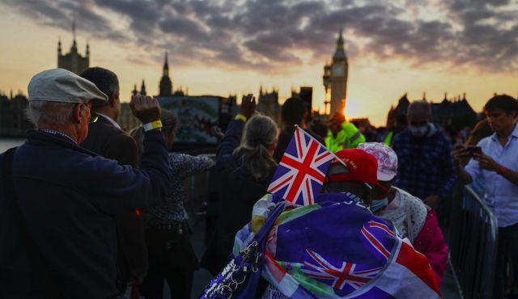
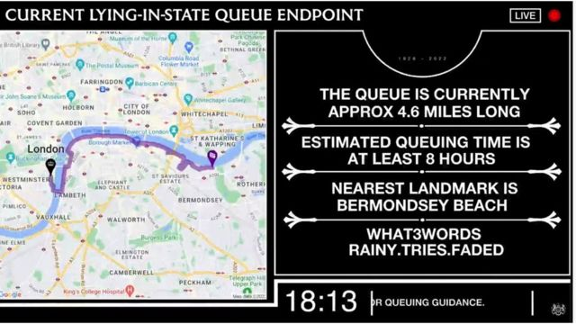
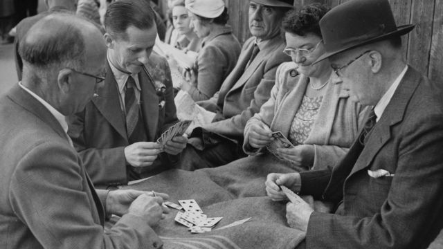
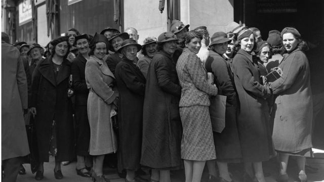

# “爱女王，爱排队”：耐心排队是英国传统特色吗?

#  英国女王国葬：“爱女王，爱排队”——耐心排队属于英国文化特色吗?

> 图像来源，  Getty Images
>
> 图像加注文字，民众排长队耐心等候进入西敏厅

**耐心排队，无论多长都不急不躁，秩序井然，这是不是典型的英国传统特色？**

英国女王伊丽莎白二世在位70年，以96岁高龄辞世后，关于英国的“排队文化”迅速成为社交媒体上的热搜问题之一。

与这个问题相伴的是图片，人们排长队等候迎接伊丽莎白二世女王灵柩、瞻仰女王灵柩的照片和视频。见头不见尾的队伍蜿蜒数公里。

女王葬礼前四天，周四（9月15日），这支队伍从西敏厅（Westminster Hall）所在的威斯敏斯特宫（又译西敏宫）外开始，沿泰晤士河岸一直向东排到伦敦塔桥以外，约有七公里长。

周三，约克大主教斯蒂芬·科特雷尔（Stephen Cottrell）对排队的人们说：“我们正在遵循两个伟大的英国传统：爱女王和爱排队。”

这句话可能抓住了成千上万的人耐心等待并缓缓走向女王灵柩的心灵。

与友人排队等候已有 12 个小时的退休校长克莱尔·莱纳斯（Clare Lynas）， 61岁，就“想好好跟女王告别”。

对他们来说，如此漫长的等待是值得的。他们看了卫兵换岗仪式，这给了他们意想不到的与女王在一起的几分钟。

> 图像来源，  Getty Images
>
> 图像加注文字，排队的人戴着不同颜色的腕带，表明他们在队伍中的位置

队伍沿线为排队者提供了各种服务，满足基本需求：

  * 共500多个便携式厕所，设在沿线多个地点 
  * 队伍经过的街区一些餐馆和企业为排队的人延长或通宵营业 
  * 为残障人士提供无台阶通道，并开设一条单独的无障碍路线 
  * 政府在视频网站 YouTube 上开放 队列实时跟踪  ，供民众随时查看队伍移动进展 

> 图像来源，  UK Government / Google / YouTube
>
> 图像加注文字，队列实时跟踪页面截屏，显示队列长4.6英里，排队时间为8小时，距离起点最近的地标是柏蒙西河滩，可以使用What3Words应用程序代码“rainy.tries，faded”进行定位。

对于熟悉英国文化习俗的人来说，排长队、为排长队的人们提供必要的服务，是一件寻常之事。

温布尔登网球赛期间，按惯例会有一份长达 30 页的排队指南，详细解释观众应该如何排队，有序地等候入场。

> 图像来源，  Getty Images
>
> 图像加注文字，1950年6月20日，温布尔登网球锦标赛开幕，球迷排队买入场券，等候期间玩牌打发时间

##  可追溯到第二次世界大战

英国人对排队的执着痴迷至少可以追溯到上个世纪中叶。乔治·奥威尔（George Orwell）在1947年的文章《英国人》中，试图挖掘第一次到英国旅游的外国游客的心声：

“那位想象中的外国观察员肯定会被我们的温顺、彬彬有礼所震撼：聚集成群的人们行为有序，没有推搡和争吵，心甘情愿地排队。”

一些历史学家认为，排队这个社会习俗是在工业革命期间形成的。当时，城市化浪潮推动了工业社会的产生，引发了从农村到城镇的人口流动，并彻底改变了日常生活的模式。

但真正塑造、确立了英国人“文明排队”声誉的是第二次世界大战，肯特大学社会历史和社会政策讲师凯特·布拉德利（Kate Bradley） 博士说。

她2013年接受BBC采访时说：“起初，排队跟（生活）极端困难相关，因为穷人不得不排队领取施舍，获得慈善帮助。”

“当时的舆论宣传都是敦促民众各尽职守，遵守秩序。

“这是政府在动荡不安的时期试图控制时局的一种方式。”

> 图像来源，  Getty Images
>
> 图像加注文字，1938年6月29日，伦敦市中心 Selfridges 百货公司茶和糖半价促销，女顾客在门外排长队等候

时至今日，有序、礼貌和自愿排队已经成为英国人引以为自豪的国民特色。

近日，一连串 赞扬排队的推文  在网上疯传，截至9月14日，已有超过2.5万人分享。在一些人看来，它归纳了公众对排队的心态：

“排队是英国特色的胜利。这简直不可思议......"

“这是队列之母。这是艺术。这是诗歌。这是所有队列中最出类拔萃的。”

