# 最后的告别：英国女王伊丽莎白二世国葬

#  英国女王伊丽莎白二世国葬图辑：最后的告别

8 小时前

**英国女王伊丽莎白二世2022年9月9日在苏格兰巴尔莫勒尔去世，9月19日在伦敦西敏寺举行葬礼。礼毕，女王棺椁以前所未见的庄重仪仗护送到在海德公园东南角的威灵顿拱门，放入灵车，前往伦敦西郊的温莎堡。**

成千上万民众聚集在出殡路线街道两旁，最后一次向女王致意。

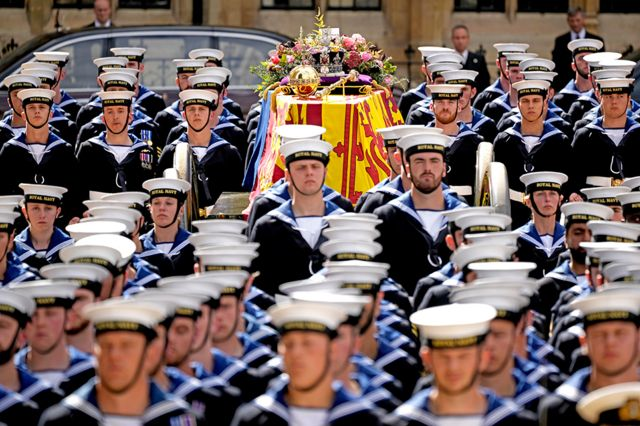

> 图像来源，  Getty Images
>
> 图像加注文字，2022 年 9 月 19 日，英国皇家海军的御用炮车将女王伊丽莎白二世的棺椁从伦敦西敏寺（威斯敏斯特）教堂运往海德公园东南角的威灵顿拱门，沿途无数民众目送出殡队列，最后一次向女王致意。棺椁顶上是帝国皇冠。

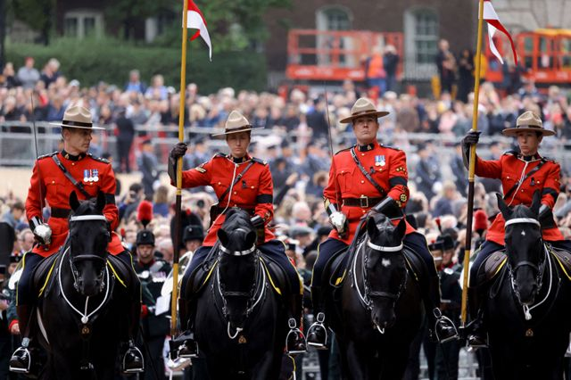

> 图像来源，  AFP
>
> 图像加注文字，女王国葬仪式结束后，出殡队伍踏上最后一程，前往温莎堡，仪仗队里有皇家加拿大骑警。加拿大是英联邦成员国，国家元首由英国君主担任。

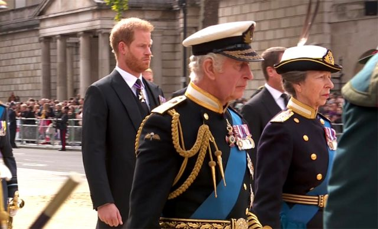

> 图像加注文字，出殡队伍中走在棺椁后面的哈里王子、查尔斯三世国王和安妮长公主和其他王室高级成员。

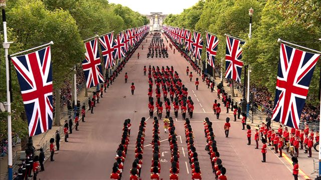

> 图像加注文字，西敏寺葬礼结束后，出殡队伍向海德公园角行进

大约2000名宾客应邀参加了在西敏寺教堂举行的葬礼。坐在第一排的是王室成员。

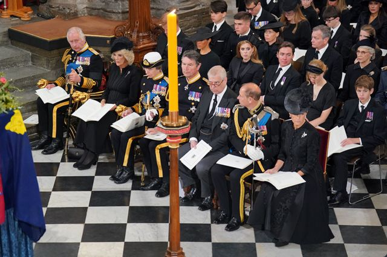

> 图像来源，  PA Media
>
> 图像加注文字，2022年9月22日，西敏寺国葬仪式上，第一排左起：国王查尔斯三世，王后，安妮长公主，蒂姆·劳伦斯勋爵，约克公爵，威塞克斯伯爵和威塞克斯伯爵夫人。第二排左一、左二是萨塞克斯公爵夫妇。

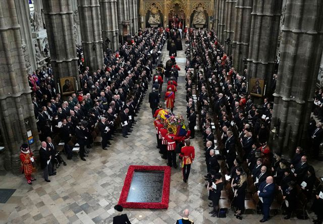

> 图像来源，  AFP
>
> 图像加注文字，9 月 19 日，葬礼开始前，覆盖着英国王旗的女王棺椁由皇家御林军掷弹兵卫队成员抬进西敏寺教堂。出席英国女王伊丽莎白二世国葬葬礼的还有世界各国领导人。

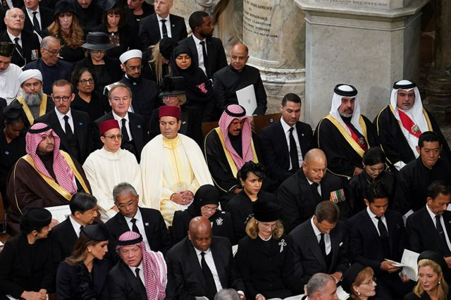

> 图像来源，  Reuters
>
> 图像加注文字，参加葬礼的还有其他国家的王室代表和政要

坎特伯雷大主教贾斯汀·韦尔比（Justin Welby）在葬礼上布道。

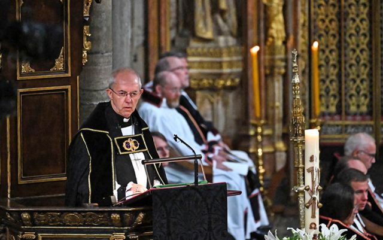

> 图像来源，  AFP

夏洛特公主和乔治王子随父母一同参加了曾祖母的葬礼。

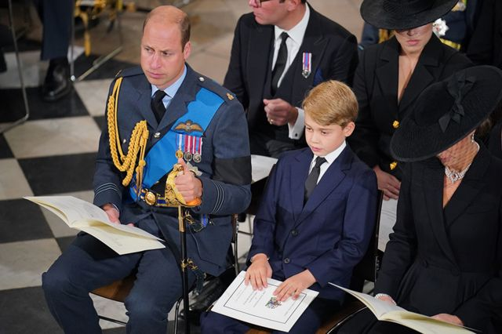

> 图像来源，  PA Media
>
> 图像加注文字，威尔士亲王（左一）、乔治王子和威尔士王妃在葬礼上

有些王室成员穿制服参加葬礼，其他人穿黑色丧服。

> 图像来源，  AFP
>
> 图像加注文字，（左起）英国国王查尔斯三世、长公主安妮、约克公爵安德鲁王子，威塞克斯伯爵爱德华王子抵达西敏寺教堂参加女王伊丽莎白二世国葬仪式

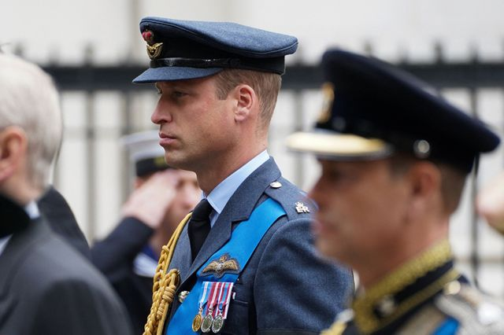

> 图像来源，  AFP
>
> 图像加注文字，威尔士亲王威廉王子抵达西敏寺教堂

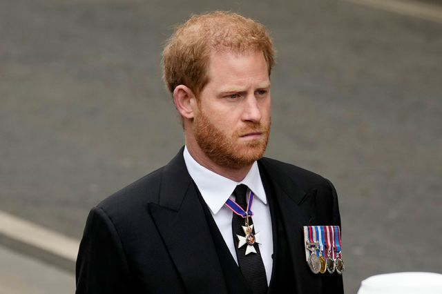

> 图像来源，  Getty Images
>
> 图像加注文字，萨塞克斯公爵哈里王子着丧服出席祖母葬礼

9月19日早晨，国王查尔斯三世和其他王室成员乘车前往西敏厅，然后随出殡队列护送女王棺椁前往西敏寺教堂。

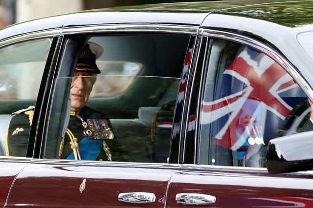

> 图像来源，  Reuters

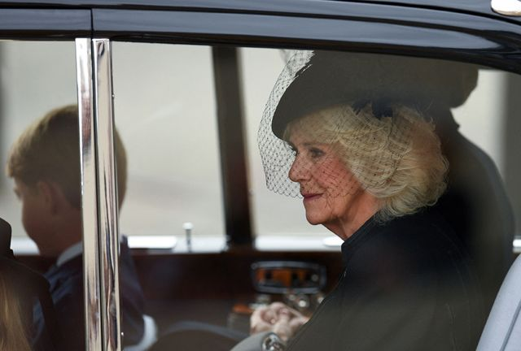

> 图像来源，  AFP
>
> 图像加注文字，王后卡米拉、威尔士王妃凯瑟琳（后排）、威尔士王子乔治和威尔士公主夏洛特乘车前去参加女王国葬仪式

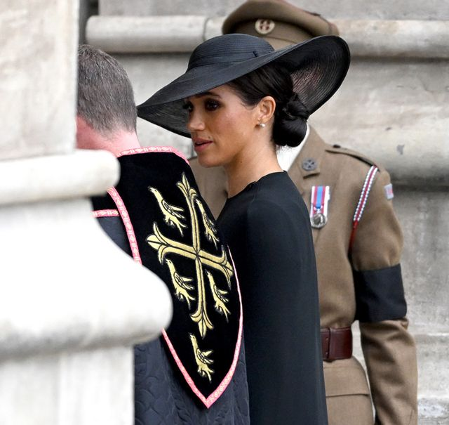

> 图像来源，  Getty Images
>
> 图像加注文字，萨塞克斯公爵夫人梅根出席了女王葬礼

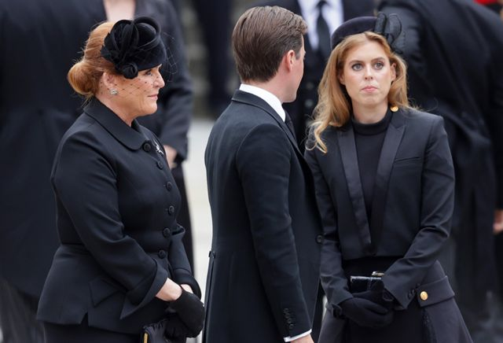

> 图像来源，  Getty Images
>
> 图像加注文字，约克公爵夫人莎拉（左一）和女儿比阿特丽丝公主（碧翠丝，右一）出席葬礼

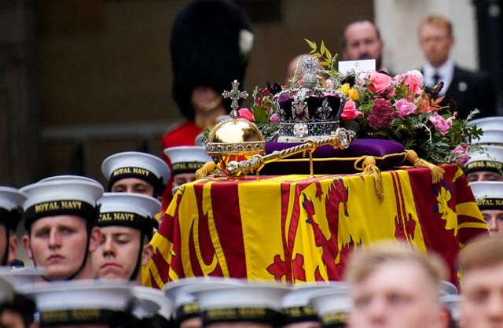

> 图像来源，  Getty Images

法国总统马克龙、美国总统拜登等外国领导人出席了葬礼。

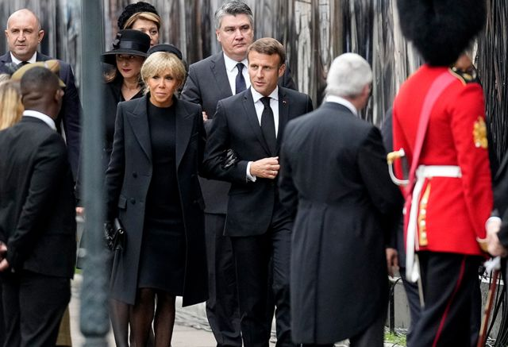

> 图像来源，  Getty Images
>
> 图像加注文字，法国总统夫妇在西敏寺教堂参加女王葬礼

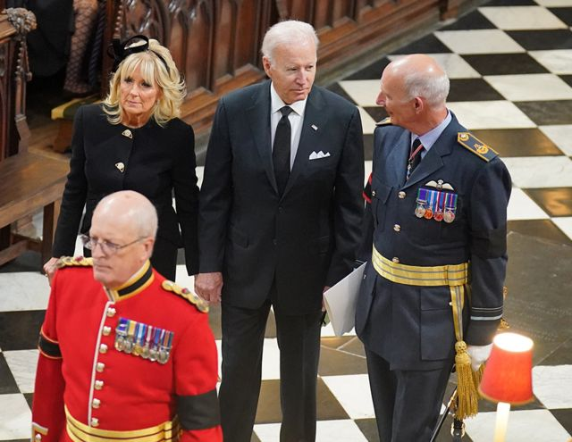

> 图像来源，  PA Media
>
> 图像加注文字，美国总统和夫人抵达西敏寺教堂

英国首相特拉斯（卓慧思）和其他几位前首相也出席了女王葬礼。

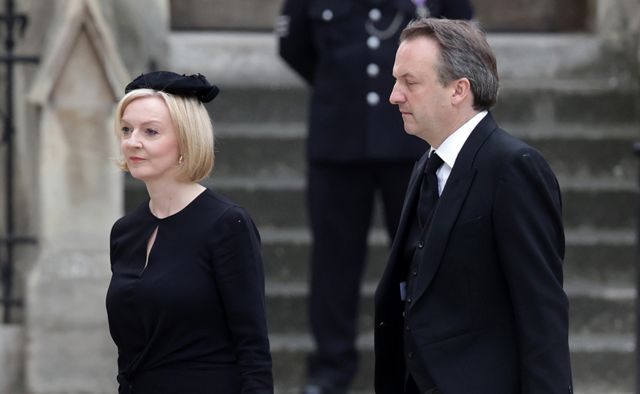

> 图像来源，  Getty Images

> 图像加注文字，英国几位前首相梅杰、特蕾莎·梅、布莱尔、布朗、约翰逊、卡梅伦一同出席女王葬礼。女王在位70年里，见证了唐宁街10号首相府主人历次交替，从丘吉尔到特拉斯

**全部图片版权所有**

