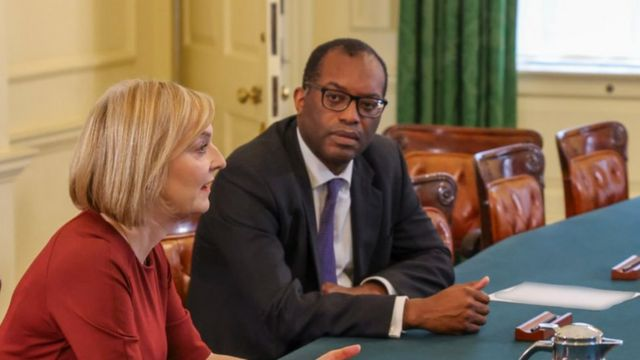
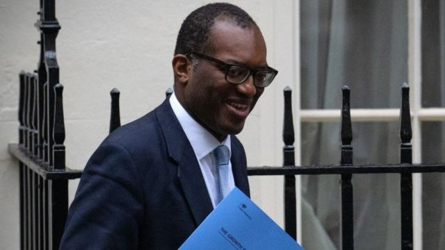

# 英国推50年来最激进减税方案，财政大臣克沃滕称“新时代”到来

#  英国推50年来最激进减税方案，财政大臣克沃滕称“新时代”到来

> 图像来源，  Number 10
>
> 图像加注文字，克沃滕和首相特拉斯

**英国财政大臣夸西·克沃滕（Kwasi Kwarteng，关浩霆）宣布本国近50年来最激进的减税方案，声称这是英国经济的一个“新时代”。**

方案包括取消仅适用于高收入人群的最高所得税税率，并降低收入所得税和置业印花税，同时先前提升企业所得税的计划亦将搁置。

克沃滕表示，英国需要一次重大政策转向，来刺激经济增长。

但是在野工党表示，这项自20世纪70年代以来最大规模的减税措施并不能解决英国当前的生活成本危机，是一项“奖赏已富者的计划”。

但是克沃滕坚持，他的减税计划是“公平”的。

减税措施宣布之际，正值英伦银行（Bank of England）发出警告指英国可能已经处于经济衰退当中。

财政大臣发表讲话宣布方案之际，英镑兑美元随即大跌至37年来的新低。

> 图像来源，  Getty Images
>
> 图像加注文字，克沃滕

放弃前首相约翰逊（Boris Johnson）经济政策的克沃滕，已经取消通过增税来支付公共服务的计划，他的目标是刺激经济增长。

在下议院公布这个被称为“迷你预算”（mini-budget）的计划时，克沃滕表示，高税率“破坏了英国的竞争力”，降低了工作和企业投资的积极性。

他宣布，基本所得税将会在4月下调一个百分点，至19%——比原计划早一年。

他还宣布，最高所得税从45%下调至40%，意味着从4月起，英国将只有一个较高税率。

还有一项出乎意料的措施是，年收入高于15万英镑的人群最高税率45%将会废除。

所得税削减，以及国民保险（National Insurance）的回调，将令较高收入人群能存下更多钱。

其他措施包括：

  * 英格兰及北爱尔兰民众为置业支付印花税的门槛将会上调至25万英镑 

  * 首次置业买家的门槛将上调至42.5万英镑，而他们能够申请税收减免的物业价值 

也将从50万英镑上调至62.5万英镑

  * 原计划的啤酒、苹果酒、葡萄酒和蒸馏酒税率上调将取消 

  * 银行家的奖金上限将取消 

  * 将设立新的投资区域，区内企业将享受减税和放宽计划规限，以鼓励房产建设 

克沃滕兑现了承诺，对约翰逊制订的国民保险金上升进行回调。

他还确认，原定将企业所得税从19%提升至25%的计划也会取消。

克沃滕宣布的减税计划，预计至2027年的总支出会达到近450亿英镑。这位财政大臣表示，这会“将停滞的恶性循环扭转为增长的良性循环”。

“我们在一个新时代需要一个新的做法，聚焦在增长上，”他说。

据英国财政部指，方案宣布后，政府国债将上升720亿英镑。

收入所得税的改变并不适用于苏格兰，但是企业税和国民保险的下调是全英国通行。

##  “大赌博”

独立的英国财政研究所（Institute for Fiscal Studies）所长保罗·约翰逊（Paul Johnson）表示，这一方案相当于是自1972年预算案以来的最大规模减税，减幅比预期高50%。

他说，要实现这些措施，英国可能会在三年内借入1200亿英镑。

保罗·约翰逊还表示，计划是一次“大赌博”，钱被投进一个通胀仍然高企的经济里。不过，他表示，如果经济增长“真的能跟上”，这些是“可控的”。

————————————————————————

##  分析——BBC政治事务记者尼克·伊尔德利（Nick Eardley）

这不是迷你预算。这是激进的减税经济干预，是一次重大的方案调整。

鲍里斯·约翰顿的税务计划已被丢弃。很多家庭将会省下一些钱，但是一些最大的税务减免将是给那些最高薪的人。

而这将会花掉很多钱。

在财政大臣的算盘里，这是值得的。人们需要帮助支付账单，而减税将会刺激增长。如果你提振了经济，将会有更多的税收，然后这会帮助在中期支付债务。

但是很多人怀疑这会不会奏效。

资深保守党人多个月来一直在警告，指这一策略是错误的，将会令未来的世代被债务所累。

反对党认为，政府为富人减税是优先级设定错误，应该从能源公司利润的暴利税中筹钱。

财政部未有表示，预期会在什么时候达到经济增长的目标。

但是财政大臣决心推进这项激进的政策转向。最大的问题是：它会奏效吗？

————————————————————————

工党形容，克沃滕的讲话是“承认12年的经济失败”。

“保守党人不能够解决生活成本的危机，保守党人就是生活成本的危机，而我们的国家再也受不了他们了，”影子财政大臣蕾切尔·里夫斯（Rachel Reeves）说。

“财政大臣今天表明了，他的优先给了哪些人。这不是增长计划，是一个奖赏已富者的计划。是回到过去的下渗（涓滴/trickle- down）经济时代，是未来倒退，不是一个勇敢的新时代。”

自由民主党党魁爱德·戴维（Ed Davey，戴宏）表示：“这是亿万富豪的预算案，显示了保守党完全脱离了那些苦于负担账单的家庭。”

##  衰退并非“不可避免”

在减税方案宣布时，金融市场立即产生反应，英镑汇率和英国股市同时下挫。

但是，克沃滕表示，他的减税计划对各个收入等级是“公平”的。

在接受BBC政治事务编辑克里斯·梅森（Chris Mason）访问时，财政大臣表示：“我完全不认为这是一次赌博。”

“在我看来，坚持原有的路线才是赌博。”

他坚称，不减税，继续奉行前任首相约翰逊的方向，风险更大。

“所以我们必须要做的是重启，重新考虑，”克沃滕说。

就工党的批评他回应指，“迷你预算”不是承认失败，而英伦银行预测的衰退也“并非不可避免”。

但是，他说：“我们也承认我们能够做得更好。”

他表示，减税、取消国民保险提高的计划以及对家庭能源账单提供支持将会“帮助社会里最脆弱的人群度过一段艰难时期”。

在被问到英国经济是否正在衰退时，克沃滕表示，虽然英伦银行这样描述，但是他认为就算有衰退也是小幅度的，而他希望“我们会反弹并增长”。

被追问时，他拒绝确认英国经济是否在衰退。

##  年度公布经济预测

方案还包括一些政府计划为家庭和企业能源账单设定上限的计划细节。

克沃滕表示，这些预算中的成本是“特别不确定”，因为能源价格不稳定，但是以近期价格为准的话，这一方案从10月起的6个月里，总支出预计约在600亿英镑左右。

“我们预期支出会随着与供应商谈判出新的长期能源合约而下降，”他说。

政府通常都会公布独立预报，来反映大规模税务调整对经济的影响，但是克沃滕选择不这样做，因为他的讲话在程序上并不算是预算案。

但是，克沃滕承诺，英国预算责任办公室（Office for Budget Responsibility）将会在年底前公布全面的经济预测，新年还会公布第二份。

国债的大幅上涨正值通胀处于40年新高之际，从而令利息支付增加。

周四，英伦银行将利率从1.75%提升至2.25%——14年来最大幅——这样做是为了给物价降温。

