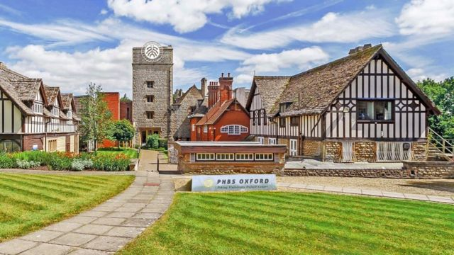
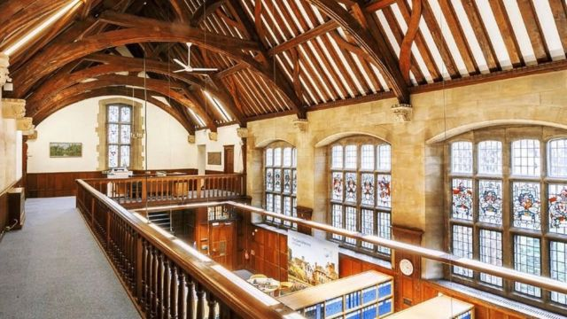

# 北大汇丰商学院英国分校扩建计划为何遭遇反对

#  北京大学汇丰商学院英国分校扩建计划为何遭遇反对

> 图像来源，  PHBS
>
> 图像加注文字，扩建工程规划者称，该地块上增加的建筑占地面积343平方米，仅占牛津绿化带的0.00005%。

**英国议员莫兰（Layla Moran）与选区居民希望政府拒绝中国北京大学汇丰商学院（PHBS）在一个绿化带上扩建校园的申请。**

PHBS所在地，牛津西及阿宾顿区（Oxford West and Abingdon）的议员莫兰说，该校扩建计划 “主要受益者”将是中国，而不是当地居民。

事实上，该校在2017年就从英国开放大学（Open University）买下了位于牛津绿化带上野猪丘（Boars Hill）的大宅Foxcombe Hall作为校舍。

当地的白马谷区议会（Vale of White Horse District Council）今年9月7日批准了扩建计划。

根据该决议，这一地块的用途可以从非住宅教育用地改为住宅用地，并对建筑进行大改造。

决议已提交给区议会秘书处代表克拉克（Simon Clarke）。

##  遭遇反对

来自自由民主党（Liberal Democrats）的莫兰说，此计划“极其不合适”，她告诉英国下议院， “迫切”希望与克拉克会面，解释为何“此计划在当地和英国都是个错误的选择”。

莫兰在提交给英国议会的文件中补充说：“这项规划将在绿化带上进行明显的开发，而野猪丘的当地计划是保护绿化带。”

地方团体“野猪丘之友”也要求克拉克暂停这项计划的申请。该团体声称，在有关校园附近的替代住所的潜在用途方面，区议会的议员们被扩建规划官员 “误导”。

> 图像来源，  Getty Images
>
> 图像加注文字，来自自由民主党的莫兰说，此计划“极不合适”。

但是，北京大学汇丰商学院的规划代表史拉特（Paul Slater）则强调，该校希望为135名学生提供一个 “世界级的环境”，让这些学生在该处学习。

他表示，该地块上增加的建筑占地面积343平方米，仅占牛津绿化带的0.00005%。

“泰晤士报高等教育评鉴”将北京大学列为世界最佳大学之一，排名全球第16。

目前当地共有303人正式连署反对此扩建计划。

##  扩建计划

> 图像来源，  PHBS
>
> 图像加注文字，北京大学汇丰商学院强调该分校希望为135名学生提供一个“世界级的环境”，让这些学生将在该处学习。

该计划将包括建造60名学生的卧室、一个餐厅、一个校园咖啡馆和商店、健身房和一个演讲厅的扩建。一座老实验楼也将被拆除。

这座被列为二级保护的老建筑以前由开放大学使用，后来被北大买下。

2015年，开放大学宣布关闭7个区域中心，包括在牛津郡的校园。

该区议会回覆BBC证实目前有关该校扩建的筹款、住房和社区工作的申请正在审议中，但现在不便置评。

