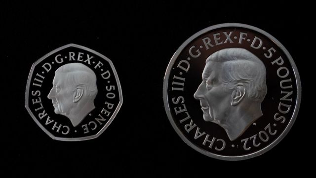
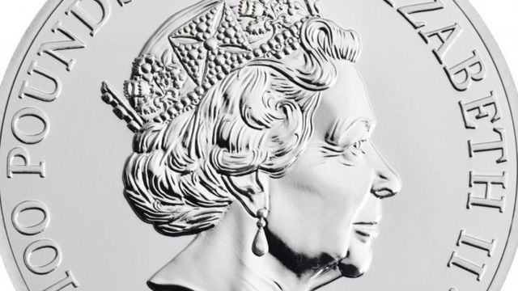
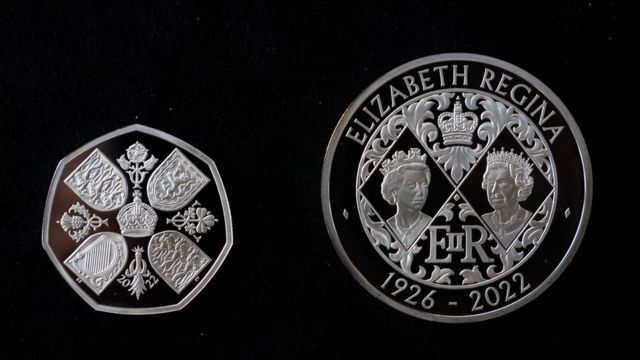

# 英国国王查尔斯三世新币设计揭晓 新币和旧币的三点不同

#  英国国王查尔斯三世新币设计揭晓 新币和旧币的三点不同

> 图像来源，  PA Media
>
> 图像加注文字，英镑硬币上的查尔斯头像

**英国女王伊丽莎白二世去世后，新国王查尔斯三世继位，“改朝换代”的各项工作已经开始进行。**

国王作为英国的国家元首，除了有许多象征性、仪式性的职能，也深入到普通民众的日常生活中。

铸有查尔斯国王肖像的英国新硬币设计已经揭晓。预计新的英镑50便士硬币将在几周内开始流通。

另外揭晓的还有5英镑的纪念硬币，硬币的背面有两幅已故女王的肖像，记录她从年轻到年迈的70年在位历程。

查尔斯国王亲自批准了新币上的设计，据了解，他对硬币上自己的铸像很满意。

> 图像来源，  PA Media
>
> 图像加注文字，英国女王时期发行的货币，都印有女王头戴王冠朝右看的侧面像。

从2023年开始，在英国使用的从1便士到2英镑的各种币值的硬币，都将铸有查尔斯国王的形象。

这些新币将与女王在位时印制的270亿枚硬币在市场上共同流通。

英国皇家铸币厂的首席执行官安妮·杰索普（Anne Jessop）说，硬币一般流通20年，因此伊丽莎白女王和查尔斯国王的硬币将在未来许多年里一起流通。

虽然都是硬币，但是查尔斯国王的硬币与女王硬币还是有三个极为重要的不同之处：

##  1.查尔斯像脸向左，女王像向右

英国王室有数百年的传统，新君在钱币上的脸部朝向与旧君王相反。

> 图像来源，  PA Media
>
> 图像加注文字，两枚硬币的背面设计纪念已故女王

因此即将流通的硬币上，查尔斯国王面向左边，伊丽莎白女王时期铸造的钱币上她面向右边。

但这样的传统也曾有过破例。女王的伯父、曾短暂在位不到一年的爱德华八世，就坚持与前任国王乔治五世一样脸朝左边，因为他认为脸朝右并不是最佳形象。

##  2\. 查尔斯不戴王冠，女王戴王冠

女王在位70年，人们熟悉的英国钱币上都有她头戴王冠的图像。

但是查尔斯选择了不戴王冠。

官方肖像的设计是为了体现国王平易近人的形象。

##  3.铭文用英文不是拉丁文

以前的英国君主在硬币铭文中使用他们名字的拉丁文版本。然而，新硬币上写的是英文的查尔斯三世（Charles III），而不是拉丁文的Carolus。

在硬币上围绕国王肖像的完整铭文是：查尔斯三世-D-G-REX- F-D-50便士-2022"，其中拉丁文的缩写意思为“国王查尔斯三世，以上帝的恩典，信仰的捍卫者”。

