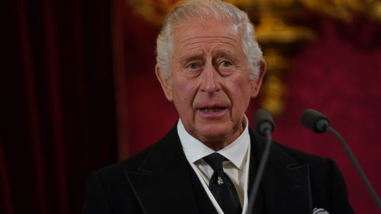
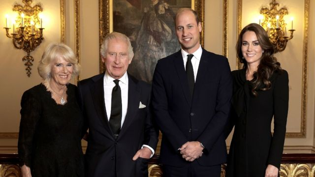

# 接受英国首相特拉斯建议 查尔斯国王将不出席COP27

#  接受英国首相特拉斯建议 查尔斯国王将不出席COP27

9 小时前

> 图像来源，  PA Media
>
> 图像加注文字，白金汉宫已经确认，英国查尔斯国王将不出席下个月在埃及举行的气候变化会议。

**白金汉宫确认，英国国王查尔斯三世将不出席下个月在埃及举行的联合国气候变化峰会COP27。**

它做出相关回应是因为《星期日泰晤士报》此前刊登一篇报道称，英国首相特拉斯“命令”国王不要参加。

白金汉宫说，国王向政府征求了建议，特拉斯女士也给出了建议。

白金汉宫声明说：“基于相互的友谊和尊重达成协议，国王不会出席这次会议。”

在上个月登基之前，当时还是威尔士亲王的查尔斯曾经表示他将出席全球气候变化的这场年度会议。

BBC英国王室事务记者强尼·戴蒙德表示，他向王室提出的问题是：鉴于查尔斯国王长达数十年对环保运动的热情支持，国王个人对此一定感到失望。

但王室回应说，国王会因此感到不快的想法并非事实。国王一向注意英国君主的作用，即根据政府的建议采取行动。

2021年11月，在英国前政府的安排下，当时作为查尔斯王子的国王前往埃及，在访问期间会见了埃及总统塞西，敦促埃及政府加大在防止气候变化方面的努力。

过去，作为威尔士亲王，查尔斯履行了他对环境问题的坚定承诺，长期以来倡导呼吁减少气候变化影响。

2021年，他在格拉斯哥举行的全球气候变化峰会COP26开幕式上发表了讲话，当时峰会由英国主办。已故的英国女王也通过视频致辞。

保守党资深议员托比亚斯·埃尔伍德表示，他希望要“理性常识”地看待这个问题，让查尔斯国王前往埃及。

他在一条推文中说，查尔斯国王在环境保护领域发出“受人尊敬的国际声音”，他的出席将为英国代表团增加“权威”。

_**BBC王室事务记者肖恩·科格兰的分析**_

在去年的COP26会议上，当时的查尔斯王子是大会上的明星之一，热情地呼吁世界领导人在气候变化问题上采取“要打一场战争般的态度”。

今年，至少在表面上，（英国王室和政府的）有无争议的协议，他不会去（COP27）。

他将不得不保持低调。

但是，值得注意的是，这是关于他不会“亲自出席”，这可能为查尔斯做出其他虚拟贡献留下一线希望。

这不可避免地会让有人猜测，在符合英国宪法的规定之下，这将真正让国王感到失望。几十年来，他一直努力致力于解决这些环境问题。

它还可能增加一位新国王和一位新首相之间早期关系紧张的可能性。

但是，不同的角色就有不同的规则的，国王一直都已经清楚：作为一国之君，他必须在一套不同的政治中立约束下行事。

保守党内阁大臣西蒙·克拉克表示，据他所知，国王不出席会议的决定是“友好平和地”做出的。

他告诉英国广播时代杂志，关于国王被命令不要出席这次大会的建议根本不是事实。他表示，这个问题由政府而不是君主来处理是完全正常的程序。

埃及当局表示，他们希望利用担任COP27主席国的时间，敦促国际社会兑现支持发展中国家应对气候变化破坏性影响的承诺。

然而，在峰会之前一直存在各种批评。人权观察表示，埃及已严重削减对环保组织工作的支持。但开罗的官员们表示，该报道有误导。

COP27大会是联合国的峰会，将于11月8日至16日在埃及沿海城市沙姆沙伊赫举行。

> 图像来源，  Buckingham Palace/Getty Images/PA
>
> 图像加注文字，查尔斯国王夫妇、威尔士亲王威廉王子夫妇最新发布的合影。

从10月中旬开始，查尔斯国王将参加他自英国王室哀悼期结束以来的第一批公开活动，包括在爱丁堡为来自英国各地的南亚社区举行的招待会，以及访问苏格兰法夫的邓弗姆林修道院。

周一，唐宁街驳回了媒体有关命令国王不准出席峰会的说法。

政府的一位发言人表示，英国王室是否有任何成员在COP27气候会议上发言是王室的问题。

英国首相的官方发言人不愿对首相与国王之间的对话发表评论，但表示英国在应对气候变化方面有着“令人自豪的记录”。

白金汉宫此前曾表示，国王本着“相互友谊和尊重”向特拉斯女士寻求参加会议的建议。

