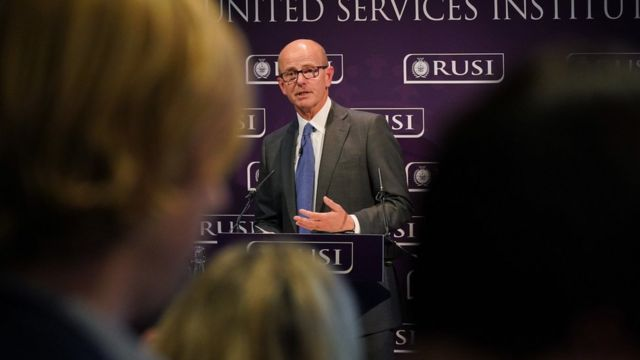
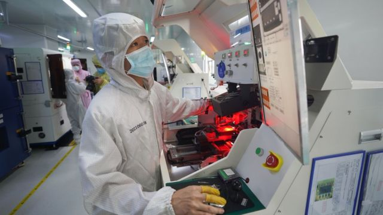

# 英国情报首长：中国科技构成安全威胁

#  “中国科技威胁国家安全”——英国GCHQ首长弗莱明爵士发出警告

  * 戈登·科雷拉（Gordon Corera） 
  * BBC安全事务记者 

> 图像来源，  PA Media
>
> 图像加注文字，弗莱明爵士促请各国提防引入中国科技所要付出的“隐藏成本”。

**英国政府通信总部（GCHQ）总监称，中国科技对英国安全与繁荣构成重大威胁。**

杰瑞米·弗莱明爵士（Sir Jeremy Fleming；傅烈明爵士）在一场演讲中称，中国国家领导层在利用科技，实现对国内与国外的控制。

他强调形势刻不容缓，英国与盟国得予以应对。

弗莱明爵士同时指出，俄罗斯军队在乌克兰战事上已筋疲力尽，但目前没有动用核武器的迹象。

这位情报机关首长在皇家三军研究所（Royal United Services Institute）周年安全演讲上对观众说，中国正刻意、耐心地“透过塑造世界科技生态”，着手获取“战略优势”。

弗莱明爵士认为，中共旨在操纵支撑百姓生活的科技，在国内外植入其影响力，并创造监控的机会。

他警告说，中国透过向世界各地出口科技，寻求建立“附庸经济与政府”，而这些国家在以“隐藏成本”吸纳中国科技的过程中，蒙受着“抵押未来”的风险。

他提出了系列案例，包括：
  * 中国提出的互联网新标准，而这可能植入更大程度的政府操控 

##  中国反驳弗莱明爵士言论

> 图像来源，  Xinhua

中国驻英国大使馆在弗莱明爵士发表演讲后不久，对其言论表示“坚决反对”，“予以强烈谴责”。
 使馆发言人星期二（10月11日）深夜发表书面评论称  ：“英方情报部门负责人有关论调充满偏见、毫无根据，是对中国的恶意诽谤。”

“中国坚持走和平发展道路，始终是世界和平的建设者、全球发展的贡献者、国际秩序的维护者，始终是维护世界和平、促进共同发展的坚定力量。反观美英等少数国家，它们惯用科技优势打压遏制别国发展，在国际上制造对立对抗，给世界带来了数不清的混乱和动荡。谁是国际和平与安全的威胁，世人早有公论。”

弗莱明爵士的发言内容事前已被披露。在北京， 中国外交部发言人毛宁回应说  ：“中国发展科技是为了让中国人民过上更加美好的生活，不针对谁，更不构成威胁。抱守‘中国威胁论’、挑动对立对抗既损人又害己。”

但这位情报总监说，他不会阻止儿童使用中国企业字节跳动旗下应用TikTok（抖音国际版），然而他也说，年轻人应多加留意其个人信息会如何被分享。

他在演讲前对BBC第四广播电台栏目《今日》（Today, BBC Radio 4）说：“不，我不会（制止儿童使用TikTok），但我会跟我的孩子聊，了解他们如何看待手机上的个人信息。”

“我想从小开始认识世上没有免费商品实在很重要。我们在使用这些服务时，我们以自己的数据来交换。要是符合比例，我们又对它们保障数据的手段感到放心，那就最好不过。”

他还说：“好好利用，拍好视频，使用TikTok，但想清楚才用。”

但弗莱明爵士也认为，中国控制未来科技并非无可避免。他说：“我们未来的战略科技优势，在于我们接下来作为一个群体会怎么做。”

弗莱明爵士所运营的机关负责监听通讯与网络空间。他呼吁英国各大学就与中国合作开展“成熟”对话。

一些教育机构与中国同业建立合作项目，而这些合作伙伴与国防或情报机关有联系，引起争议。

弗莱明爵士对演讲观众说，英国应继续欢迎中国学生留学，但要“清楚说明哪些是我们要求额外保护的科技领域”，例如人工智能和量子计算机工程方面，尤其重要。

他的演说也提到了俄罗斯入侵乌克兰事态。他说，俄罗斯军队已“筋疲力尽”，物资与弹药快将耗尽。

> 图像来源，  EPA
>
> 图像加注文字，弗莱明爵士认为俄罗斯不但在乌克兰濒临弹尽粮绝，也丢失了盟友。

他认为动员囚犯与毫无作战经验的兵丁“说明情况有多绝望”，并批评俄罗斯总统普京（Vladimir Putin）做出错误决定。

弗莱明爵士在BBC《今日》栏目中评论俄军状况时，形容它“弹尽朋绝”。

他说从俄罗斯所使用的武器来看，其近日的空袭行动并非升级，但他警告说， 俄罗斯星期一（10日）空袭乌克兰广泛目标  ，说明俄国仍“甚具能力”造成破坏。

他补充说：“俄罗斯的战争机器能推出各式武器，库存与专家经验雄厚，但即便如此，它还是在乌克兰弄得捉襟见肘。”

弗莱明爵士在演讲之后被问到俄罗斯可能动用战术核武器的忧虑，他回应说，任何使用核武器的提议都“极其危险”，但俄罗斯距离使用核武器似乎仍然“遥遥无期”。

他还说，他相信英国及其盟友或有“颇大机会”能及早发现使用核武的事前准备，但不可能保证万无一失。

