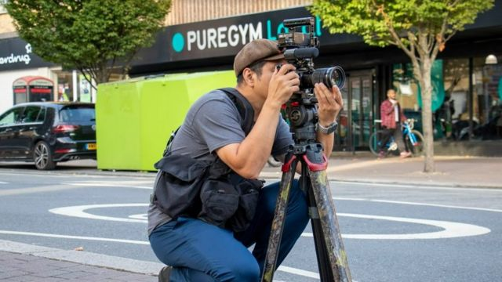
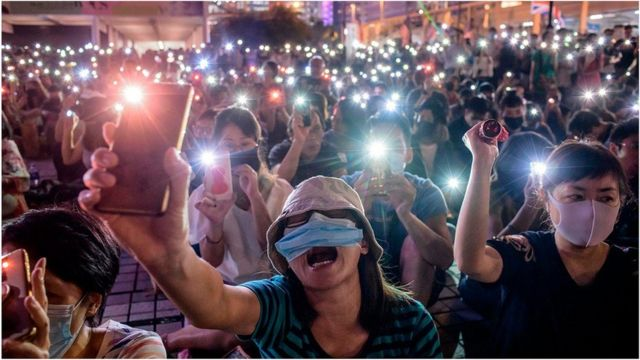
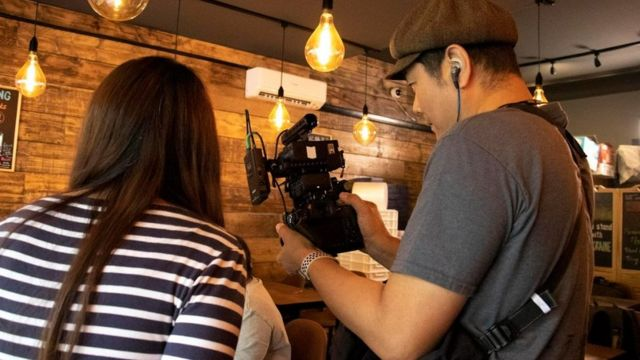

# [Uk] 香港BNO移民英国：飘洋过海之后仍放不下的镜头与笔

#  香港BNO移民英国：飘洋过海之后仍放不下的镜头与笔

  * 林子晴 
  * BBC中文特约记者 

7 小时前

> 图像来源，  BBC CHINESE
>
> 图像加注文字，阿军在英国拍摄时仍然穿着当初在直播拍摄香港反修例示威时穿着的摄影背心。

**时钟已经敲过晚十点，家里的孩子也已入睡。夜深人静之际，散居在英国东南西北各地的多名前香港新闻工作者，齐集于电脑屏幕前，就向他们当年在香港媒体公司时一样开始了视像编辑会。他们密锣紧鼓，讨论新一周新闻节目的编排与拍摄。不知不觉，已至夜半。**

《国安法》实施后，香港新闻界风声鹤唳，不少传媒人选择出走和移民海外。他们其中有些人，飘洋过海来到英国之后，仍然不甘心放下那曾经汇聚他们情感与寄托——纪录时代的镜头与笔杆......

陈广慧就是这群前香港媒体人的负责人。传讯界出身的她解释说：”如果这群人不是痴线（疯狂）的话，都真是没有可能发生的。“

据介绍，十多名原香港记者与制作人，移民英国之后，实在不甘心放下老本行，放下他们深爱的事业，深爱的镜头与笔杆，尽管知道媒体创业的难，也凭着仅仅数十万港元的集资，在英国开创了海外港人的网上媒体“绿豆”。

团队在几乎不收分毫报酬下，有的早出晚归的拍摄、有的通宵达旦剪辑，支撑起每周更新的节目制作。

传媒研究学者指，这些侨民媒体某程度填补了香港本地媒体审查日增下，采访不了的故事、反映不了的批判声音。但由于它们大多是小本经营，面临资源紧绌限制，难以扩大规模。

> 图像来源，  BBC CHINESE
>
> 图像加注文字，阿军拍摄时要身兼多职，一人主理灯光、收音和两部拍摄不同角度的相机。

##  “听到的第一反应是，做得到吗？”

陈广慧口中“疯狂”的团队成员之一，是五十多岁的阿军。他1995年起便为《香港电台》电视拍摄，镜头下作品包罗早年的人物特辑《杰出华人系列》，到近年反修例示威峰烟四起的现场报道。

惟去年，港台管理层改朝换代后，大刀阔斧抽起时事论政节目，一贯阿军合作的导演、制作人纷纷引退后，他的岗位不再，无奈盖上镜头，年初与家人移居英国。他说，“没有想过可以继续拍下去。”

岂料，来了没两个月，他便接到拍摄缴约。提议的是来自曾经共事的老牌时事纪录片节目《铿锵集》制作人。他抛出了“绿豆”的概念，打算在英国拍摄一季十集纪录港人故事的记录片﹐并制作每周时事节目。

“我们做得来吗？”是阿军的第一反应，“我们拍东西可不是那么简单的。”从事电视拍摄多年的他脑中立刻想到：前期、交通、剪接，谁来负责呢？

但他答应的手，还是举了出去。

> 图像来源，  Getty Images
>
> 图像加注文字，2019年香港的民主抗议活动资料照片。

##  “你多少晚没有睡？”

当然，平台不可能有电视台规模的配备。最初，阿军只有“到亚马逊买了一个无线麦克风，加上一部单反（相机）、一个小脚架”。

但就这样，他驾轻就熟，戴上耳筒，躲在镜头后，紧盯着摄影机屏幕，从跟着前香港大学法律学院教授陈文敏游走伦敦法律重地，到走进前劳福局长政治助理莫宜端的英国新居后院，记录她谈在香港为官时的言论禁区。

资源紧拙，很多拍摄工作挤一天完成，尤是劳累。而家住英格兰雷丁（Reading）的他，通常要来回伦敦拍摄，光是乘车就有可能要花上六小时。

有天拍摄，碰巧火车班次大乱，早上八时出门，回到家已将近凌晨。

“我不想麻烦家人到车站接我，最后徒步走回家，走了45分钟，”他说。

当第一集关于陈文敏的纪录片剪成后，阿军就知道，没有白费腿力，但他只是淡淡说道，“我觉得可以再做多些。”

负责管理与文字的陈广慧则甚为兴奋，形容看到成品时，“是感动的，大家都说：‘哇，好看呀！你多少晚没有睡、才可以呕心沥血把它做出来’”。

> 图像来源，  Web
>
> 图像加注文字，绿豆频道网络截图

##  “很久没有看过这些节目”

“绿豆”的节目风格，承传了香港公共广播制制作的味道。团队中一编导自言，“在里面做得久了，无法脱离这风格。”

平台七月起宣布运作而来，来自不同新闻专业背景的团队成员，兵分三路，每周更新纪录片、一周时事论政节目和文字专栏，短短三个月，累积了二千多名每月付费订户。

影片平台YouTube频道获得13万人追踪，总浏览量达300万次。陈广慧指，他们六成的观众身在香港，四成在英国，还有些身处美加。

“‘哇，很久没有看过这些节目’”，陈广慧转述观众的讯息，说收到不少人感谢他们为自己发声。

但她说，他们做的不是什么英勇大事，节目报道只是“正正常常时代会说的正常说话”，是“我们受的专业训练要求我们做的事”。

##  “这不能维持很久”

“但在一个扭曲的年代， 做回一些正常人做的事情.....但原来是那么困难的，”陈广慧说。

她苦恼的，是自平台至今仍然未能完全向全职或半职的同事支薪，只能支付微薄的车马费。“有些人坚持一毫也不收，你给了他，他又把钱转回给你，”她慨叹道，“唉，但这不能维持很久。”

纵然团队众志成城，满腔热血，但她说，有必要寻觅持久可行的经营模式。平台最初主要依赖集资本金、订阅收入作营运；然后，几经波折下，终能开通YouTube频道获广告收益，惟资金未足以支付基本薪酬。

她曾考虑申请慈善基金资助，但资金很多源自外国政府或机构，她不希望牵连外国资金，惹来把柄。她也考虑经营广告，又碍于人手欠缺、搭挡意见不一，尚未实行。

她自嘲搭挡与自己“都不是做大事的人”，没有生意头脑，“我们都不是做生意的，没有一个是（办报商人）‘肥佬黎’”。

##  “他们非常需要这些声音”

流散社群在英国建立侨民媒体早有先例。伦敦政经学院媒体与传播系教授乔治奥（Myria Georgiou）指，侨民媒体在英国具200年历史，从起初的邮寄通讯，发展至电视电台广播，到现今的网上媒体；几乎是愈商业化的，长远地愈成功。

乔治奥说，当一个社群的民意在原居地被边缘化、不得政府或议会代表时，流散侨民媒体成为传达政治声音的首要媒介。

她说，侨民媒体的记者甚至会因为“权威声音”特别获侨民和原居地民众尊重，因为“他们非常需要这些声音，比在具有开放民主体制的国家里的人，更需要这些声音。”

今波香港BNO移民浪潮下，海外港人创办与营运的网上媒体也应运而生。除了绿豆，还有网媒《同文Commons》和在社交媒体运作的《追新闻》。

香港中文大学新闻与传播学院院长李立峰指，过往因应八、九十年代港人移民潮，在美加地区营办的侨民媒体如加拿大《明报》、《星岛日报》，多数由报业集团投资，部分内容会刊登香港版本报章新闻。

今天媒体移师网络，李立峰指，“几个人志同道合，有办法筹到钱，就可以开始。”这些媒体，是依赖“社会资本”，即社会网络来动员的资源或能力起家。

但单靠社会资本不持久。他说，在寻觅营运经费上，将会面对“恒久存在的困难”，预计长远地能以小规模“挨下去”，但难以扩大发展。

> 图像来源，  BBC CHINESE
>
> 图像加注文字，阿军与编导一起在东伦敦一家由港人开设的茶餐厅为“绿豆”的纪录片作拍摄

##  “能做到什么，就做什么”

这天，阿军又再一早出门，伙同一名绿豆编导在东伦敦采访一家经营茶餐厅的香港人。

拍摄完成后，两人站在街头聊天。编导慨叹，这两年见尽香港多家媒体倒闭，时事节目被腰斩，总觉得“所有东西都有完结得一天，能做一天是一天了”。

阿军也相信，作为走出来的人，“能做到什么，就做什么”，

无论如何，先把东西纪录下来，因为那些东西“沉淀下来后，再回看，（是）有历史价值的”。

**为尊重受访者意愿，阿军为化名。**

