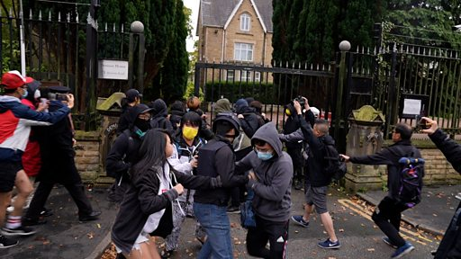

# 居英港人曼城中国领馆外抗议期间遭殴打

#  中共二十大：港人曼城中国领馆外抗议期间遭殴打 警方调查

**中共二十大：港人曼城中国领馆外抗议期间遭殴打 警方调查**

中共二十大开幕之际，一群居英港人在中国驻曼彻斯特总领事馆外抗议，与一群从领馆内走出来的人士发生冲突，有港人一度被拖进领馆范围殴打。

事发于星期天（10月16日）英国夏令时间15:00左右（14:00 GMT）。BBC中文镜头拍摄到冲突发生，与警察制止事态过程。

集会初时和平进行，有人摆放宣传字句条幅和画有中国国家主席，中共中央总书记习近平的漫画肖像。突然有人从领事馆内走出，破坏条幅并取走画像，引起在场集会人士不满，上前试图阻止，双方爆发冲突。

其间一度有示威者遭拖入领事馆范围内殴打，后来获到场警员救出。

英国大曼彻斯特警察（Greater Manchester Police）向BBC中文确认正进一步调查事件，并将加强巡逻；英国外交部消息称正寻求“紧急厘清事态”。

中国领馆方面对BBC中文称，对于“一小撮‘港独’分子未经批准”在领馆外聚集，并悬挂“侮辱中国国家元首的画像”表示“强烈愤慨和坚决反对”，并要求英方“确保我领事机构和人员的安全与尊严”。

采访、制片：李洛

