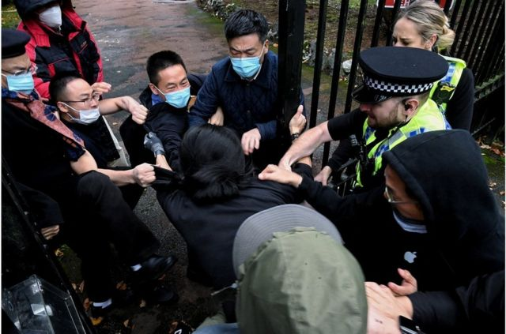
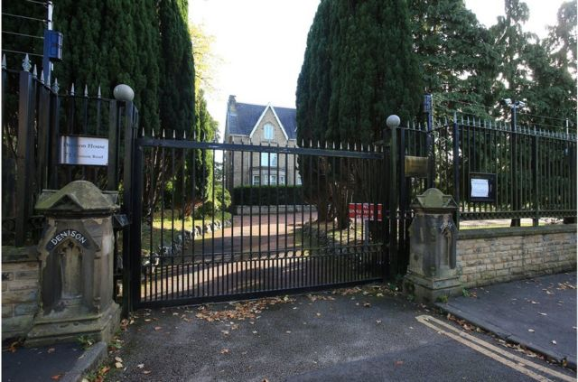

# 中共二十大：居英港人曼城示威风波 英国首相称“令人深感忧虑”

#  中共二十大：居英港人曼城示威风波 英国首相称“令人深感忧虑”

  * 林子晴 
  * BBC中文特约撰稿人 

> 图像来源，  MATTHEW LEUNG/THE CHASER NEWS
>
> 图像加注文字，英国当局呼吁目击者提供片段，协助警方调查。

**中共二十大开幕之际，在英港人组织周日（10月16日）下午在中国驻曼彻斯特总领事馆门外举行集会；其间，有从总领事馆走出来的人与示威者发生肢体冲突，引起英国传媒和政界关注，使事件升级至外交层面。**

英国首相特拉斯（Liz Truss）发言人回应事件指，“这些报道显然令人深感忧虑”（obviously deeply concerning），“我了解到曼彻斯特警方已立即回应事件，并正作调查，因此我不宜评论”。

多名跨党派英国国会议员促请英国外交部传召中国驻英大使解释，并指将最快于周二在下议院就此提出“紧急质询”，询问政府如何回应事件。

中国外交部发言人汪文斌星期二（10月18日）在例行记者会上回答媒体提问时回应说，“滋扰分子非法进入中国驻曼彻斯特总领馆，危及中国外交官舍安全”，“中国驻外使领馆的安宁和尊严不容侵犯”。

##  曼城警方调查

英国大曼彻斯特警方（Greater Manchester Police）证实，当局已经在就中国驻曼彻斯特总领事馆外示威后“一名男子遇袭事件”进行调查，目前未有人被捕。

警方声明指，10月16日下午，大约有30至40人在中国领事馆外聚集，当时也有警员在场巡逻。接近下午四时，总领事馆内有一小群人走出来；然后，有一名年约30岁的男子被拖入总领事馆范围内，并且遭到袭击。有警员担心男子安危，上前介入，把受害者移离总领事馆范围。

警方指，该名遇袭男子身体多处受伤，当晚要留院接受治疗。当局亦正呼吁目击者提供片段，协助警方调查。

##  英国议员回应

多名跨党派英国国会议员要求英国外相詹姆斯·克莱弗利 （James Clevery，又译祈湛明）紧急传召中国驻英国大使郑泽光解释事件。

英国国会下议院外交事务委员会主席、保守党议员艾丽西亚·卡恩斯（Alicia Kearns）指，对事情“感到震惊”，“如果片段获得证实， 中国驻英大使应该要立即被传召并要求道歉，涉事的领事馆官员应该被送回国”。

她续指，“中国共产党不能把殴打示威者、阻止言论自由的行为带来英国”，“我们有责任保护为逃离政治迫害、来到英国的香港人”。

关注香港和中国事务多时的工党国会议员凯瑟琳·韦斯特（Catherine West）向BBC中文说，她指对此“绝度关注”，而 “中国政府可以预计，英方将会就此采取强硬立场”。

“我是第一次见到，在使馆外面会发生这种程度的暴力行为”，韦斯特强调，英国是一个重视言论自由的地方，“我们会强硬地捍卫每个人在英国表达意见的权利”。

她指，她和其他党友将在国会提出质询，询问政府就事件的应对措施，藉此向中国与其他国家的驻英代表“发出强硬讯息”，表明不能接受袭击个人或撕毁示威条幅的行为。

##  中方如何回应

中国外交部发言人汪文斌星期二（10月18日）在例行记者会上说，“滋扰分子非法进入中国驻曼彻斯特总领馆，危及中国外交官舍安全，任何国家的外交机构都有权采取必要措施，维护馆舍的安宁和尊严”。

汪文斌说：“我要强调的是，中国驻外使领馆的安宁和尊严不容侵犯，希望英方切实履行责任，采取有效措施，加强对中国驻英使领馆馆舍和人员的保护。”

中国驻曼彻斯特总领事馆早些时候回应BBC中文查询时指，“一小撮‘港独’分子未经批准，在中国驻曼彻斯特总领馆前聚集，并在领馆正门悬挂侮辱中国国家元首的画像”。

声明指，“这种恶劣行径是任何国家的外交领事机构都不能容忍和接受的。我们对此表示强烈愤慨和坚决反对。”

总领事馆亦指，“希望英方从两国友好出发，按照《维也纳领事公约》，确保我领事机构和人员的安全与尊严”。

> 图像来源，  Lindsey Parnaby/PA Wire
>
> 图像加注文字，中国驻曼彻斯特总领事馆。

##  分析

**BBC外交事务记者兰戴尔（James Landale）**

在英国大使馆和领事馆外的抗议活动经常会发生一些冲突，警察也经常会在现场维持秩序。

但很少有领事人员走到街上拉下横幅和海报；更为罕见的是，抗议者被拖进大门并显然遭到殴打。

因此，越来越多的人要求外交大臣詹姆斯·克莱弗利召见中国驻英国大使对此做出解释也就不足为奇了。

工党外交事务发言人大卫·拉米（David Lammy）表示，如果殴打示威者属实，那是“不可接受”的，他还说：“永远不会容忍我们街头的和平抗议被打压。”

英国警方和内政部首先将展开调查，然后从刑事司法的角度决定是否、以及采取何种行动。至于外交部，将决定是否作出任何外交回应。

英国是《维也纳公约》的签约国，该公约赋予领事人员及其财产一些外交豁免权。但外交官及使领馆雇员仍受英国法律约束，也有可能被英国政府宣布为不受欢迎的人（persona non grata）。

##  示威集会主办方是谁？

是次的示威集会是由在英香港人组织 “捍卫港人阵线”（Hong Kong Indigenous Defence Force）  举办。

“捍卫港人阵线”发言人蒂姆（Tim）称当天是希望藉着中共二十大召开，“以和平集会方式，包括展示标语和画像”，表达对中共的反对声音；袭击事件令他们觉得“在英国的人权被侵犯，希望英国政府作出应变”措施回应。

他指，该组织由是一批港人今年在曼彻斯特成立，成员大多为持有“英国国民（海外）护照”（即BNO）的新移英港人；成立组织是希望，透过展览、集会等活动，“关心香港人政治处境，协助香港人投入议政等政治参与”。

此外，在曼彻斯特的香港人与多个港人组织，发起了网上联署；信件指，事件“明显侵犯英国公民的言论及人身自由，绝不能容忍”。他们要求外交部调查“涉事中国领使馆职员有否违反英国法律及国际法”。

##  事件如何影响英中关系？

前英国外交官、伦敦大学国王学院刘氏中国研究院凯瑞·布朗（Kerry Brown）教授指，事件对中国在英国的印象和声誉具“灾难性”的影响，“对中国毫无好处，对英中关系毫无好处，真是一个灾难”。

布朗指，事件在“不能更糟糕的时机”发生，尤其近日有英国传媒引述消息报道，英国政府将把中国列为“威胁”。他说，这事件为英国国会内的对华鹰派议员，提供了“他们需要的所有弹药”，推动对华立场强硬的外交政策。

布朗形容，相信是中国驻曼城总领事馆官员或职员人士的行径“完全不能接受”，有如“流氓”，“令人震惊”且“无法辩解”。

布朗指，中国驻英使馆门外很少发生同类事件，对上一次已经要追溯到1967年的“波特兰广场事件”；当时中国外交官员在伦敦的中国大使馆门外，与警察和记者发生流血冲突。

