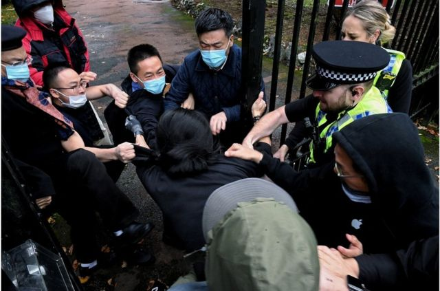
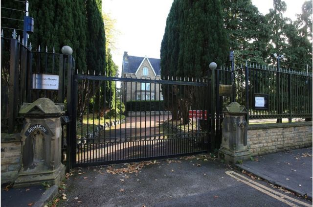
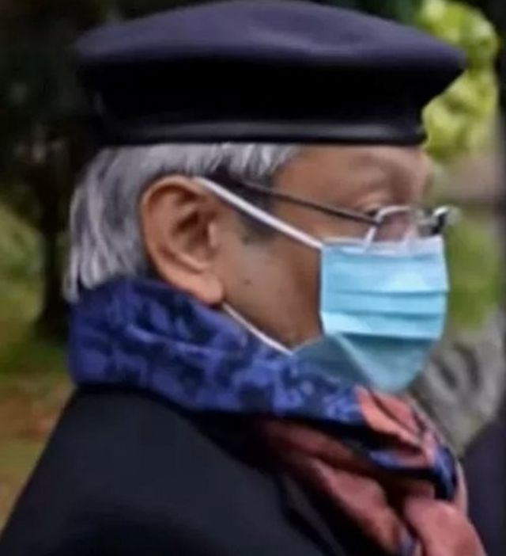

# 英国议员：中国外交官参与曼城领馆针对抗议者的暴力

#  居英港人曼城示威风波：英国议员称中国外交官参与针对抗议者的暴力

  * 陈炜斯和弗雷泽（Yvette Tan 和 Simon Fraser） 
  * BBC 新闻 

> 图像来源，  MATTHEW LEUNG/THE CHASER NEWS
>
> 图像加注文字，英国当局呼吁目击者提供信息，协助警方调查。

**一位英国议会议员说，中国驻英国最高级别的外交官之一在曼彻斯特中国领事馆外参与了针对抗议者的暴力事件。**

“我们看到，中国总领事撕扯海报和（驱赶）和平抗议，”艾丽西亚·卡恩斯（Alicia Kearns）18日在下议院告诉议员。

在英国，议员享有一定特权，允许他们在议会自由发言，而不必担心法律诉讼。

中国尚未就郑曦原总领事涉嫌参与攻击抗议者发表评论。

但北京外交部已经为曼城领事馆工作人员的行为进行了辩护。

中国外交部发言人汪文斌星期二（10月18日）在例行记者会上回答媒体提问时回应说，“滋扰分子非法进入中国驻曼彻斯特总领馆，危及中国外交馆舍安全”，“中国驻外使领馆的安宁和尊严不容侵犯”。

中国官方的说法与现场视频录像和当地警方声明不一致。当一名抗议者遭到袭击时，警察不得不将他从领事馆大门内拖回来。

卡恩斯女士告诉国会议员，在郑曦原总领事撕毁标语牌后以及接下来的冲突当中，“一名香港人受到严重的身体伤害，其中一人因参加和平抗议而住院。”

“一些人随后被拖到领事馆领地，遭到被认定为中共党员的官员的更多殴打。”

“我们不能允许中共把他们的一贯做法带进来：对抗议者的殴打、对言论自由的压制，以及一次又一次地不允许在英国领土上举行抗议。这是令人不寒而栗的升级。"

> 图像来源，  Lindsey Parnaby/PA Wire
>
> 图像加注文字，中国驻曼彻斯特总领事馆。

大曼彻斯特警方（Greater Manchester Police）证实，当局已经在就中国驻曼彻斯特总领事馆外示威后”一名男子遇袭事件“进行调查，目前未有人被捕。

警方声明指，10月16日下午，大约有30至40人在中国领事馆外聚集，当时也有警员在场巡逻。接近下午四时，总领事馆内有一小群人走出来；然后，有一名年约30岁的男子被拖入总领事馆范围内，并且遭到袭击。有警员担心男子安危，上前介入，把受害者移离总领事馆范围。

警方指，该名遇袭男子身体多处受伤，当晚要留院接受治疗。当局亦正呼吁目击者提供片段，协助警方调查。

英国保守党资深议员伊恩·邓肯-史密斯（Iain Duncan- Smith）爵士质疑政府，是否会”准备驱逐（中国）总领事以及任何被证实参与殴打和破坏行为的人“。

英国外交部长杰西·诺曼（Jesse Norman）表示，政府已召见中国驻伦敦临时代办，要求其作出解释。

诺曼告诉下议院：”我们已经概述了向中国大使馆正式提出这个问题的程序......我们将看看这些程序，这些法律和起诉程序可能会导致什么，到那时我们将采取进一步行动。“

> 图像加注文字，抗议现场视频中被指是中国驻曼彻斯特总领事的人

