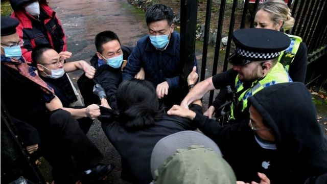
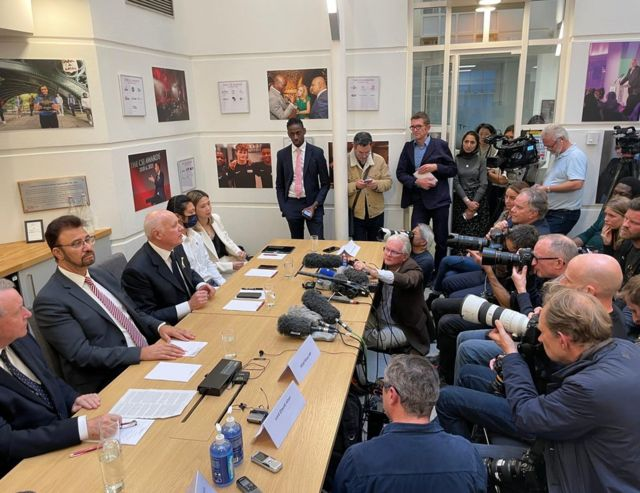
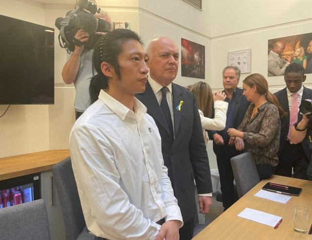
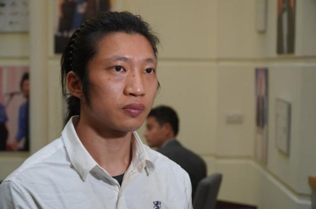

# [Uk] 居英港人曼城示威风波：中国外交官郑曦原承认介入事件

#  居英港人曼城示威风波：中国外交官郑曦原承认介入事件

59 分钟前

> 图像来源，  Reuters
>
> 图像加注文字，上周日（10月16日）中国驻曼彻斯特总领事馆外的一场示威活动演变成暴力冲突。

**英国曼彻斯特中国总领事馆冲突事件被指涉及中方高级外交官，中国驻曼城总领事郑曦原于周三（10月19日）向英国媒体承认自己曾介入事件，并称这是“我的责任”。**

上周日（10月16日）中国驻曼彻斯特总领事馆外的一场示威活动演变成暴力冲突，有视频显示一名示威者被殴打，引发中英外交风波，英国政界高度关注事件。

在事件中受伤的居英香港示威者Bob Chan于周三向媒体表示，自己未曾试图闯入领事馆范围，“我是被拉进去的。”

他表示自己被多名男子殴打，事后受伤送院。

中国驻曼城总领事郑曦原则否认自己曾袭击示威者，但声称当时总领事馆人员的生命受到威胁。

英国议员发声要求英国政府驱逐中国总领事。

##  “这是我的责任”

> 图像来源，  BBC News Chinese
>
> 图像加注文字，英国议会多名议员在周三（10月19日）举行记者会。

郑曦原向英国媒体表示，自己的确曾介入事件。

“我认为当时是个紧急情况——该名男子威胁我同事的生命，”郑曦原在接受天空新闻台（Sky News）访问时说，“我们是在试图控制当时的状况。”

他表示自己没有“袭击任何人”，但是视频和照片显示，他曾拉拽一名男子的头发。

“那是因为他侮辱我的国家，我的领导人，”郑曦原在访问中说，“我认为那是我的责任。”

事发当天是中共二十大开幕日，数十名香港示威者在中国驻曼彻斯特总领事馆门外摆放讽刺习近平的漫画，包括带有中文脏话的直幡。

BBC的视频显示，郑曦原一度走出领事馆，将直幡扯下，随便被示威者指骂。

中国驻曼彻斯特总领事馆声明指：“一小撮‘港独’分子未经批准”在领事馆外聚集，并悬挂“侮辱中国国家元首的画像”，“这种恶劣行径是任何国家的外交领事机构都不能容忍和接受”。

##  “我是被拉进去的”

> 图像来源，  BBC News Chinese
>
> 图像加注文字，事件中受伤的30多岁港人Bob Chan在周三（10月19日）出席了英国议会多名议员举行的记者会，他身旁是保守党前党魁伊恩·邓肯-史密斯（Iain Duncan Smith，施志安）。

BBC中文记者李澄欣报道，英国议会多名议员在周三（10月19日）举行记者会，事件中受伤的30多岁港人Bob Chan出席，并通过即时传译用广东话回答记者问题。

他表示自己遇袭后多处受伤，目前“腰骨最痛，一坐下就痛”，事后亦有心理阴影，晚上难以入睡，并会做噩梦，很担忧家人及示威组织成员的安全。

中国外交部发言人汪文斌在周二指责有关事件起因是“滋扰分子非法进入领事馆”，批评示威者危及中国外交馆舍安全，称任何国家的外交机构都有权采取必要措施，维护馆舍的安宁和尊严。

对此，Bob Chan重申自己从没试图进入领事馆，“我是被拉进去的”。

他忆述，中国领事馆人员当时出来拿走示威道具，他试图阻止，期间被人拉入领事馆范围并拳打脚踢，有人在其背后扯头发。从冲突影片可见，拉扯头发者疑似是中国驻曼彻斯特总领事郑曦原，但Bob Chan说当时自己背对着施袭者，无法证实是谁动手，但形容有关行径“野蛮”。

Bob Chan表示集会是和平示威，否认有挑衅行为。他说： “一开始帮手在领事馆栏杆外摆放旗帜、纸牌等示威道具，已经有两个领事馆保安说不能摆，但我知道是可以的，因为到场后问过警方，警方说我们有权利表达意见，只要不碰到围栏、不要有任何冲击领事馆的行为就可以。 我们很小心不碰到围栏，从来都没想过要冲击。 ”

> 图像来源，  BBC News Chinese
>
> 图像加注文字，Bob Chan身体多处受伤，包括眼部周围都有擦伤。

他还表示，自己清楚知道不能进入总领事馆范围的“常识”，并质疑中方的指控。

Bob Chan曾在香港参与社会运动，2021年3月以“英国海外公民”（BNO）身份移民英国。

他向记者表示，这次事件令他担心人身安全，但未来仍会“站出来”，“因为这是我的自由，不应该被打击”，他又相信英国是安全的国家。

##  曼市警方亦曾介入

曼彻斯特警方表示，当时有多达40名示威者在总领事馆外聚集——此类外交机构亦属英国领土，但在未经同意的情况下不得进入。

大曼彻斯特警方（Greater Manchester Police）的声明指，事发当天的英国当地时间16时左右，多名男子“从大楼内走出，一名男子被拉进领事馆内，并受到袭击”。

声明还说：“由于我们担忧该名男子的安全，警员介入并将遇袭者拉出领事馆范围。”

大曼彻斯特警方发言人罗伯·波茨（Rob Potts）星期三表示，“这项复杂而敏感的调查涉及许多方面，我们将尽我们所能获得尽可能多的答案”，但他强调，这项调查需要时间，警方将在适当的时候尽可能定期提供最新进展。

##  议员促驱逐涉事外交官

英国议会外交事务委员会主席艾丽西亚·卡恩斯（Alicia Kearns）指，事件涉及中国驻曼彻斯特总领事郑曦原，要求将其列为“不受欢迎人物”（persona non grata）并驱逐出境。

英国议会议员、保守党前党魁伊恩·邓肯-史密斯（Iain Duncan Smith，施志安）批评英国政府对中方太软弱。

选区为曼彻斯特的工党国会议员阿夫扎尔·汗（Afzal Khan）表示，对有关行径感到“恶心”，并称中方外交人员“超越了红线”，当局应该采取行动。

英国外交部此前就事件召见中国驻英国临时代办杨晓光，但是中国使馆只派一名官员代替杨晓光前往。

英国外交部声明指，在会晤中已向中方强调，所有外交官和领事馆工作人员都必须遵守英国的法律。

