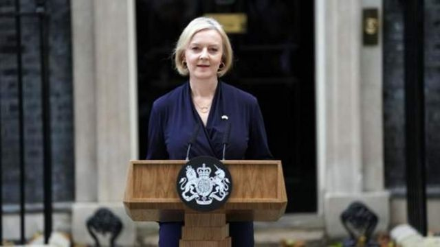
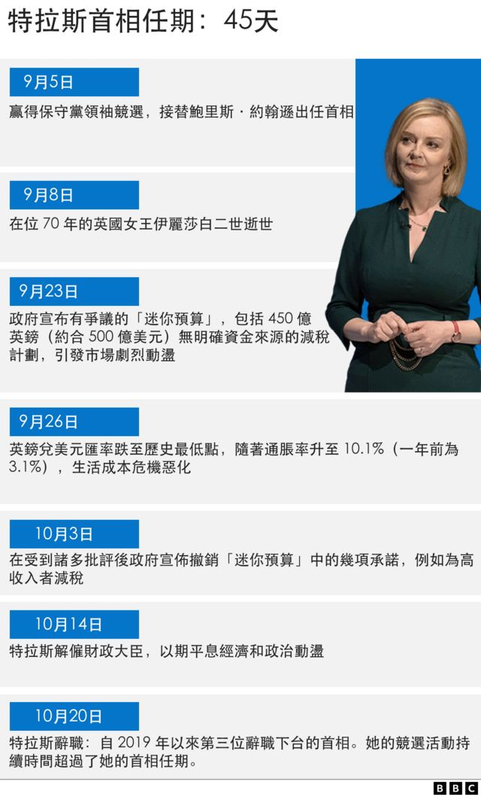
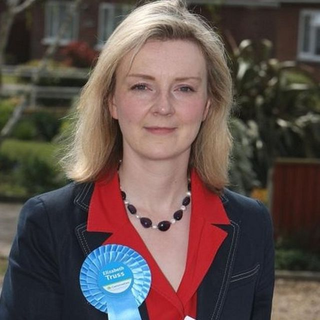
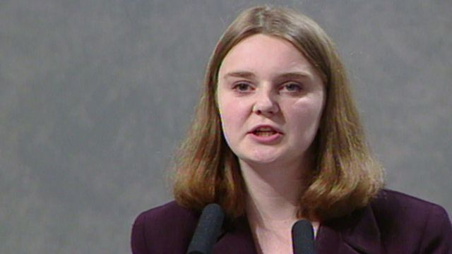
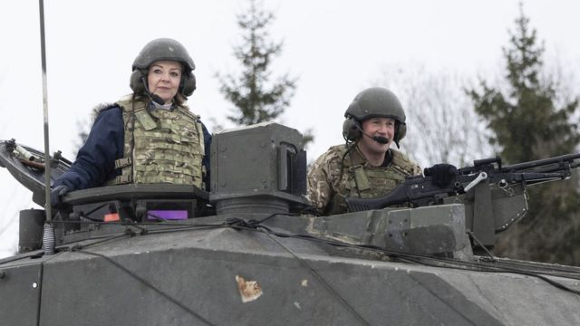
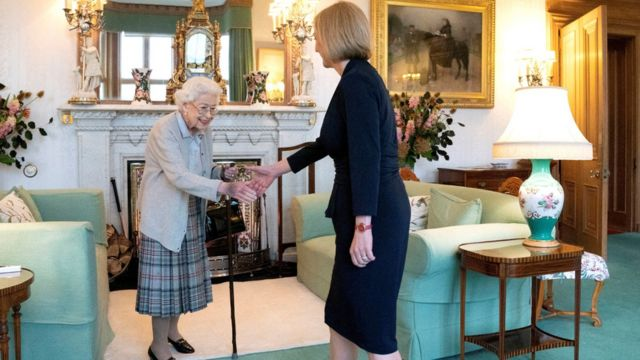
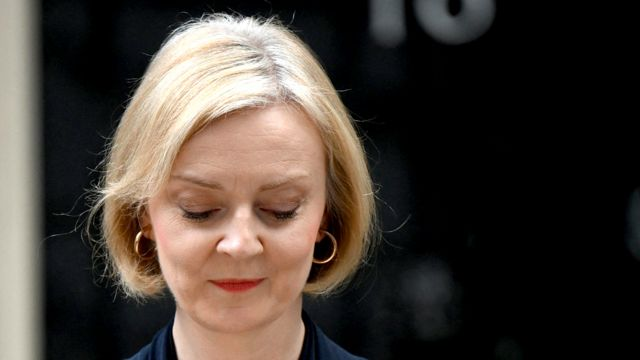

# [Uk] 英国首相特拉斯辞职 执政保守党将再一次选举党魁

#  英国首相特拉斯辞职 执政保守党将再一次选举党魁

> 图像来源，  PA Media

**英国首相特拉斯（又译：卓慧思）在上任仅45天后戏剧性地辞去了首相职务，成为英国有史以来执政时间最短的首相。**

她在上任后推出的“袖珍预算案”引发金融市场剧烈的反应，英镑汇率大跌后，英国执政保守党面临内外的巨大政治压力。

尽管特拉斯撤换了财政大臣，新上任的财政大臣改变了她的大部分经济政策，但保守党议员仍然要求她离职，而主要反对党工党也提议立刻举行大选。

特拉斯女士在9月由保守党成员选举出任首相一职，但她在一系列政策大转弯后彻底失去了执政权威。

特拉斯在首相府外发表了非常简短的辞职讲话，并表示保守党将在一周之内选出新党魁。

##  特拉斯下台的关键原因有哪些？

**她很快陷入麻烦**

特拉斯进入唐宁街后任命的财政大臣在她上任后第三周公布了价值450亿英镑的减税计划，即所谓的“袖珍预算案”，引起了金融市场的剧烈波动，英镑汇率一度跌至过去37年来的最低点，被广泛指责造成了巨大的经济问题。

包括国际货币基金组织IMF在内的国际机构罕见地对英国的这一减税计划提出批评，特拉斯受到国内和国际的巨大政治压力和批评。她被迫解除了财政大臣的职务，新任命的财相亨特提出经济路线大转弯，几乎全盘推翻了她的经济方案。

**党内外一片反对声**

上任不足两月的特拉斯在执政保守党内部失去了支持，数十名保守党人呼吁她下台。

在她解除财政大臣职务几天后，周三（19日）她的内政大臣苏拉·布拉弗曼突然辞职，更加剧了党内的乱局。有保守党议员公开表示：对“无能”的人已经忍无可忍。

与此同时，英国政界对首相极为不满，主要反对党工党要求立即举行大选，而媒体对首相大加讥讽与批评。

**无法兑现政治承诺**

在特拉斯的辞职讲话中，她承认：“我认识到自己无法兑现胜出保守党选举所做的承诺。”

特拉斯接手掌管的英国刚刚经历过新冠疫情造成的经济低迷、物价上涨，又面临俄罗斯入侵乌克兰造成的能源危机。

在这样的经济形势下，她提出的为经济增长而减税的计划被认为从根本上无法解决英国面临的问题。

##  分析：下任首相面临的巨大挑战

**BBC政治事务主编梅森（Chris Mason）**

真是让人大跌眼镜，就在三个半月前，我站在这个地方报道前任首相（鲍里斯·约翰逊）辞职的消息。

100 多天后，还是在这里，他的继任特拉斯重复前任走过的路，做出措辞非常相似的声明。

如果你觉得昨天的政坛是乱局，那么，今后混乱将会继续加深。在接下来的几天里，英国将出现另一位首相。

保守党议员希望他们自己能在团队中找出一个人接任特拉斯，以避免党内投票，那样做会需要几个月的时间，下任领导人才能选出。

但是，这位新首相 —— 如果保守党议员能找出一个可以让全党团结起来的人，这是一个巨大的假设 —— 还将面临围绕他/她合法性的巨大挑战。

不过，应该记住的是，从宪法上讲，英国是议会民主制，如果继任首相能够在下院掌控多数席位，他/她就有宪法赋予的权利在下届大选依法举行之前担任首相。

##  回顾：图片中的特拉斯政治生涯

> 图像来源，  PA Media
>
> 图像加注文字，2010年，特拉斯当选为议员。

> 图像加注文字，特拉斯年轻时在自民党大会上的反王室讲话曾经轰动一时。

> 图像来源，  Reuters
>
> 图像加注文字，特拉斯曾担任英国外交大臣，这是作为外相的她访问莫斯科

> 图像来源，  UK Government
>
> 图像加注文字，外相特拉斯2021年走访部署在爱沙尼亚的英国部队

> 图像来源，  Reuters
>
> 图像加注文字，特拉斯是伊丽莎白女王任命的最后一个首相。

> 图像来源，  Getty Images
>
> 图像加注文字，10月22日特拉斯辞职，成为英国有史以来任期最短的首相

