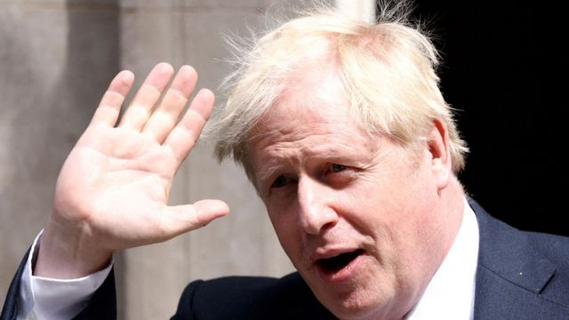

# [Uk] 鲍里斯·约翰逊：再度角逐保守党党魁“不是正确的做法”

#  鲍里斯·约翰逊：再度角逐保守党党魁“不是正确的做法”

  * 贾斯敏·安德森（Jasmine Andersson） 
  * BBC记者 

> 图像来源，  Reuters
>
> 图像加注文字，约翰逊已经宣布退出保守党党魁的竞争

**英国前首相鲍里斯·约翰逊（Boris Johnson）宣布退出保守党党魁的竞争，称他已得到足够的支持参选，但是参选不会是“正确的做法”。**

前财政大臣里希·苏纳克（Rishi Sunak，辛伟诚）和内阁大臣佩妮·摩丹特（Penny Mordaunt，莫佩琳）仍将继续角逐——其中苏纳克在议员公开支持率上遥遥领先。

约翰逊表示，如果参与竞争搞乱，他有“非常大的机会”成功，然后“在星期五就回到唐宁街”。

但是，他表示，现在“议会内需要一个团结的政党”。

上周四（10月20日），丽兹·特拉斯（Liz Truss，卓慧思）在担任首相45天后辞职，新首相之位的角逐开始。

竞选提名于周一（10月24日）下午截止，候选人需要至少100名保守党议员的支持，才能参与角逐。

BBC最新的统计显示，公开声称支持苏纳克的有155人，支持摩丹特的则有25人。

根据这个统计，约翰逊有54人支持——不过他声称自己有102。并不是全部357名议员都公开表达了自己支持谁。

苏纳克有可能最早在周一成为首相，而新首相最晚也会在本周结束时产生。

约翰逊表示，他曾对竞选感兴趣，因为“我在不到三年前曾经带领我的政党在竞选中取得大胜——因此我相信我现在处于独特的位置，要去避免一场大选”。

“一场大选将会令政府更加分心而陷入灾难，这个时候政府必须聚焦于全国家庭面临的经济压力问题上。”

下一届大选定在2025年1月。但是新的首相——已是今年的第三位——可能会受到反对党越来越多的压力，要在那之前举行大选。

约翰逊还表示：“我能确定地说，我已经得到102个提名的高门槛，包括一个提议者和一个附议者，我明天就可以递交我的提名。”

“有非常大的机会我会在保守党成员中间的选举里取得成功，而那样我很可能在周五就回到唐宁街。”

“但遗憾的是，过去这几天里我已经得出结论，这不会是正确的做法。”

“如果你不能在议会里有一个团结的政党，你就不能有效施政。”

他说，他已经联络了苏纳克和摩丹特，因为他“希望我们能名为国家利益而团结一致——我们很遗憾地还未能找到方法做到这一点。”

“恐怕最好的做法是，不让我的提名更进一上，然后将我的支持给予获胜的人。”

“我相信我可以做很多贡献，但是我恐怕现在的确不是合适的时候。”

##  分析——BBC首席政治事务记者尼克·厄尔德利（Nick Eardley）

这是一个巨大的进展。我今晚曾和鲍里斯·约翰逊的支持者通电话，他们当时相信他会参选的。今晚，又确定他不会了。

在他的声明中，约翰逊说，他相信自己本应可以赢得参选资格并到周五回到唐宁街。但是他承认，他很难在议会内团结他的政党。

这名前首相说，他有102名支持者。我们无法核实这一点，公开的数字比这个低，而我们可能永远无法确切知道。基本上可以说，很多议员都对他的阵营声称的数字持怀疑态度。

这一切都令苏纳克成为大热门。但是佩妮·摩丹特会在未来这几个小时里试图将约翰逊的支持者争取过来，然后显示她背后有一大批党内议员的支持。

可以预期，反对党派会对约翰逊所说的自己“现在处在一个独特的位置上，要避免一场大选”大加批评。

苏纳克在推特上表示，对于约翰逊在任时的工作，“我们会永远感激”，包括完成英国脱欧程序，以及疫苗推广。

“虽然他决定不再竞逐首相职位，我真的希望他会继续在国内外为公共事业做贡献，”他写道。

而虽然苏纳克目前是领跑者，但有接近这名前财相的消息源指：“我们不会把任何事视作理所当然。”

他们向BBC表示：“里希在明天早上递交提名文件之前，会继续和同僚讨论，如何最好地团结政党，带着这个国家向前走。”

工党副党魁安吉拉·雷纳（Angela Rayner，卫雅兰）则重申了工党的呼吁，要求立即举行大选。

她说：“托利党（保守党）人即将把这个国家的钥匙交到里希·苏纳克手上，而不用他就如何治理这个国家说半句。没有人投票决定过这件事。”

“或许他逃避监督并不令人意外：毕竟，几个星期前他还那么糟糕，以至于被丽兹·特拉斯打败。”

约翰逊在2019年赢得大选之后成为首相，但是在内阁大臣推翻他的领导后，于今年7月辞职。

特拉斯接替他成为英国第56任首相。她在今年夏天的党魁竞争中击败苏纳克。

然而，她短暂的首相生涯仅持续了45天。

她在9月23日提出的“迷你预算案”，之后引发经济动荡和政府接连的政策调头，导致她于周四宣布辞职，从而有了三个月里的第二次领导层争夺。

