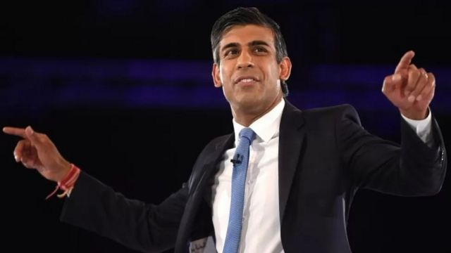
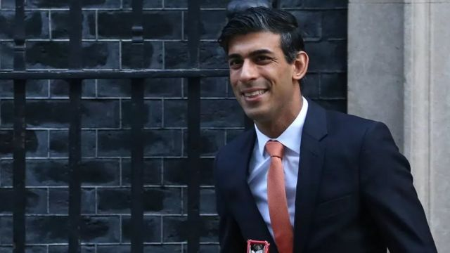
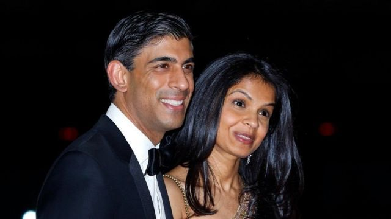

# [Uk] 英国保守党选出新党魁 苏纳克将出任首相

#  英国保守党选出新党魁 苏纳克将出任首相

8 小时前

> 图像来源，  EPA

**英国前任财政大臣苏纳克（Rishi Sunak, 又译辛伟诚）成为保守党新党魁，将出任英国首相。**

前任保守党党魁、英国首相约翰逊在7月因首相府“派对门”风波辞职之后，苏纳克也曾参加竞选党魁，但最终败给特拉斯（Liz Truss，又译卓慧思）。

特拉斯辞职后，保守党再次选举党魁。

昨天（23日）晚间， 约翰逊率先宣布退出竞选  ，另一位候选人摩丹特（Penny Mordaunt）也在24日提名截止前最后一刻退出。保守党1992委员会主席宣布，苏纳克成为新党魁。

苏纳克将拜见国王查尔斯三世，请求组阁。

之后他将成为英国有史以来第一位亚裔首相，在英国面临巨大经济挑战的大背景下入主唐宁街。

##  苏纳克可能会是怎样的领导人？

> 图像来源，  Getty Images

今年夏天竞选保守党党魁期间，苏纳克团队主要聚焦一个问题：英国经济状况恶化以及相应对策。

期间苏纳克曾明确告诉BBC，他宁愿输掉党魁竞争也不愿意“靠虚假承诺获胜”。

听起来，这句话似乎是针对特拉斯承诺的减税措施，当时特拉斯曾指责苏纳克“危言耸听”。

但是，特拉斯在入主唐宁街仅45天后戏剧性地辞去了首相职务，成为英国有史以来执政时间最短的首相。

她在上任后推出的“袖珍预算案”引发金融市场剧烈的反应，英镑汇率大跌，英国执政保守党面临内外的巨大政治压力。

尽管特拉斯撤换了财政大臣，新上任的财政大臣也改变了她的大部分经济政策，但保守党议员仍然要求她离职，而主要反对党工党提议立刻举行大选。

对于近期保守党内外的风波，苏纳克还没有公开置评。但他在此轮参与竞选党魁时表示，他的目标是解决英国面临的“严重经济危机”、“让保守党团结起来”

##  苏纳克面前的巨大挑战

BBC首席政治记者埃尔德利（Nick Eardley）分析：

苏纳克在英国经济面临严峻挑战的时刻出任首相。

自从今年夏天英国党魁选举以来，我们还没有听到他就此提出详细计划。

还有，他将面临举行大选的巨大政治压力。反对党早就提出这一点，有些保守党议员也表示，现在有必要大选。

但是，在上一次输掉党魁选举七个星期后，苏纳克拿到了唐宁街10号的钥匙。

摆在他面前的是一长串的“待办”事项。

> 图像加注文字，苏纳克在新冠疫情期间担任首相

##  前任财相苏纳克有怎样的记录？

苏纳克是约翰逊政府期间的财政大臣，曾被称为“不惜一切救经济”的财相。

苏纳克2020年2月出任财相，是唐宁街11号财相官邸历史上最年轻的主人，才39岁。

新冠疫情重创经济，成为苏纳克上任伊始面临的严峻考验，而且是自第二次世界大战以来最大的挑战：带领英国走出病毒大流行和经济活动大幅度停滞的困境。

2月份上任时，新财相被问到准备怎么扶持被新冠疫情和防疫措施重创的经济，他回答：“不惜代价”，竭尽所能。这个承诺在当年7月公布的夏季财政预算案中得到印证。

苏纳克由于推出大规模借贷和社会扶持政策，帮助人们度过难关，一度获得很高的民意支持率。

特别是在首相约翰逊陷入“派对门”风波的时候，苏纳克甚至曾被认为是最热门的首相接替者。

但是，后来苏纳克本人也卷入2020年6月唐宁街“派对门”风波，因违反防疫规定被警察开罚单。

随着疫情结束、能源危机以及乌克兰战争以来的英国政府推出的紧缩和增税政策出台，苏纳克的受欢迎程度明显下降。

> 图像来源，  Getty Images
>
> 图像加注文字，苏纳克因为妻子纳税状况受到批评

英国经济困境持续，通货膨胀很严重，基本物资价格飚升。苏纳克在春季财政预算报告中没有做出相应的政策而受到批评。亦有保守党内批评人士质疑这位百万富翁财相是否真正懂得普通英国家庭面临的生活成本危机的严重程度。

他本人强调，由于疫情给国家经济带来了重创，他自己把重点放在控制借贷的数额。

今年4月，苏纳克的妻子 -- 印度亿万富翁的女儿 -- 的纳税安排也成为媒体审视的焦点，引发轩然大波。

争议起因是苏纳克的妻子穆尔蒂因为在英国拥有“非定居者身份”（non-dom），没有在英国为自己的海外收入纳税而受到广泛批评。

穆尔蒂已经表示，虽然仍会保持非定居者身份，但是将会开始向英国增加交付海外收入所得税。

> 图像来源，  Rishi Sunak's campaign material via PA
>
> 图像加注文字，苏纳克上一次参与党魁竞选期间发布的视频中的家人照片，照片中为苏纳克的母亲、弟弟和妹妹

##  第一位亚裔首相

苏纳克属于出生在英国的第二代移民。外国移民血统和少数族裔这种身份识别对他来说很重要。

2018年，他在接受英国广播公司（BBC）采访时提到父母都是南亚移民，“就文化教育而言，我周末会去印度教的庙宇 — 我是印度教徒 — 但星期六我也会参加南安普顿足球俱乐部的比赛；就是两头兼顾，什么都参与。”

他说自己成长过程中没有太多遭遇种族歧视的经历，但确实有一件事一直难以释怀。

那是他十来岁的时候，有一次跟弟弟妹妹一起出去玩，进了一家快餐店。他在照顾弟弟妹妹，坐在附近餐桌的人出言不逊，“这是我第一次经历（种族歧视），……说了些令人非常不愉快的话。用了P字（英语中对巴基斯坦或南亚裔人的蔑称）。”

被人无端辱骂，苏纳克永远记得那种刺痛，“像针一样刺痛；我至今记忆犹新，那就烙在我的记忆中。侮辱可以表现为许多不同的方式。”

不过，他觉得“无法想象”那样的事会发生在今天的英国。

