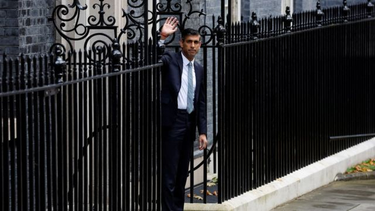
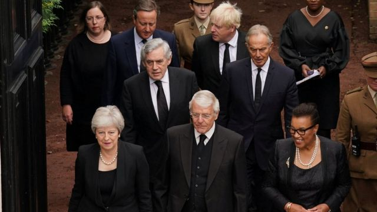

# [Uk] 英国首相：两个月中唐宁街换了三个人—— 这是英国政坛新常态？

#  英国首相：两个月中唐宁街换了三个人—— 这是英国政坛新常态？

  * 詹姆斯·格里高利（ James Gregory） 
  * BBC 新闻 

8 小时前

> 图像加注文字，英国首相苏纳克和他的几位前任

**不到二个月时间，英国有了第三位首相，里希·苏纳克（Rishi Sunak，辛伟诚），他也是六年来第五位首相。这是过去近一个世纪以来唐宁街10号主人变更最频繁的一段时间。**

自2007年夏天以来，首相官邸迎来送往，先后有戈登·布朗（ Gordon Brown）、戴维·卡梅伦（David Cameron）、特蕾莎·梅（Theresa May）、鲍里斯·约翰逊（Boris Johnson）、丽兹·特拉斯（Liz Truss，卓慧思）和苏纳克。作为对比，在之前的 28 年里英国只有过三位首相——玛格丽特·撒切尔（Margaret Thatcher）、约翰·梅杰（John Major） 和托尼·布莱尔（Tony Blair）。

唐宁街10号的旋转门转得如此之快，原因是什么？这种趋势会成为英国政治的新常态吗？

**一个专家小组** **与 BBC** **分享他们** **对这个问题的看法：** **为什么** **首相职位** **似乎越来越** **难持久？**

英国智库政府研究所的吉尔·拉特（Jill Rutter）认为，2016年的英国脱欧公投是过去六年来英国政治的头号破坏稳定因素。

“我们可以将几乎所有的不稳定归咎于英国脱欧公投的后果及其对保守党的冲击，”她说。

“卡梅伦是要长期任职的首相。如果没有公投，他本可以在首相位置上一直待到2018年，并且会向乔治·奥斯本或鲍里斯·约翰逊交棒。”

“他因举行公投而翻车。这是一个战术错误 ——不全力以赴地去争取胜利，还相信自己必胜，”她补充道。

卡梅伦任职六年后辞职，为特蕾莎·梅铺平了道路。她在任三年零11天，而她的继任者约翰逊任职三年零44天。

“特蕾莎·梅显然遇到双重困境 —— 2017年灾难性选举，以及她和保守党无法就英国脱欧的含义达成一致，”拉特女士补充道。

她说，保守党“认为约翰逊可以打破英国脱欧的僵局，但他的方法之一就是不太关注规范和规则”。

“正因为他没能做到这一点，所以令人失望，这意味着他的部长们再也无法忍受。他们绝望之下去找新人了。”

据拉特女士说，特拉斯能在不到七周的时间内当上首相，任期却那么短，这是脱欧公投的直接遗产。

伦敦国王学院政府学教授弗农·波格达诺（Vernon Bogdanor）对此表示赞同。

“公投破坏了英国政治的稳定，”他说，“困难在于找到与欧洲的正确关系。”

> 图像来源，  Reuters
>
> 图像加注文字，苏纳克当选国会议员后不到 10 年就成为英国首相

但这真的是因为英国脱欧吗？

玛丽皇后大学政治学教授蒂姆·贝尔（Tim Bale）认为，这种趋势可能会更深入。

他指出，他所称的英国议会制度的“总统化”，或者对政党领导人的更多关注，是首相任期没有那么长的原因之一。

“选民和政客们更多地关注党的领导人，而不是整个政党 ——- 这意味着领导人经常对任何出错的事情承担个人责任，”他说。

“现在，一个政党领导人几乎不可能在选举失败后领导他或她的政党，”他解释说，并补充说，2017年前工党领袖杰里米·科尔宾（Jeremy Corbyn）是个显著例外。

苏纳克现年 42 岁，是 200 多年来最年轻的首相。自2015年首次当选国会议员以来，七年中他在保守党内声名鹊起。

“议员进了议会，很快就能为自己赢得声望，”贝尔教授说。

“这破坏了议会政治的稳定。它曾经等级相当分明，但现在国会议员通常不会耐心逐级向上爬。如果他们认为事情不如意，会在推特和滚动新闻频道上宣称，‘有些事情需要改变 - 包括领导人’。”

> 图像来源，  Reuters
>
> 图像加注文字，部分前首相参加英国国王查尔斯三世登基礼

贝尔教授认为，社交和数字媒体的兴起也对选民如何看待政治家产生了很大的影响。

过去，“政客们不是不露面的，”他说，“但他们不是现在的名人。这影响了选民如何看待政治。”

博格丹诺教授不同意。他认为，两次世界大战期间的大卫·劳埃德·乔治和温斯顿·丘吉尔的政府，19世纪的威廉·格莱斯顿，以及最近的玛格丽特·撒切尔，都可以被描述为“总统”。

“政府一直是总统制，”他说。“首相的权力确实随着他们的选举地位浮动。”

博格达诺尔教授认为，苏纳克现在可能会迎来一个更加稳定的时期。

“我看不到他在未来两年内被推翻。经济将会陷入困境，但保守党距离下一次大选还有两年时间。”

但伦敦经济学院政治学和公共政策名誉教授帕特里克·邓利维（Patrick Dunleavy）认为，选举将在两年后的最后期限之前举行。

“我不认为这个两年是一个可信的时间表，”他说。他认为，根据苏纳克的民意调查评级，他将面临的关卡包括明年的地方议会选举，然后是他的就任周年纪念日。

邓利维教授也看到了其他类似威斯敏斯特式政治体制的问题。澳大利亚也是一个议会制国家，12年来有九位总理，部分原因是所谓的“党内票决”（spill election）。这导致澳大利亚被称为“民主世界的政变之都”。

当议会政党成员认为领导人将他们带向错误的方向，或者没有兑现对选举他们的人做出的承诺，并且没有足够的人数支持他们的立场时，就会发生党内票决，或称党内改选。

“保守党已经转向全面党内票决行动。他们在2016年威胁卡梅伦，被用来对付梅 —— 她第一次幸存下来，然后不得不放弃 —— 还被用来对付鲍里斯，然后用来对付特拉斯，”邓利维教授说。

“党内票决肯定在英国扎根了。”

