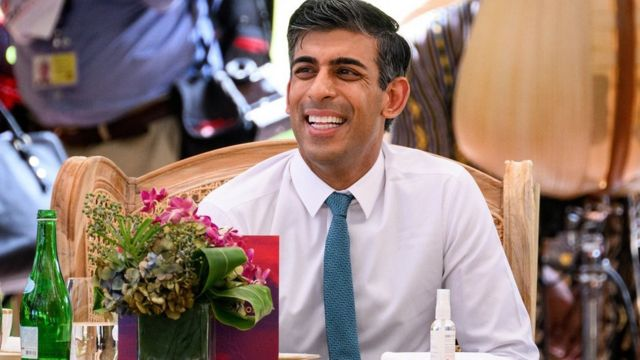

# [Uk] 苏纳克与习近平巴厘岛会晤因“日程安排”问题取消

#  苏纳克与习近平巴厘岛会晤因“日程安排”问题取消

> 图像来源，  Reuters

**英国首相里希·苏纳克（Rishi Sunak，辛伟诚）原定于周三（10月16日）与中国国家主席习近平在20国集团（G20）峰会期间举行会晤，但最后时刻因“日程安排”问题而取消。**

唐宁街10号称，部分原因是由于较早前导弹落入波兰境内的事件，七大工业国组织（G7）领导人需临时举行紧急会议。

此前，苏纳克曾表示希望与中国国家主席进行自2018年以来中英首脑的第一次亲身会面，并构建“坦率而有建设性的关系”。

唐宁街指，苏纳克仍然希望与习近平对话。

##  紧急会议

周三凌晨消息指，有导弹落入波兰境内靠近乌克兰边境热沃多夫（Przewodów）的一处农庄，波兰方面证实有两人丧生。

事件正值巴厘岛G20峰会第二日，多国领导人需对这一突发事件作出应对，七大工业国组织须在印尼举行紧急会议，英、美、日以及欧盟主席等代表均出席。

英国媒体周三报道，紧急会议令苏纳克的日程变得紧迫，因此取消与习近平的会面。

此前，外界对此的焦点之一是苏纳克是否会像他的前任特拉斯（Liz Truss，卓慧思）所计划的那样，将中国正式列为对英国的“威胁”——此前有消息指，他可能会在这一问题上有所退却。

##  苏纳克对华态度：“威胁”？“挑战”？

周二（11月15日）被记者问及关于与中方会面的相关问题时，苏纳克曾将中国称为“威胁”，但立即更正自己的说法，称它是“挑战”。

有报道指他两度否认会按前首相特拉斯的计划升级对于中国的说法。

唐宁街10号表示，中国“与我们的价值观有根本差异”，但同时表示，像乌克兰战争等问题不可能在没有“世界重大经济体协同行动”之下解决，这当中也包括中国。

苏纳克的官方发言人表示，英国政府对于如何处理与中国的关系有“清晰的眼界”。

“中国带来的挑战是系统性的，是长期的，而且这个国家……与我们的价值观有根本差异，”他说。

“但同样地，我们在G20讨论的议题当中——无论是全球经济、乌克兰、气候变化、全球卫生——没有一个是能名在没有世界重大经济体协同行动的情况下解决的，当然这里包括中国。”

一些保守党议员则呼吁英国政府对华采取更强硬立场。

前任首相特拉斯据曾计划在外交政策审查报告中将中国列为对英国的“威胁”。

去年发表的英国外交政策报告原版中，英国形容中国是“系统性的竞争对手”，之后特拉斯曾声称会在即将更新的报告中将进一步升级对中国的定义。

去年，七名英国议员在提出有关新疆维吾尔族穆斯林的人权侵害问题之后，受到中国制裁。

被制裁者包括苏纳克的安全事务大臣汤姆·图根哈特（Tom Tugendhat，董勤达）、科学大臣努斯拉特·加尼（Nus Ghani）、前保守党领袖伊恩·邓肯·史密斯爵士（Sir Iain Duncan Smith，施志安爵士）和外交事务委员会原召集人艾丽西娅·凯恩斯（Alicia Kearns）。

《卫报》引述史密斯表示，假如将立场软化成“安抚”，习近平会将此看作是英国“示弱”的迹象。

史密斯在接受英国电视台Talk TV访问时表示，英国应该更强硬：“是时候如实地戳破它（中国）了，就是一个威胁，但是我希望（首相）不是准备掉头，那将是完全错误的。”

同样受到制裁的保守党议员希利（Bob Seely）则表示，对话虽然重要，但是“在不正常的时候将关系正常化是危险的”，指英国应该与中国进行“诚实的对话”。

