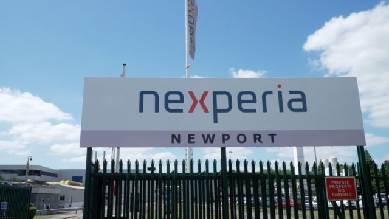

# [Uk] 中英关系：英国政府要求中资退出纽波特芯片工厂引发的员工异议

#  中英关系：英国政府要求中资退出纽波特芯片工厂引发的员工异议

8 小时前

> 图像加注文字，11月23日，威尔士纽波特晶圆制造厂（Newport Wafer Fabrications ）职工协会代表与英国议员见面，表达员工的看法。

**英国最大芯片厂的员工敦促政府有关部门允许该厂继续留在中资手中。**

出于国家安全考虑，英国政府下令由中国公司控股、总部设在荷兰的安世半导体公司（Nexperia）出售旗下在威尔士的纽波特晶圆制造厂（Newport Wafer Fabrications 又译新港晶圆厂）86%的股份。

纽波特晶圆制造厂职工协会的大约十名成员11月23日前往伦敦的议会大厦，向议员陈述他们的情况，该协会称他们对政府这个的决定“感到难以置信”。

英国政府表示希望确保股份出售后能保护工厂员工的就业。

##  纽波特晶圆厂

纽波特晶圆厂于2021年7月被荷兰半导体公司安世（Nexperia）收购，而安世由在中国上海的上市公司闻泰（Wingtech）控股。

该工厂生产的半导体或芯片被用于数百万种电子产品，从智能手机到家用设备和汽车。另外该工厂还专门制造在设备中移动电源的半导体。

英国政府的审查发现，收购纽波特晶圆厂对英国国家安全带来了两种风险：它可能破坏英国生产复合半导体的能力，并可能让中国获得技术专长和知识。

纽波特晶圆厂表示，对政府的这一决定感到“震惊”，并将提出上诉。

11月23日，来自纽波特晶圆厂职工协会的成员和首席工程师丹尼斯·奈特（Denise Knight）告诉BBC：“这个决定是谁也没有意料的”。

“人们很沮丧，很愤怒，他们确实感到被侮辱了：为什么会认为有人要把我们国家的安全置于危险之中呢？”

奈特希望英国商务大臣格兰特·沙普斯(GrantShapps)去走访工厂并与员工交谈。

##  员工呼吁

这些代表还带了一封员工协会写给沙普斯的信。

信中说：“对你决定向安世公司颁令出售在纽波特的半导体工厂，我们难以置信。”

纽波特晶圆厂表示，对政府的这一决定感到“震惊”，并将提出上诉。

信中写道：“你应该看到问题的关键，允许安世保留在纽波特的工厂，保护我们的就业。”

另一位到议会的职工代表是盖诺尔·克拉克（Gaynor Clark）。她说：“我们想保留自己的工作，我们也需要这份工作，我们需要供养家人。”

她很担心工厂被另一家公司收购后会出现的情况。克拉克希望安世公司能够继续留在纽波特。

她说：“他们是一家很好的公司，已经给我们加薪，正在为我们建造新的设备投入资金。”

“没有他们（安世）就没有未来，每次我们被小公司收购后，这家公司就会倒闭。”

##  议员支持

工厂职工呼吁英国政府允许安世公司保留纽波特晶圆厂所有权的行动还得到当地议员的支持。

工党议员露丝·琼斯（Ruth Jones）要求政府紧急处理这一问题。她表示，“离圣诞节只有一个月的时间，但是政府却把这样一个令人无法接受的震惊和担忧堆到了近600名员工的身上。”

> 图像加注文字，位于威尔士的纽波特晶圆制造厂（Newport Wafer Fabrications 又译 新港晶圆厂）被总部设在荷兰的安世（Nexperia）收购，拥有控制权的是中资公司。

琼斯议员还要求商务大臣沙普斯公布政府做出这一决定的安全评估。

沙普斯承认，对于纽波特晶圆厂的500多名员工来说，这是一个“令人担忧的时刻”。

但他说：“但她（琼斯议员）不了解我为了做出这个国家安全决定而不得不权衡考虑的信息。恐怕我也不能同意她公布这些信息的要求。”

##  政府决定

围绕中资控股的荷兰半导体公司安世收购纽波特晶圆厂的争议已经持续了一段时间。

在有关该厂涉及国家安全问题的评估报告得出结论后，11月中旬英国政府下令安世必须出售该厂股份。

英国政府在决定中说，对纽波特晶圆厂的收购给国家安全带来了两个风险。

第一个风险与安世在纽波特工厂的发展有关，政府说这可能会“破坏英国生产复合半导体的能力”。

第二，该工厂作为英国半导体生产密集地区中的一员，可以“让人获得技术专长和知识”。“纽波特工厂（与中国之间）的密切关系，可能会阻碍该密集地区未来参与关系到国家安全的项目”。

英国政府做出这一决定之时，正值市场国际芯片短缺、新冠疫情导致供应链受损、美国对中国施行科技制裁。

