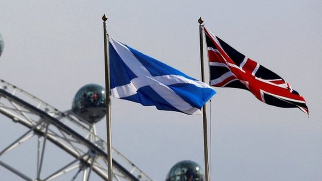
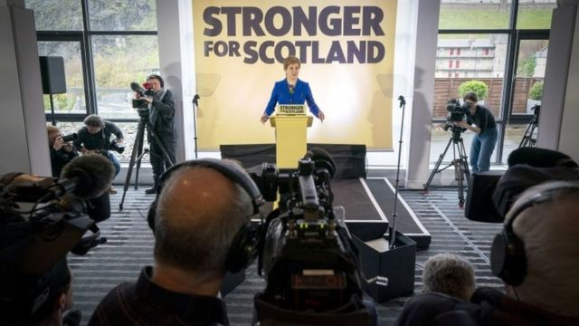

# [Uk] 苏格兰独立 英国最高法院裁定：公投必须先获得英国政府同意

#  苏格兰独立 英国最高法院裁定：公投必须先获得英国政府同意

7 小时前

> 图像来源，  Reuters

**英国最高法院裁定，未经英国政府同意，苏格兰政府不能举行独立公投。**

苏格兰首席部长斯特金（Nicola Sturgeon）希望在明年10月19日举行公投。

但最高法院一致裁定，斯特金无权举行公投。

苏格兰2014年曾经举行过一次独立公投，事先得到英国政府同意，但英国政府对苏格兰再次举行独立公投的提议一直予以拒绝。

##  法官如何裁定？

最高法院院长里德勋爵（Lord Reed）说，根据1999年权力下放后创建苏格兰议会的有关法律，苏格兰本身无权就宪法的一些领域进行立法，其中包括苏格兰和英格兰的联合。

尽管苏格兰政府争辩认为，公投对苏格兰和英格兰的联合并不具有任何法律效益，仅具“咨询”意义，只是让公众对苏格兰是否应该成为独立国家发表自己的意见。但里德勋爵驳回了这一论点。

里德勋爵说：苏格兰政府提出的公投法案涉及的是一个应该保留给英国议会来决定的问题。

他说，在苏格兰和英格兰政府没有达成协议的情况下，苏格兰议会没有权力为公投立法。

里德勋爵补充说：“合法举行的公投将对联合和联合王国议会产生重大的政治影响。”

“在建立于民主基础上的宪法和政治文化中，苏格兰选民民主表达意见的公投结果将具有权威性。”

##  反应

苏格兰第一部长斯特金在推特上表示，她对这一裁决感到失望，但尊重法院的裁决，并强调法官并不制定法律，只是解释法律。

她说：“苏格兰的民主不会被剥夺”。她还补充说：“一项不允许苏格兰在未经英国议会同意的情况下选择我们自己未来的法律，暴露了英国作为一个自愿伙伴关系的概念是虚构的，也为苏格兰独立提供了理由。”

最近的民意调查显示，在独立问题上，苏格兰的意见分裂，支持留在英国的人占极微弱多数。

此前斯特金曾表示，如果最高法院的裁决对她不利，她将把下一次大选作为“事实上的公投”，而苏格兰民族党将把独立作为大选中唯一需要全力争取的问题。

> 图像来源，  PA Media
>
> 图像加注文字，苏格兰首席部长斯特金在最高法庭裁决后举行记者招待会。

英国苏格兰事务大臣阿里斯特·杰克（Alister Jack）说，英国政府致力于与苏格兰政府就“关系到苏格兰人民最重要的问题”进行合作。

他说：“作为联合王国的一部分所享有的好处从来没有像现在一样显而易见。我们作为联合王国共同合作时，我们更加安全、强大和繁荣。”

英国首相苏纳克在周三下午的议会例行首相问答会上，对最高法院的裁决表示欢迎，说“现在是政界人士合作的时候了”。

##  斯特金转向独立C计划

_**BBC苏格兰政治编辑格伦·坎贝尔（Glenn Campbell）分析：**_

斯特金已经确认，除非英国政府突然出人意料地同意举行苏格兰独立公投，否则她将把这场独立运动带入下一次英国大选。

这就是C计划：寻求在大选中赢得苏格兰选民对独立的多数支持，如果实现了这一目标，则声称这是选民对苏格兰脱离英国的授权。

明年举行的苏格兰民族党特别会议上将决定这一方法的细节：其中包括会有什么问题，如果斯特金领导的苏格兰民族党及其盟友赢得超过50%的选票，她应该做什么。

这是一场大赌博。苏格兰民族党以前从未在选举中赢得那么大的胜利。在英国的选举中，16和17岁的人没有投票权。其他问题都可能将发挥作用，而且可能让人密切关注的是究竟是工党还是保守党能成功当选入驻首相府。

当然，（无论是哪个党上台）不能保证下一任首相会把大选结果当成独立公投一样接受它的结果。

斯特金不愿透露她的未来，也不愿透露如果苏格兰民族党在选举中落败对独立运动的影响，只是说：“如果我们不能获胜，我们就不配独立”。

##  一场轰轰烈烈的政治争拗即将来临

_BBC苏格兰政治记者菲利普·辛姆（Philip Sim）分析：_

这项裁决将对有关苏格兰独立的辩论产生巨大影响。

但是，这并不能使问题得到解决，一场巨大的政治争拗将随之而来。

斯特金并不打算放弃独立。她已经明确表示，她会把最高法院对独立的不利裁决描绘成苏格兰民主道路上的另一个路障，并希望被剥夺了发言权的不公平感觉会推动公众支持独立的浪潮。

对于英国的官员们来说，鉴于宪法问题将继续主导苏格兰的政治，宪法问题究竟如何解决也将是一个重大的问题。

法官们已经概述了法律是怎么界定的，但要一劳永逸地解决这个问题最终只能是政治家们。

