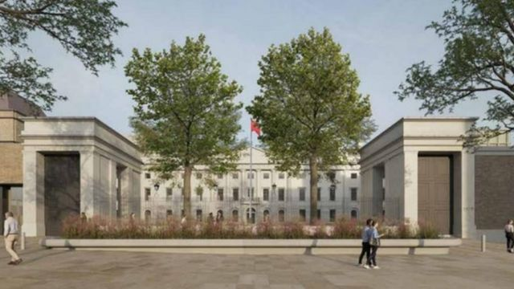
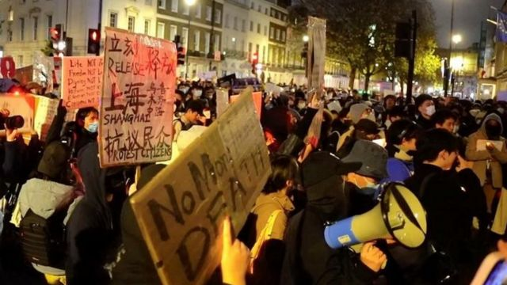
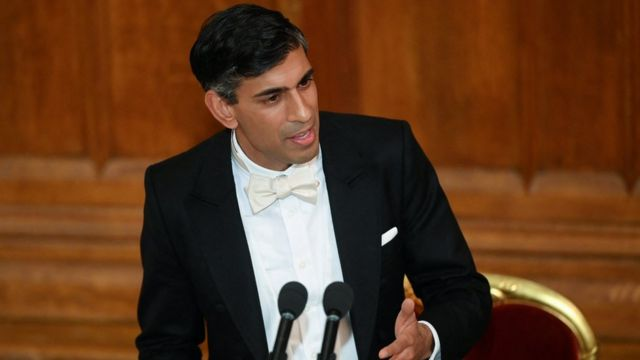

# [Uk] 伦敦中国驻英使馆新址计划为何遭到地方议会否决

#  伦敦中国驻英使馆新址计划为何遭到地方议会否决

> 图像来源，  Tower Hamlets Council
>
> 图像加注文字，中国驻英大使馆的申请内容不仅是迁移，并计划翻新这座二级保护古迹，预计将改建成全新的使馆大楼、使馆员工宿舍，以及举办大使馆活动的文化交流中心大楼。

**由于当地居民反对，位于英国伦敦的中国驻英大使馆计划搬迁至伦敦金融城附近古迹区的计划遭到否决。**

哈姆雷特塔伦敦自治市议会（Tower Hamlets Council）12月初在一场激烈会议表决后，拒绝授予该计划许可证。

不过，针对该市议会的否决，中方还能提出上诉。

中国在2018年花费2.55亿英镑巨资，买下了这个盖于1300年代的皇家铸币厂（Royal Mint Court）旧厂址，并希望对其进行重建。

##  为何遭到否决？

中国驻英大使馆目前位于伦敦市中心的波特兰广场（Portland Place）街，若迁至东伦敦伦敦塔附近的计划成功，该大使馆将成为全英最大的使馆。

但是，出于隐私和安全方面的考虑，当地许多居民反对这个搬迁计划。哈姆雷特塔伦敦自治市议会在结果出炉后已联系中国大使馆征求意见。

在公众咨询期间，反对者针对该遗址（即皇家铸币厂）的历史意义，提出了有关历史遗产和考古问题。

根据当地的独立新闻报道，当地居民担心该址成为使馆后，会成为恐怖分子的目标或抗议北京的地点。

住房组织“哈姆雷特塔房协”（Tower Hamlets Homes）称，“我们有理由预计，搬迁到新址的中国大使馆将会有迎来大量集会和抗议活动，以应对国际政治事件”。

根据美国有线新闻网（CNN）报导，承接此案的市议会战略发展委员会表示，他们已收到至少50封来自社区居民的抗议信，邻居们担心该地点如果成为中国驻英大使馆新址，除了可能成为示威抗议地带来社区混乱之外，他们还害怕遭到监控，也可能被禁止在在自家门外摆放各种政治旗帜或海报。

不过，该市议会也有一份赞同规划报告称，这个开发项目将“积极有益于和改善环境”，并为该地区提供新的就业机会。

##  新使馆计划有何内容？

该大片建筑群早期是几百年前伦敦黑死病瘟疫死者墓地的所在地，后来被英国皇家海军使用，并在1809年至1967年间成为皇家铸币厂。2018年被中国收购。

这个占地5英亩的中国驻英使馆新址计划将铲平部分二级保护建筑，也会修复其他建筑物。

综合媒体报导，中国驻英大使馆的申请内容不仅是迁移，并计划翻新这座二级保护古迹，预计将改建成全新的使馆大楼、并新盖可容纳200名使馆工作人员的宿舍，以及举办大使馆活动的文化交流中心大楼。

> 图像来源，  Reuters
>
> 图像加注文字，在地居民忧心该址成为使馆后，会成为恐怖分子的目标或抗议北京的地点。

##  中国有何反应？

中国外交部的一位发言人告诉CNN称，在伦敦购置新址“符合国际惯例”，并得到了英方的批准。

“中国驻英国大使馆新馆的规划和批准，是在遵守当地建筑规划相关法律法规的前提下进行的，”该发言人的声明说。“应当指出，为外交馆舍建设提供便利和支持是东道国的国际义务，中方敦促英方履行相关义务”。

中国官媒《环球时报》则回应称，当地居民的所谓隐私担忧是不必要的。他们引述英媒报导称，建筑师已经为当地居民提出了“一套额外的隐私措施”，并称这些公寓虽然“毗邻拟议中的新大使馆，但建筑物实际上是彼此分开的”。

报道说，中国驻英国大使馆目前位于伦敦波特兰大街49号，但包括签证、教育、科技等多个办事部门在伦敦别的地方，“行使职能的时候多有不便”，“建立一个一站式综合办公馆就方便多了”。

##  中英政治角力？

哈姆雷特塔伦敦自治市议会做出否决的决定后，引发各政治团体反应。

“英国港侨协会”创始人、家住哈姆雷特塔社区的居民郑文杰（Simon Cheng）接受英国《卫报》采访时称，对这一结果感到满意。他亦提出该区居民被监控的担忧，并在当天的市议会会议上发言称，这个使馆计划使那些“逃离北京镇压的人的人身安全受到威胁”。

“我认为香港人社群，以及其他许多人，包含维吾尔族穆斯林、西藏人，甚至我们的华人社区都会对此感到高兴，”他在当日投票后说。

10月16日，中国驻曼彻斯特总领事馆外的一场示威活动演变成暴力冲突，有视频显示一名支持香港民主的香港示威者被殴打，引发中英外交风波，英国政界高度关注事件。

> 图像来源，  Reuters
>
> 图像加注文字，英国首相苏纳克（Rishi Sunak，辛伟诚）公开表示英中两国关系的黄金时代 已经终结

前几天，英国首相苏纳克（Rishi Sunak，辛伟诚）公开表示，英中两国关系的 “黄金时代 ”已经终结。与此同时，在上海反“清零”封控政策的抗议集会中，BBC的记者曾被上海警察袭击并拘留。中国驻英大使馆则发出声明，称英国官方说法是“歪曲事实、恶意诋毁，中方绝不接受。”

事实上在11月底，中国驻英大使郑晓光就曾特别发言 点评中英关系  。他批评“一段时间以来，英方一些人利用台湾、新疆、香港等问题散布各种谣言，干涉中国内政，中方坚决反对。”他又抨击英国“有人热衷于鼓噪中国威胁、要求限制中英经贸联系”。

