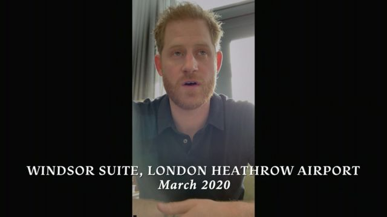
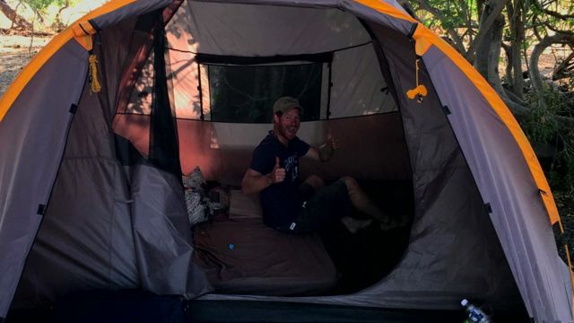
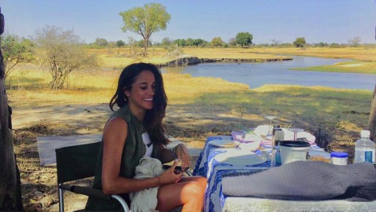
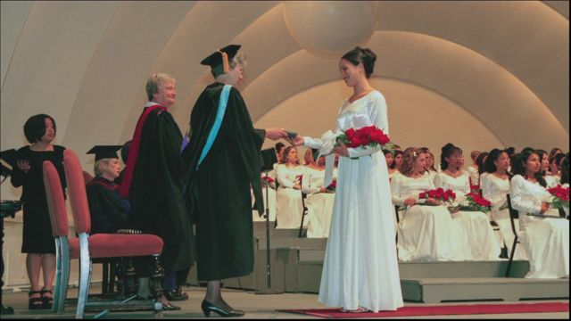
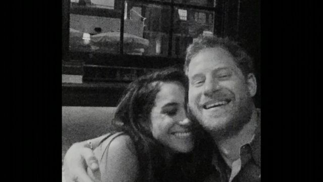

# [Uk] 哈里和梅根：网飞纪录片前三集中的看点

#  哈里和梅根：网飞纪录片前三集中的看点

9 小时前

> 图像来源，  Harry & Meghan/Archewell Productions/Netflix

**英国萨塞克斯公爵哈里王子（Prince Harry, Duke of Sussex）与夫人梅根（Meghan Markle, Duchess of Sussex）新纪录片的前三集已经播出。纪录片讲述了哈里和梅根是如何相遇的，他们的第一次约会，以及对他们家庭生活的领悟。以下是一些片中提到的场景。**

##  哈里王子离开王室的第一时刻

在戏剧性的片头字幕和音乐之后，第一集的第一个场景是哈里王子在伦敦希思罗机场的温莎VIP套房里拍摄自己。他正在等待登上飞往加拿大的航班。

这是2020年3月。女王已经同意她的孙子和妻子辞去高级王室成员职务，而哈里王子刚刚完成了最后一次任务。这是私人的关键时刻，也是外界第一次看到。

“到底发生了什么？我们是怎么走到这一步的？”哈利说。

画面中首先出现的是报纸头版，对这对夫妇辞职的戏剧性决定表示震惊，然后镜头切换到加拿大温哥华岛，梅根正用手机拍摄自己，头发上缠着毛巾。

“哈里在伦敦，我在这里，”梅根摇着头说。“我甚至不知道从哪里开始说。”

##  阿奇出镜

在第一集的后面，我们深入了解到哈里王子一家在加州家中的生活。当鲜红的日落出现在屏幕上时，我们听到梅根问她的大儿子阿奇，他会如何描述它。

“嗯，这一切都很漂亮，”这个三岁孩子回答。

音频还配有梅根用手机拍摄的片段，阿奇在他们位于蒙特西托（Montecito）的家外的一条小路上摇摇摆摆地走，哈里推着婴儿车，我们认为婴儿车里是女儿莉莉贝特（Lilibet）。

##  在博茨瓦纳露营

> 图像来源，  Harry & Meghan/Archewell Productions/Netflix

> 图像来源，  Harry & Meghan/Archewell Productions/Netflix

第一集还讲述了哈里和梅根在2016年开始恋爱的故事。两人见过两次面后，哈里王子邀请梅根和他一起去博茨瓦纳旅行五天。他们睡在帐篷里，没有浴室，没有镜子，也没有手机信号。

“我要登上飞机，飞到灌木丛中间去？我在做什么？”梅根说，“如果我们不喜欢对方怎么办？”

梅根承认，她刚到这里的时候感觉有点尴尬。“我记得他递给我一个鸡肉三明治，”她笑着说，“幸亏我们真的很喜欢对方。”

> 图像来源，  Harry & Meghan/Archewell Productions/Netflix

##  H, M和Haz

很快就会意识到，虽然哈里和梅根对我们来说可能是萨塞克斯公爵和公爵夫人，但就像其他夫妇一样，他们对彼此有爱称。

而且似乎有很多。她是M，Meg和Meghan，而他是H。镜头显示，哈里和梅根视频通话，梅根给他存的名字是Haz。

##  梅根在第二集谈种族主义

第二集主要讲述梅根和她的童年，她坦率地谈论种族主义和混血。“人们不会谈论作为混血感觉如何。我的自我认同很大程度上是在试图弄清楚我适应哪里。我认为这很大程度上关于你不够白或者你不够黑。但我不这么看世界。”

梅根开车经过洛杉矶好莱坞露天剧场，讲述了她和妈妈最近一起去的一场音乐会。

演出结束后，当他们离开停车场时，梅根记得她的母亲不耐烦地对着挡路的人按喇叭。

“那个女人转过身来，对我妈妈大喊N开头的那个词。”梅根说。

梅根说，她的母亲紧紧地握着方向盘，指关节都变白了。

“开车回家的路上，她一直沉默不语，我们从来没谈过这件事。”

同一集中，哈里王子说，尽管他认为自己“意识到”种族主义问题，但他和梅根的关系让他意识到自己“在生活中幸福梦游”。

“我的孩子是混血，我为此感到非常自豪。”他说。

##  “我一直是一个拥抱者”

在第二集中，梅根还回忆了她第一次与其他王室高级成员见面的情景，并承认自己没有预料到会面的正式程度，即使这是闭门会面。

她说，当威廉王子和他的妻子凯特来吃晚饭时，她光着脚，穿着破洞牛仔裤，她拥抱了他们。

“我一直是一个拥抱者，”梅根说，“我没有意识到对很多英国人来说这令人不快。”

后来，她描述了哈里问她是否知道如何行屈膝礼的时候，就在她"超现实"地第一次见到男友的祖母，即已故伊丽莎白女王前。

“我觉得这只是个玩笑，”梅根说，“太紧张了。”

当女王离开房间，尤金妮郡主和她的母亲约克公爵夫人莎拉祝贺了梅根。

“我不知道我在做什么。”梅根承认。

> 图像来源，  Archewell Productions/Diamond Docs/Netflix

##  求婚细节和企鹅连体衣

在同一集中，哈里王子描述了他向梅根求婚的情景。那是在2017年年底，梅根正在家里烤鸡，哈里决定开一瓶香槟。

在征得祖母同意后，哈里王子在肯辛顿宫的花园里单膝跪地求婚，周围有15支电子蜡烛。

虽然官方要过几个星期才会宣布订婚，但这对夫妇为朋友们举办了一场订婚派对，所有的客人都身穿动物服装。

“梅根和哈里穿着企鹅连体衣，因为企鹅伴侣终生相伴。”他们的朋友露西·弗雷泽（Lucy Fraser）回忆，“他们太甜蜜了。”

##  柔和色调的服装

伊丽莎白女王以其丰富多彩且协调的服装而闻名。在第三集中，梅根解释了为什么她在英国时经常穿着柔和的色调，包括白色和米色。

“你永远不能和女王陛下穿一样的颜色，你也不应该和家里更年长的成员穿一样的颜色。”她解释。

她说，她竭尽全力“融入其中”。

“我不想让家人难堪，”她还说。

