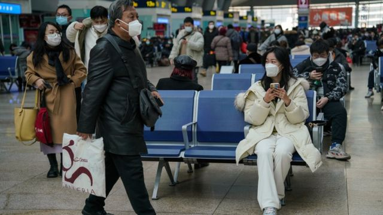
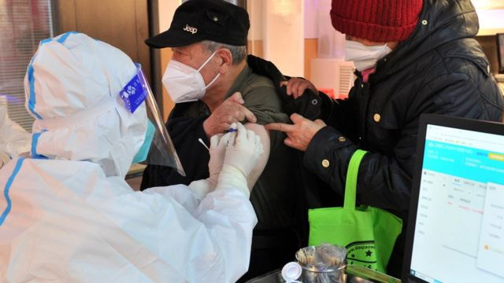
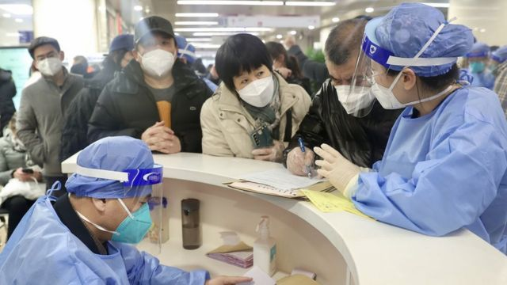
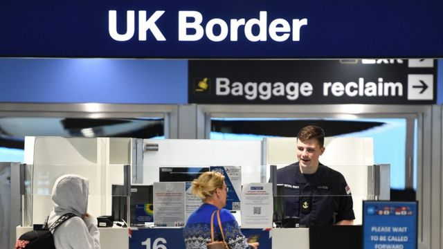

# [Uk] 中国疫情：世卫督促分享新冠实时数据 英国英格兰等加强防疫入境客

#  中国疫情：世卫督促分享新冠实时数据 英国英格兰等加强防疫入境客

> 图像来源，  EPA
>
> 图像加注文字，中国2023年春运快将展开，意味着新冠病毒可能进一步在中国大陆境内扩散。

**联合国世界卫生组织（WHO）表示，随着感染人数激增，中国官员必须分享更多关于国内疫情的实时信息。**

世卫组织官员表示，他们希望看到更多有关住院率、重症监护病房入院率、死亡率、疫苗接种率等数据。

几周前，中国取消了严格的“清零”措施之后，病例激增。许多国家宣布对来自中国的旅客进行强制检测。英国的英格兰是最新一批宣布相关措施的地方。

截至目前，美国、法国、西班牙、韩国、印度、意大利、日本、台湾等地都宣布对来自中国的旅客进行了检测，他们担心病毒再次传播。

##  世卫组织督促分享数据

世界卫生组织周五（12月30日）和中国卫生当局举行高级别会议，再次要求中国定期分享有关疫情的具体和实时数据，以制定准确的风险评估和有效的应对措施。
 在会晤后发表的声明中  ，世卫组织表示，除了实时流行病学数据，他们尤其希望中方能说明60岁以上人群接种新冠疫苗的情况。

> 图像来源，  AFP
>
> 图像加注文字，中国卫生当局许诺推进提高长者新冠疫苗接种比率。

世卫组织强调了监测并及时发布数据的重要性，称这些数据可以帮助中国和国际社会制定准确的风险评估，以便制定有效的应对措施。

世卫组织总干事谭德塞（Tedros Adhanom Ghebreyesus）当天在社交媒体上也强调了维持透明度和定期共享数据的重要性。

他说：“在缺乏有关中国疫情的全面信息的情况下，世界各国正在以他们认为可以保护其国民的方式采取行动，这是可以理解的。”
 自12月25日起  ，中国国家卫生健康委员会将每日确诊病例和死亡人数发布职能移交予下级中国疾病预防控制中心，并表明数据是“供参考和研究使用”。此外，官方也改变了新冠死亡的分类。分析人士称，中国每天病例可能接近100万例。

中国外交部本周早些时候强调，中国的疫情总体上是“可预测且可控的”。

> 图像来源，  China News Service
>
> 图像加注文字，中国许多医院急诊室与发热门诊仍在承受新冠患者激增的庞大压力。

##  英国的决定与担心

> 图像来源，  PA Media
>
> 图像加注文字，中国只有直航班机往返英格兰航点，但伦敦中央政府将寻求在全国执行对中国旅客入境前检测的要求。

英国也在周五决定跟随其他国家，强制中国入境旅客接受检测：英国卫生和社会保障部（Department of Health and Social Care）表示，从1月5日起乘坐直飞航班从中国出发的旅客要在出发前进行新冠检测。

入境前检测要求只适用于英格兰机场。伦敦政府支出，中国与苏格兰、威尔士和北爱尔兰之间并无直航航班，但中央政府将与三地的权力下放政府协调，确保有关政策能推展至全国。

从1月8日起，英国卫生安全署（UK Health Security Agency）也将启动监测，对从中国抵达乘客的样本进行病毒检测。英国卫生大臣史蒂夫·巴克莱（Steve Barclay）表示，政府正在采取“平衡和预防措施”，这些措施是“暂时的”，官员们正在评估最新数据。

疫苗接种联合委员会主席安德鲁·波拉德教授爵士（Prof Sir Andrew Pollard）说，相关限制不太可能阻止新冠病毒变体进入英国，也很难知道此举会对英国产生什么影响。

“试图通过调整旅行方式来禁止病毒传播效果不太好”，他告诉BBC新闻，“我们已经看到，在大流行期间，各国都限制了旅行，但这并没有阻止病毒最终在世界各地传播。”

英国政府还受到了议会内保守党议员的压力，有议员希望采取更有力的回应。其中保守党议员大卫·戴维斯（David Davis）表示，对来自中国的人进行强制性检测是“相当合理的要求”。

> 图像来源，  EPA
>
> 图像加注文字，意大利是最先要求中国入境旅客接受新冠核酸检测的欧盟国家。

英国议会下议院国防特别委员会主席托拜厄斯·埃尔伍德（Tobias Ellwood）称检测是“最低限度能够做出的努力”。

他对民营伦敦广播公司（LBC）表示：“让我们对所有从中国入境的乘客进行检测，无论他们来自哪个国家。在经历了这场大流行之后，我们还想冒险吗？”

2019年，英国政府向有意愿从中国前往英国的人签发了813,532张签证。在接下来两年里，受到北京严格边境管控的影响，这一数字降至不到20万。

##  科学家的质疑

一些科学家对英国、美国等地的做法提出质疑，他们表示，最好是在旅客抵达后对进行筛查。

并非所有国家都宣布了防控措施。德国、澳大利亚、葡萄牙等表示目前还不会出台新规定。

东安格利亚大学（University of East Anglia）医学教授保罗·亨特（Prof Paul Hunter）认为，中国目前的情况不太可能在英国乃至全球范围内产生更多病例。

他周三（28日）在BBC广播电台第四台节目中表示，虽然中国处于“黑暗”和“困难”的境地，但目前的证据表明，特定变异病毒在中国引发的大多数感染“在世界其他地方非常普遍”。

他还说，自今年夏天出现疫情以来，英国已经出现了许多此类病例。

