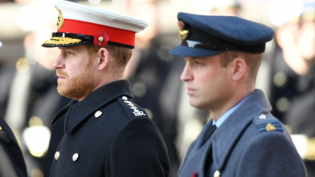
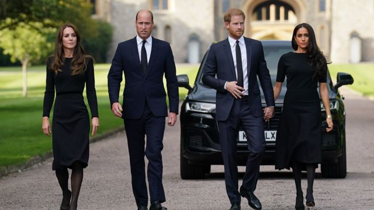
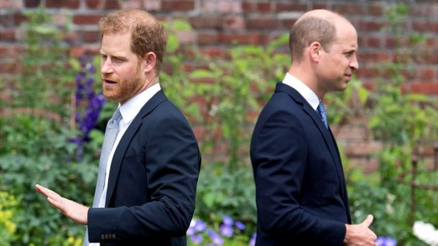
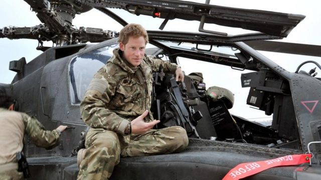

# [Uk] 哈里王子自传《后备人选》中出现了哪些让人震惊的说法

#  哈里王子自传《后备人选》中出现了哪些让人震惊的说法

  * 詹姆斯·格里高利（James Gregory） ，肖恩·考赫兰（Sean Coughlan) 
  * BBC新闻 

> 图像来源，  Getty Images

**近日，哈里王子自传《后备人选》（Spare）中一系列耸人听闻的言论和指控被披露。**

这本书罗列出了英国王室家族里的不满和痛苦。例如，他和威廉王子曾要求他们的父亲不要娶卡米拉。

但《卫报》最先报道的哈里王子最惊人的说法之一是，他如何遭到哥哥的身体攻击。

肯辛顿宫和白金汉宫均表示不予置评。

BBC新闻还没有看到这本书，它将于1月10日正式发布。

《卫报》看到了这本书。在正式发行日期之前，该书在西班牙出版，《太阳报》、路透社等其他媒体看到了西班牙语版。

《卫报》周三晚上发表第一篇文章后，书中更多的指控被公之于众。

据《纽约邮报》报道，哈里王子声称，威廉和凯特（现在的威尔士亲王和王妃）在看到他穿着纳粹制服参加聚会后“笑得大叫”。

书中还记载了哈里王子吸毒的经历，以及在阿富汗冲突中担任陆军直升机飞行员的经历。

从泄露的节选来看，和解和妥协并不在议程上。到目前为止，哈里的指控中有一种未解的悲伤、委屈和指责的语气。

它也非常私人，关于他最亲密的家人、兄弟、继母、嫂子和父亲。这些指控笼罩着愤怒的阴云，下次再看到哈里王子和王室成员在一起时，人们不可能忽视这一点。

离加冕典礼只有几个月的时间了，而最后的准备阶段可能会变成哈里是否会来的故事。

以下是这本书中的一些关键观点和启示：

##  哈里和威廉曾劝父亲不要娶卡米拉

《太阳报》报道，哈里写道，他和威廉请求父亲不要娶现在的王后卡米拉，因为担心她会成为他们邪恶的继母。

《太阳报》在这本书意外提前出版后获得了西班牙语版本，其报道透露哈里王子自称在卡米拉正式加入王室之前，他和哥哥曾分别与卡米拉见过面。

哈里王子称，他曾考虑过她是否有一天会成为他的“邪恶的继母”，但如果她能让查尔斯国王高兴，他和兄弟愿意在“心中”原谅她。

但是，这次会面的具体时间以及哈里王子当时的年龄没有披露。

> 图像来源，  PA Media
>
> 图像加注文字，威廉王子夫妇和哈里王子夫妇

##  与亡母戴安娜“对话”

哈里王子描述了他对母亲威尔士王妃戴安娜去世的悲伤，导致他向一个“自称有某种能力”的女人寻求帮助。

“你妈妈说你过着她无法过的生活，”哈里说那个女人告诉他，“你过着她希望你过的生活。”

1997年，戴安娜在巴黎的一场车祸中丧生，当时哈里只有12岁。

《卫报》称，哈里王子对他与已故母亲的一次谈话的描述很简短。与这名女子会面的地点和时间也没有任何细节。

##  威廉“把他打倒在地”

哈里王子说，在他伦敦的别墅里，他哥哥抓住他的衣领，扯下他的项链，把他打倒在地。

这本书讲述了两人之间的一场争吵，哈里声称这是由威廉对梅根的评论引发的。

哈里写道，他的哥哥对梅根很挑剔，威廉说她“难相处”、“粗鲁”和“粗暴”。

据《卫报》报道，哈里说，随着冲突升级，他的哥哥“在鹦鹉学舌地模仿媒体的叙述”。

> 图像来源，  Getty Images
>
> 图像加注文字，威廉王子和哈里王子

据说哈里王子描述了接下来发生的事情，包括声称的肢体冲突。

“他放下（一杯）水，用另一个名字叫我，然后朝我走过来。一切发生得太快了。非常快。”

“他抓住我的衣领，扯下我的项链，把我打倒在地。”

“我倒在狗的碗上，碗在我背下裂开了，碎片刺入身上。我在那里躺了一会儿，神志不清，然后站起来叫他出去。”

##  威廉和凯特对哈里的纳粹服装“放声大笑”

《纽约邮报》报道，回忆录还称，2005年，威廉王子在一次化装舞会前看到弟弟穿着纳粹制服时，“笑得大叫”。

据《纽约邮报》报道，哈里王子当时问威廉王子和威廉未来的妻子凯特，他是应该穿纳粹制服，还是应该穿飞行员的衣服，两人笑着说应该穿纳粹制服。

哈里王子20岁时，《太阳报》在头版刊登了一张他穿着制服参加一个以“土著和殖民地”为主题的化装舞会的照片。

##  17岁吸食可卡因，在伊顿公学吸大麻

哈里王子说，他17岁时在某人家里被提供了可卡因，并承认在其他几次场合吸过，尽管他并不喜欢。

他写道：“这并不有趣，也没有像其他人那样让我感到特别快乐，但它确实让我感觉不一样，这是我的主要目标。”

“我是一个17岁的男孩，准备尝试任何改变既定秩序的东西。”

他还讲述了小学生时期在伊顿公学（Eton College）的浴室里吸食大麻的经历，当时作为他保镖的警察在大楼外面巡逻。

##  在阿富汗杀死25名塔利班武装分子

哈里王子说，2012年至2013年在阿富汗担任直升机飞行员期间，他参加了6次任务，所有任务都有人员死亡，但他认为这些都是合理的。

“这个数据并没有让我感到骄傲，但也没有让我感到羞愧，”他写道，“当我发现自己陷入激烈和混乱的战斗中时，我没有把这25个人当成人。他们是被从棋盘上移除的棋子，坏人在杀死好人之前被消灭了。”

> 图像来源，  PA Media
>
> 图像加注文字，2012年哈里王子在阿富汗。

##  威廉建议在乡村小教堂为哈里梅根举行婚礼

哈里王子声称，王室在他和梅根婚礼的日期和地点上拖了后腿。

他说，当他向哥哥咨询在威斯敏斯特教堂或圣保罗大教堂结婚的可能性时，威廉说这是不可能的，因为这两个教堂分别是查尔斯和戴安娜以及威廉和凯特的婚礼场地。

哈里说，威廉建议在科茨沃尔德的海格罗夫楼附近的一个乡村小教堂。

2018年5月，哈里和梅根在温莎城堡的圣乔治教堂结婚。

