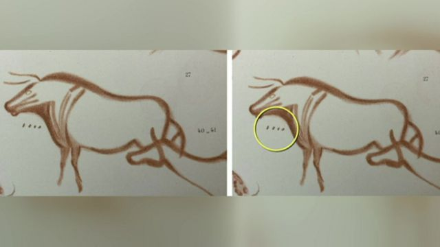
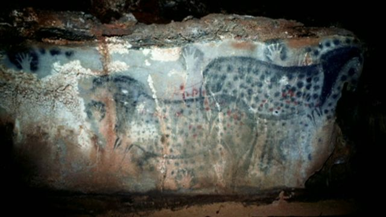
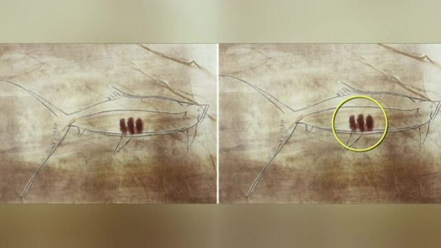

# [Uk] 冰河期欧洲洞穴岩画上的点痕、标记代表什么意思

#  冰河期欧洲洞穴岩画上的点痕、标记代表什么意思

9 小时前

> 图像来源，  Durham University/PA
>
> 图像加注文字，家具维修师本·培根（ Ben Bacon） 认为自己找到了解开冰河期洞穴岩画秘密的钥匙

**距今二万余年，冰河期的欧洲洞穴岩画，出自谁之手？表达了什么意思？有什么目的？**

解答这些问题的钥匙，据信被伦敦一位家具修复师找到了。

本·培根（Ben Bacon）分析了二万年前洞穴岩画上的标记后断定，它们可能代表了阴历。

一个专家小组闻讯跟踪研究，最终证明，远古时期欧洲的狩猎采集者已经开始记录动物的生殖周期。该团队的研究结果发表在剑桥考古杂志 （Cambridge Archaeological Journal）上。

培根说，第一次解开冰河期岩画的密码令人感到难以置信的 “诡异 ”。

洞穴岩画散布在欧洲各地的山洞里，大都是驯鹿、鱼和牛之类的动物图形，但考古学界很久以来都困惑于这类岩画上那些标记和点痕的意义。

于是，培根决定尝试解开这个谜。

> 图像来源，  Henri Breuli/Durham University/PA Wire
>
> 图像加注文字，距今2.3万年的洞穴岩画上这些点状痕迹可能对冰河期狩猎采集者的生存至关重要

他在网上搜索，到大英图书馆查阅，花了大量时间收集了 “尽可能多的数据并开始寻找重复的模式 ”。

特别是，他检查了一些画作上的 “Y”符号，他认为这可能是 “分娩”的象征，因为它显示了一条线从另一条线生长出来。

> 图像来源，  Neanderthal Museum, Mettmann/Durham University/PA
>
> 图像加注文字，这些洞穴岩壁上的野马图形年代久远，距今有三万年。

随着研究的推进，他带来了朋友和资深学者。他们鼓励他继续调查，尽管培根先生 “实际上堪称是个足不出户的人”。

他与一个团队合作，其中包括杜伦大学的两名教授和伦敦大学学院的一名教授，通过计算当今类似动物的出生周期，他们推断洞穴壁画上的标记数量是按阴历月份的动物交配季节记录。

> 图像来源，  Berenguer, M/Durham University/PA Wire
>
> 图像加注文字，点痕和其他标记用来记录动物的升值周期

该团队的研究结果发表在剑桥考古杂志上。

杜伦大学的保罗·佩蒂特（Paul Pettitt）教授说，他很高兴在培根与他联系时自己 “认真对待”。

“结果表明，冰河时代的狩猎采集者是第一个使用系统日历和标记来记录该日历中主要生态事件信息的人。”

> 图像来源，  Neanderthal Museum, Mettmann/Durham University/PA
>
> 图像加注文字，这些岩画和标记距今约1.5万年

他补充说：“于是，我们能够证明，在法国的拉斯科和西班牙的阿尔塔米拉的洞穴中留下了壮观的艺术遗产的先人也留下了早期计时的记录，而这种计时方式逐渐变得司空见惯。”

培根说，我们的祖先“比我们以前想象的与我们更相像。这些与我们相隔千万年的祖先突然间变得更亲近了”。

