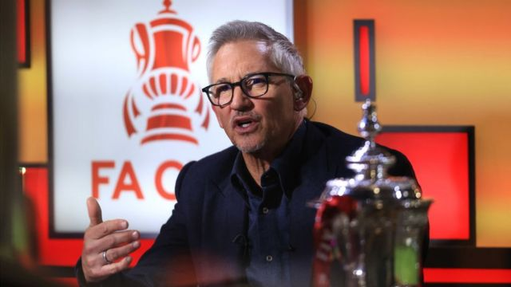
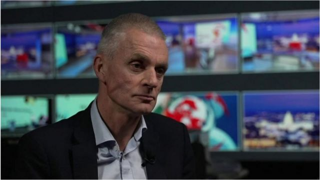
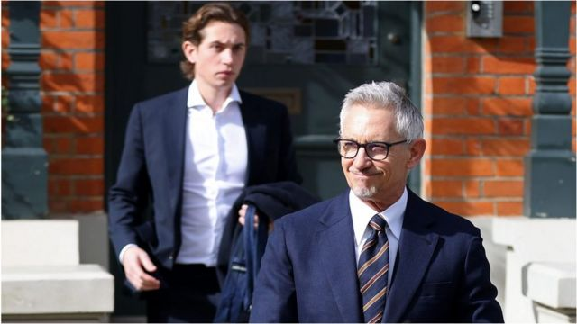

# [Uk] 莱因克尔批评英国政府後遭停职 BBC总裁致歉但否认政治打压

#  莱因克尔批评英国政府後遭停职 BBC总裁致歉但否认政治打压

  * 马特·墨菲 (MattMurphy) & 肖恩·塞登 (SeanSeddon) 
  * BBC记者 

> 图像来源，  Getty Images
>
> 图像加注文字，英格兰球坛名宿莱因克尔（Gary Lineker；连尼加）。

**英格兰球坛名宿莱因克尔（Gary Lineker；连尼加）批评英国保守党政府的难民政策后，遭英国广播公司（BBC）暂停其足球节目主持人职务，引发巨大风波。**

多名足球员和节目主持声援莱因克尔，集体杯葛BBC节目，导致多个体育节目紧急停播。

BBC总裁蒂姆·戴维（Tim Davie）就节目无法如常播出向观众致歉，但他表明不会辞职，并否认受到政府压力。

莱因克尔本来主持的足球节目《今日赛事》（Match of the Day），在3月11日周六晚间在BBC一台播出，节目缩减至20分钟，球评家艾伦·希勒（Alan Shearer；舒利亚）、伊恩·赖特（Ian Wright；伊恩胡礼）均没有亮相，也没有或任何替代者现身节目。

节目甚至没有播放招牌的主题曲和开场白，仅以“英超联赛精华”的图案开始，然后直接进入伯恩茅斯（Bournemouth） 对阵利物浦（Liverpool）的比赛片段。

##  BBC总裁否认政治打压

> 图像加注文字，BBC总裁戴维接受BBC News访问时被问到他是否已经失去了对BBC的掌控。

BBC总裁戴维接受BBC News访问时承认，这对公司来说是“困难的一天”，正在努力解决问题。

他说正努力让让莱因克尔重返幕前，并说将审视对包括莱因克尔在内的自由工作者的公正性守则（impartiality rules）。

戴维表明“绝对不会”辞职，他反驳在野党批评BBC高层屈服于唐宁街压力的指控，并指没有“迎合”任何政党。

他表示，莱因克尔是在“卷入政党政治事务”后被要求“退后（step back）”。

英国保守党政府日前提出难民政策新法案，容许当局扣留乘小艇到当地的非法入境者，在数周内遣返母国或第三国，并终身禁止入境英国。

莱因克尔上周二在推特发文批评该法案为“针对最脆弱人群的不可估量的残酷政策，其语言与德国在30年代使用的语言并无二致”。

有关言论引来保守党多名人士抨击，他在周五被BBC停职。

这随即引发多项争议，包括关于BBC公正性、英国政府难民政策，以及BBC主席理理查德·夏普（Richard Sharp）的立场。

##  多个体育节目停播

> 图像来源，  Getty Images
>
> 图像加注文字，莱因克尔（右）上周二在推特发文批评该法案为"针对最脆弱人群的不可估量的残酷政策，其语言与德国在30年代使用的语言并无二致"。

周六原订从早到晚都有足球节目，但知名节目主持人和相关工作人员接连杯葛节目，令BBC体育部门陷入前所未有的混乱。

本来在中午播出的《足球焦点》（Football Focus），主持人亚历克斯·斯科特（Alex Scott ）在节目开始前一个半小时于推特上发文指“今天继续做节目感觉不对劲”，节目之后被撤下。

原订于下午四点播放的《终场比分》（Final Score），也因为主持人杰森·穆罕默德（Jason Mohammad）拒绝上节目而停播。

BBC第五广播电台（Radio 5 Live）周六上午常规节目《Fighting Talk》在工作人员抵制下停播，主持人科林·默里（Colin Murray）指这是“整个团队和我自己做出的决定”。

为了填补节目空缺，BBC要在电视重播《Bargain Hunt》和《The Repair Shop》等库存节目，第五台也要播放预录的旧节目。

##  政坛各界的声音

英国首相苏纳克（Rishi Sunak, 又译辛伟诚）周六晚间发声明指，莱因克尔是“一位伟大的球员和才华横溢的主持人”，希望莱因克尔与BBC及早化解争端，但形容有关争议是“他们双方之间的问题”，而非政府的事情。

他也为难民政策辩护说：“作为首相，我必须做我认为正确的事情，我明白不是所有人都会同意。这就是为什么我以明确方式应对船民问题。”

英国文化传媒及体育部发言人也表示，有关“个别情况是BBC的事”。

不过，唐宁街和多名高级官员近日一直大声批评事件，比如内政大臣苏埃拉·布雷弗曼（Suella Braverman；柏斐文）说，莱因克尔以纳粹德国类比英国政府政策是“懒惰和毫无帮助的”。

在野党成员纷纷声援莱尼克尔，工党领袖基尔·斯塔默爵士（Sir Keir Starmer；施纪贤）表示，政府应该专注于修复难民庇护系统，而不是对莱因克尔“大发牢骚”，并指责BBC高层屈服于政府官员的压力。

自由民主党党魁埃德·戴维爵士（Sir Ed Davey）要求BBC主席夏普下台，称这一争论暴露了BBC“高层的失败”。

他说：“我们需要BBC的领导层维护我们引以为傲的英国价值观，并能抵受当今持续动荡的政治风波，以及保守党的霸凌手段。”

##  “损害了自身信誉”

周六稍早时，曾在2000至2004年期间担任BBC总裁的格雷格·戴克（Greg Dyke）表示，BBC在处理这次事件方面“损害了自身信誉”。

他指出，围绕着夏普的争议持续之际，将莱因克尔停职的举动会构成“BBC向政府压力低头”的印象。

夏普早前被揭发，曾向前首相约翰逊安排提供80万英镑贷款担保，之后获任命为BBC主席，引发利益冲突争议。夏普已否认为约翰逊安排贷款，BBC正展开内部调查。

前BBC总编和体育总监罗杰·摩西（Roger Mosey）也呼吁夏普先生下台，指他“损害BBC信誉”。

不过针对这次莱因克尔风波，也有人表示支持BBC的行动。BBC前编辑部主任理查德·艾尔（Richard Ayre）周五表示，BBC除了对莱因克尔采取行动外，别无选择。

##  “公正守则”适用范围惹议

他说，BBC总裁戴维“显然曾尝试”与莱因克尔达成协议但不果，“BBC没有解雇他而将他暂时调离职务，现在不可避免会受到大量批评，被指是在政府的授意下采取行动”。

62岁的莱因克尔自1999年起主持《今日赛事》，他以自由工作者的身份受雇于BBC，在2020-21年收入约135万英镑，是BBC薪酬最高的节目主持人。

BBC要求员工在政治事务上保持公正，必须遵循严格的社交媒体守则，但有关守则应如何适用于新闻以外的员工，存在着重大争议。

BBC News获悉，《今日赛事》制作团队没有被提前告知莱因克尔被停职。

莱因克尔周六稍早曾现身莱斯特城（李斯特城）对切尔西（车路士）的比赛，但未有公开回应事件。

